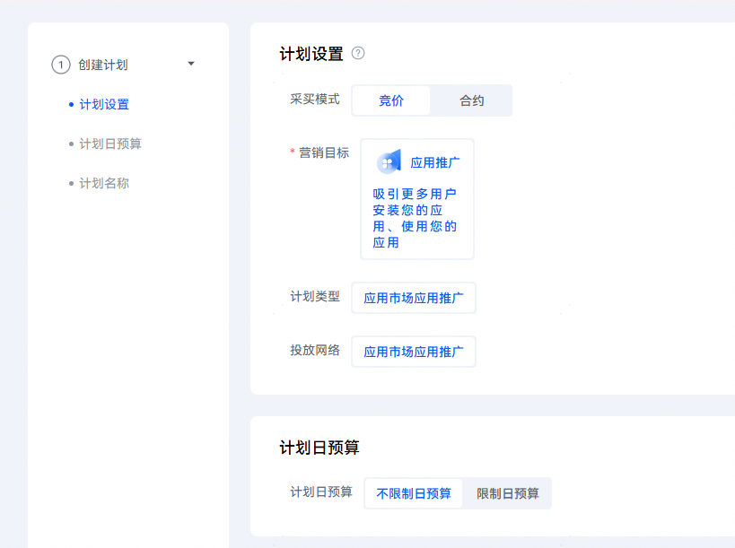
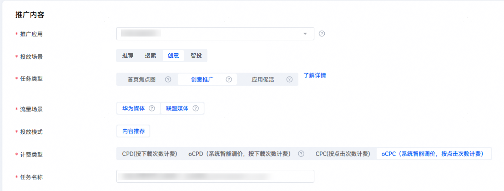
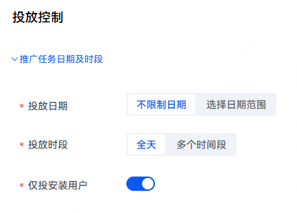
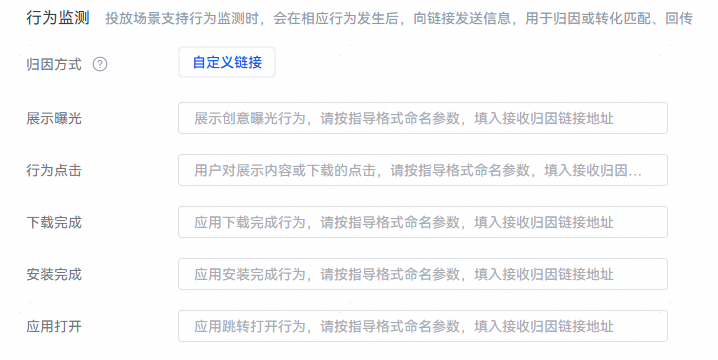

# 创建oCPC任务

## 前提条件

连续[回传转化数据](/docs/monetize/promotion/bp-functions-ocpx-return-0000001282520037)等于或大于两天，且每天回传量超过10，已开通oCPC白名单。

## 操作步骤

 

当前oCPC支持能力如下。

- “任务类型”支持“精选推荐”、“全域推荐”和“创意推广”。
- “投放模式”支持“系统投放”和“内容推荐”。
- 支持“启动应用”转化目标，可使用oCPC投放任务实现促活效果。

1. 登录[华为应用市场应用推广平台](https://ads.huawei.com/cn/)。进入“概览”主页面，点击左上角“+创建”按钮，在下拉框选择“创建计划”。
2. 在“计划设置”模块，为新建任务设置日预算。并填写计划名称，点击“继续，创建任务”。

   

   此处以投放创意推广任务为例说明。

   

   具体设置项说明如下表所示。

   | 任务设置项 | 说明 |
   | --- | --- |
   | 被推广应用 | 选择您需要推广的应用。 |
   | 投放场景 | 选择“创意”。 |
   | 任务类型 | 选择“创意推广”。 |
   | 流量场景 | 选择“华为媒体”、“联盟媒体”。 |
   | 投放模式 | 选择“内容推荐”。 |
   | 计费类型 | 选择“oCPC”。 |
   | 任务名称 | 命名格式建议：任务类型+应用名称+时间信息，长度不超过50个字符。 |
3. 进行投放控制设置。

   
4. 点击“新建”，在场景投放下新建oCPC子任务，配置相关的任务设置项。

    

   - oCPC支持“启动应用”，“激活应用”，“次日留存”，“首次付费”转化目标。
   - 出价按开发者考核的促活成本填写，前期出价请稍高当前CPC任务的促活价格，出价过低会导致oCPC量级较少。每日预算建议设置为10000以上。
   - 不同类型的投放任务对应子任务数的上限是不同的。具体子任务数的上限，请查看“新建”下的界面提示。
   - 若子任务<strong>转化目标</strong>设置项无目标选项，请检查是否已回传对应目标转化数据。若直客账号切换后创建了新数据源，需完成新数据源回传数据后，转化目标设置项才可显示选项。

   
5. 根据开发者使用的归因方案，在“归因监测”栏目，选择对应的配置方案。
   - 智能分包：

     在“分包设置”处选择已创建的智能分包，如不选择则默认使用主包为智能分包。

     
   - 监测链接：

     在“归因方式”处选择“自定义监测”，并按监测链接要求填写，请至少填写一个链接。

     
6. 点击“提交任务”，填写推广创意信息后提交。

   具体创建创意的操作，请参见[推广创意](https://developer.huawei.com/consumer/cn/doc/promotion/bp-function-creative-center-0000001349892530)。
