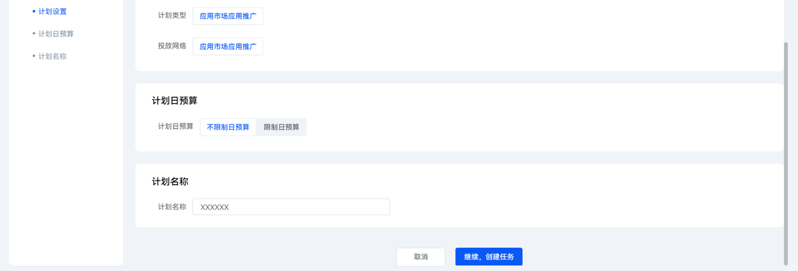
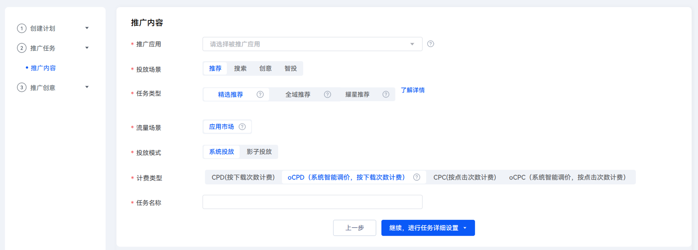

# 创建oCPD任务

## 前提条件

连续[回传转化数据](/docs/monetize/promotion/bp-functions-ocpx-return-0000001282520037)等于或大于两天，且每天回传量超过10（注：平台首日ROI单目标不涉及回传）。

## 操作步骤

1. 登录[华为应用市场应用推广平台](https://ads.huawei.com/cn/)，进入“概览”主页面，点击左上角“创建”按钮，下拉框中选择“创建任务”。
2. 在“计划设置”模块，为新建任务设置日预算。并填写计划名称，点击“继续，创建任务”。

   
3. 在“计划设置”模块，选择“任务类型”，并选择“计费类型”为“oCPD”。填写新任务名称，点击“继续，进行任务详细设置”。

    

   当前oCPD支持的任务类型包括：精选推荐、应用搜索、大卡智投oCPD、创意推广、全域推荐、首页焦点图和焦点展台。

   
4. 在“通用投放”栏目，填写CPD主任务出价。

   
5. 在“场景投放”栏目，点击“新建”，创建相关的子任务。

   在场景投放下新建oCPD子任务，设置子任务名称、选择转化目标并出价。

    

   - 不同类型的投放任务对应子任务数量的上限是不同的。具体子任务数量的上限，请查看“新建”下的界面提示。
   - 以投放“激活应用”为例，出价按照应用考核的激活成本填写，前期出价请稍高当前CPD任务的激活价格，出价过低会导致oCPD量级较少。每日预算建议设置为10000以上。
   - 若子任务转化目标设置项无对应选项，请检查是否已回传对应目标转化数据。若直客账号切换后创建了新数据源，需完成新数据源回传数据后，转化目标设置项才可显示选项。
   - 通过对oCPD各个投放目标设置合适出价，实现对应用后端效果的精准把控。例如，如对<strong>首次付费</strong>出价，通过平台算法实时预估用户付费意愿与下载转化概率，进行差异化出价，在成本可控的同时精准获量，实现投放效果最优。
   - 当转化目标选择“激活应用”时，在“深度转化”选项点击“编辑”字段，可设置深度转化内容。具体请参见[oCPD双目标出价](/docs/monetize/promotion/bp-functions-ocpd_2target_overview-0000001527328981)。
6. 在“归因监测”栏目，配置相关任务设置项。

   根据开发者使用的归因方案，选择对应的配置方案。
   - 智能分包：

     在“分包设置”处选择已创建的智能分包，如不选择则默认使用主包为智能分包。

     
   - 监测链接：

     在“归因方式”处选择“自定义监测”，并按监测链接要求填写，请至少填写一个链接。

     
