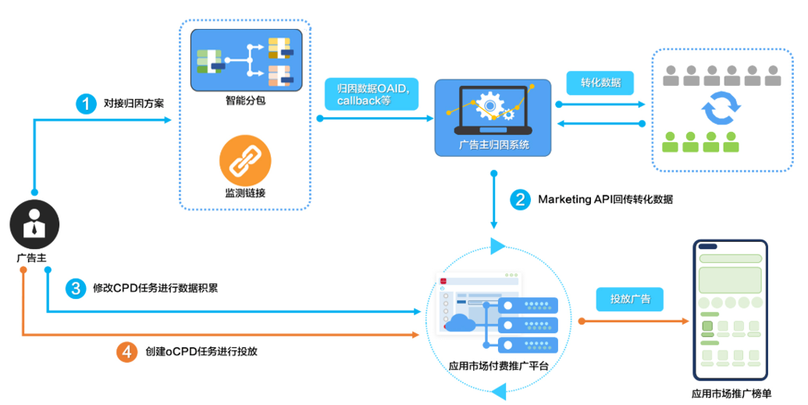

# 业务介绍

oCPX是一种任务投放形式，支持开发者以转化成本（如激活、注册）为目标智能出价。

oCPX又可以细分为oCPD和oCPC，业务上相似，具体区别如下。

- oCPD是按下载量计费，支持激活、注册、次日留存、授信、首次付费、每次付费、关键行为1、线索收集页面访问、老客激活、平台首日ROI、激活-首日ROI、激活-次日留存、首日ROI、7日ROI、激活-7日留存等转化目标。
- oCPC是按点击量计费，支持启动、激活、次日留存和首次付费转化目标。

请根据实际推广业务需求，创建对应的oCPX任务。

 

线索收集页面访问、平台首日ROI、首日ROI、7日ROI目标为白名单开放，投放前请提供对应的应用ID和应用名称，通过行业运营、客服邮箱（developer@huawei.com）与我们进行联系开通。

<strong>此处以oCPD为例，进行业务介绍。</strong>

在创建oCPD任务前要求开发者先将转化数据进行回传，平台积累一段时间数据，在模型训练完成之后才能进行oCPD投放。使用oCPD，开发者无需再针对不同人群尝试性地进行出价，定向和出价过程由oCPD算法自动完成，为开发者节约了时间和投放成本。

 

- 满足以下两个条件的应用将会自动开通oCPD功能：
  - 已开通归因功能（[智能分包](/docs/monetize/promotion/bp-functions-intelligent-subcontract-create-task-0000001284811940)或[监测链接](/docs/monetize/promotion/bp-functions-link-configure-0000001351658397)）。
  - 已回传转化数据，且连续两天回传转化量大于10。
- 如果您想快速了解oCPD，可以观看[短视频](https://www.bilibili.com/video/BV1DS4y1C7wr?spm_id_from=333.999.0.0)。
- oCPD相关的介绍，可参考学习[视频课程](https://developer.huawei.com/consumer/cn/training/course/video/C101678343783508900)。

## 工作原理

使用oCPD前，开发者需要将目标转化数据归因后通过数据回传接口回传至应用推广平台。平台基于自有数据分析已转化用户特征，帮助开发者找到与其已转化用户相似的人群作为目标投放受众。

## 接入流程

1. 根据您的需要选择对接归因方案，详见[对接归因](/docs/monetize/promotion/bp-functions-ocpx-attribution-0000001238638944)。

   当前支持智能分包和监测链接两种归因方式，二者对比如下，根据需要选择一种即可：

   | 归因方案 | 相同点 | 不同点 |
   | --- | --- | --- |
   | [智能分包](/docs/monetize/promotion/bp-functions-ocpx-attribution-0000001238638944#智能分包归因) | 均可实现归因，将推广的后续投放效果匹配到具体的推广上，解决转化效果归属划分的问题。 | - 需要客户端开发，调用应用市场提供的渠道号查询接口获取归因信息，并将客户端获取的归因信息上报到您的服务端。 - 需要开发者获取设备标识ID，在服务端将渠道号和设备标识ID进行关联完成归因。 - 受老版应用市场影响，可支持设备覆盖率超过95%。 |
   | [监测链接](/docs/monetize/promotion/bp-functions-ocpx-attribution-0000001238638944#监测链接归因) | - 需要开发者服务端开发监测链接功能。通过监测链接，获取用户是通过哪一个推广任务，在何时看到、何时点击、何时下载安装了您的应用。 - 开发者只需填写好链接，信息由应用市场发送给开发者的服务端，开发者直接统计数据即可。 - 应用市场版本在10.5.3之后的才具备采集OAID的功能，可支持设备覆盖率超过80%。 |
2. 通过数据回传接口回传转化数据，回传后查询转化数据报表。
3. 创建oCPD任务进行投放，参见[创建oCPD任务](/docs/monetize/promotion/bp-functions-ocpx-create-ocpd-0000001282723545)。
4. oCPD任务投放后，查询投放任务数据报表。
