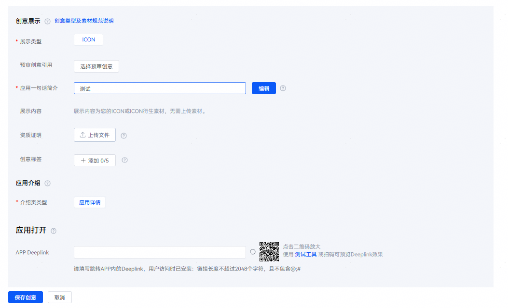

# 配置应用一句话简介

登录[华为应用市场应用推广平台](https://ads.huawei.com/cn/)，创建一个推广任务，在推广任务完成后，并创建推广创意，在推广创意中配置“应用一句话简介”设置项。

- 如果不编辑，则界面展示灰色的简介内容，此内容即为应用上架时默认文案。
- 如果默认文案不满足您推广创意的诉求，则点击“编辑”，修改为更具吸引力的文案，用于让用户更容易地关注和记住应用。

针对旅游类APP，一句话简介示例如下。

例如：想跟TA环游世界，选择我更精彩。

