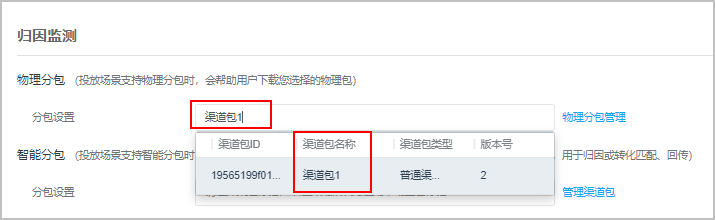

# 新建物理分包任务

## 前提条件

已完成[管理渠道包](https://developer.huawei.com/consumer/cn/doc/promotion/bp-functions-physical-subcontract-manage-0000001288400496)。

## 操作步骤

1. 登录[华为应用市场应用推广平台](https://developer.huawei.com/consumer/cn/service/apcs/app/home.html)，参见[推荐](https://developer.huawei.com/consumer/cn/doc/promotion/bp-delivery-task-recommend-0000001337110797)进行创建或修改推广任务，在任务中“归因监测-物理分包”中选择该任务投放的包体，即选择默认主包之外的渠道包。

    

   渠道包功能支持推荐、搜索、创意以及合约的CPD和oCPD计费类型的任务，选择“推广任务”进行创建即可。

    

   - 在“物理分包-分包设置”任务设置项中输入渠道包的名称，界面支持按渠道包名称查询已添加的渠道包。
   - 点击“物理分包-分包设置”任务设置项后的“物理分包管理”，则可以自动跳转到AppGallery Connect的“渠道包管理”页面。

   
