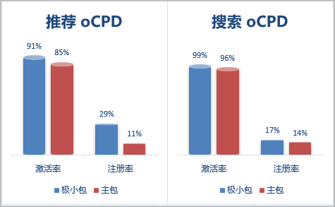

# 成功案例

## 客户需求

某应用软件包体较大，投放过程中部分人群因为下载时间长而中断下载，容易导致应用投放后的激活率和注册率不够理想。

## 解决方案

某应用使用物理分包任务投放极小包后，相比主包任务投放，提升效果明显。

- 终端用户在华为应用市场客户端秒开任务，提升应用抢量效果显著。
- 下载后打开的激活率、注册率明显高于主包。

 

此处的激活率为用户下载后的打开行为，未区分新用户和老用户。
