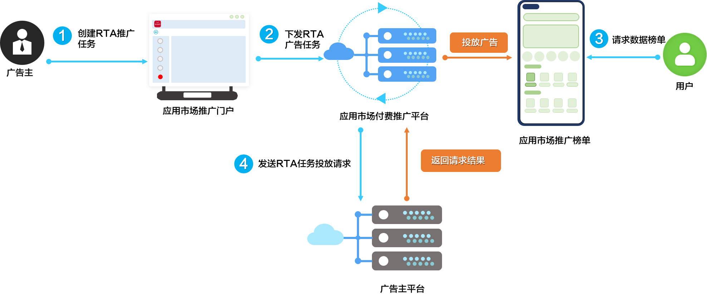

# 业务介绍

Real Time API（简称RTA API）用于华为应用市场应用推广平台向开发者平台请求投放推广任务，开发者可实时选择投放人群，达到精准投放和降低成本的目的。详细的流程如下图所示。

 

RTA目前为定向邀请功能，未开通的应用不能使用。如有疑问请通过客服、[邮箱](mailto:developer@huawei.com)或者[在线工单系统](https://developer.huawei.com/consumer/cn/support/feedback/#/)与我们进行联系咨询。

1. 开发者在华为应用市场应用推广门户创建RTA推广任务，并配置投放策略对应的RTA ID。
2. 创建推广任务后任务会同步到华为应用市场应用推广平台。
3. 终端用户请求应用市场推广榜单。
4. 华为应用市场应用推广平台携带OAID及推广任务关联的任务ID和RTA ID，调用开发者平台提供的[RTA广告推广接口](/docs/monetize/promotion/bp-functions-rta-interface-request-0000001299178600)确认需要投放的任务列表。
   - 若开发者平台基于OAID关联了对应人群，并返回了需要投放的结果。在获取任务列表后华为应用市场应用推广平台将需要投放的任务投放给终端用户。
   - 若开发者平台未返回消息、返回超时或者异常。开发者可以与对口的行业运营协商处理策略，选择不投放或者按照系统策略投放 。
