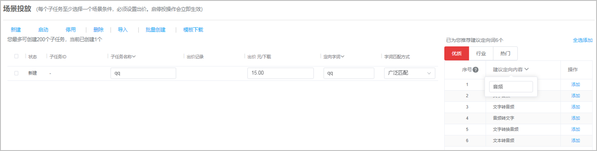

# 使用搜索投放建议词

1. 登录[华为应用市场应用推广平台](https://developer.huawei.com/consumer/cn/service/apcs/app/home.html)，创建一个搜索推广任务，在推广任务中创建搜索场景子任务时，右侧会出现搜索投放建议词窗口，从窗口中按优质、行业、热门、潜力四个推荐理由类型，并结合流行度排序添加建议词。

    

   - 如果优质、行业、热门、潜力四个页签下没有建议词推荐，则对应的页签不展示。
   - 如果推广任务支持添加10个子任务，建议词有12个，则点击“全选添加”时，系统会提醒无法全部添加，并成功添加推荐列表中前10个建议词。

   
