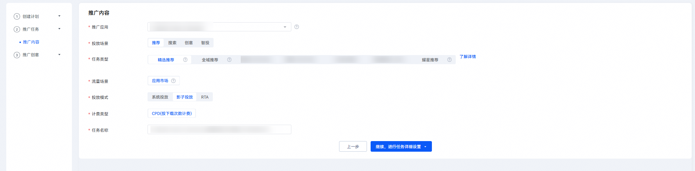
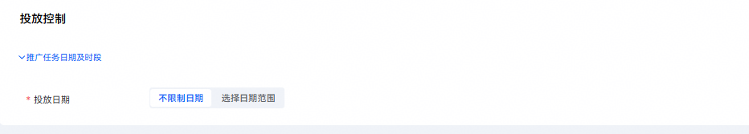
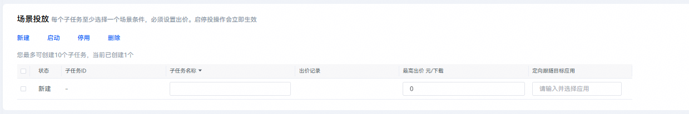
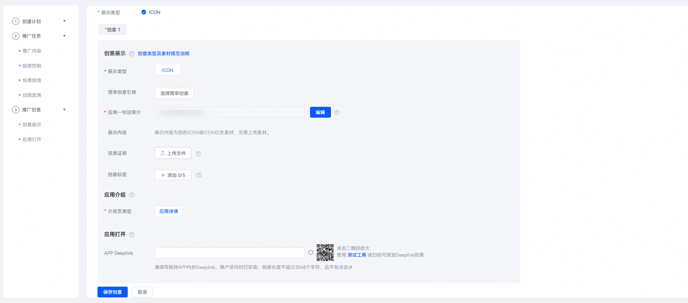

# 创建影子投放任务

1. 登录[华为应用市场应用推广平台](https://ads.huawei.com/cn/)，“应用市场应用推广”推广范围，点击“推广”—“创建计划”，进入任务创建页面。

   

   

   | 计划设置项 | 说明 |
   | --- | --- |
   | 采买模式 | 选择“竞价”。 |
   | 计划日预算 | 用于限制任务每日（自然日）整体消耗，计划内的所有任务总消耗超过此预算后，系统会自动限制该任务的推广，次日再恢复正常投放。由于预算达到限额后，您的应用可能会因为之前的推广曝光产生后续下载，已曝光的任务30天内产生的点击或下载行为等转化行为仍计费，故您的实际消耗有可能会超出设置的日预算。 |
   | 计划名称 | 命名格式建议：任务类型+应用名称+时间信息，长度不超过128字符。计划与任务层级一一对应，计划名称可与任务名称命名一致。 |
2. 在“推广内容”设置模块，配置相关任务设置项。

   

   | 任务设置项 | 说明 |
   | --- | --- |
   | 被推广应用 | 选择您需要推广的应用。 |
   | 投放场景 | 选择“推荐”或“搜索”。 |
   | 任务类型 | 选择“精选推荐”、“全域推荐”或“应用搜索”。  注意：  精选推荐、全域推荐和应用搜索任务均支持影子投放模式。 |
   | 流量场景 | 取值范围：  - 应用市场：投放到华为应用市场及精选流量。 - 华为媒体：投放到除华为应用市场之外的其他华为媒体。 - 联盟媒体：投放到非华为的其他三方合作媒体。 |
   | 投放模式 | 应用推广投放方式。  <strong>选择“影子投放”。</strong>  取值范围：  - 系统投放：应用推广主要投放方式，投放系统通过各类算法将应用推送至客户端展示。 - 影子投放：在此模式下，开发者选择目标应用，系统锁定目标应用后一位的位置，系统根据开发者设定最高目标出价，精准计算跟随目标竞品的出价，合理消耗预算。 |
   | 计费类型 | 取值范围：  - CPD：按下载完成次数计费。 |
   | 任务名称 | 命名格式建议：任务类型+应用名称+时间信息，长度不超过50个字符。 |
3. 配置完成后，点击“继续，进行任务详细设置”。
4. 在“投放控制”设置模块，配置相关任务设置项。

   

   | 任务设置项 | 说明 |
   | --- | --- |
   | 投放日期 | 取值范围：  - 长期投放：该任务不限时间。 - 选定日期：设置任务执行的开始和结束时间。 |
5. 在“场景投放”设置模块，点击“新建”，创建相关的子任务。

    

   不同类型的投放任务对应子任务数的上限是不同的。具体子任务数的上限，请查看“新建”下的界面提示。

   - 配置“子任务名称”任务设置项，一个任务内的子任务名称不能重复。
   - 配置“最高出价”任务设置项。最高出价即您愿意为跟随目标应用出的单次下载最高出价，影子投放的实际扣费价格&lt;=最高出价。影子投放任务的最高出价如果不满足系统计算的跟随价格，则该任务不生效。
   - 在“定向跟随目标应用”任务设置项中输入您想要跟随的目标应用名称，如果有重名应用，注意识别应用icon。
   - 您可以在“建议跟随目标应用”任务设置项中添加系统提供的建议跟随应用，也可以自行搜索其他想要跟随的应用，提高投放效率。

      

     跟随应用建议功能，借助大数据和算法计算应用与应用之间的关联下载概率、搜索热度、应用关联性等特征，提供了一个建议应用清单辅助投放，提高投放效率。

     
6. 以上设置模块均填写完毕后，点击“提交任务”，提交任务即可生效。勾选“编辑辅助任务信息”进入创意编辑页面。

   
