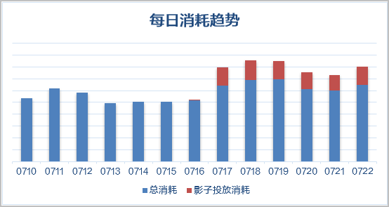
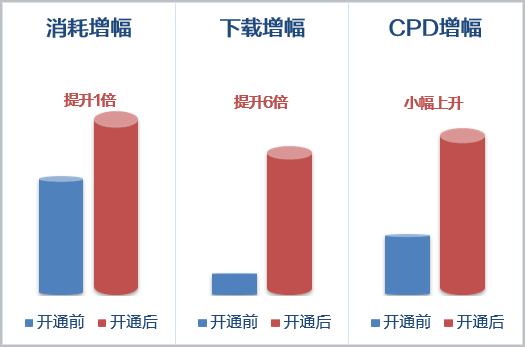
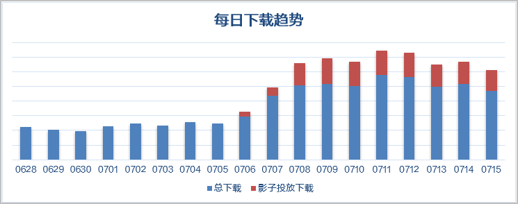

# 成功案例

启用影子投放任务后，有效实现挖掘跨品类新客群，了解潜在用户新属性，最终寻找潜在目标人群。

## 短视频类APP案例

### 客户需求

2022年某短视频类APP作为头部成熟应用，存在寻找新客难的痛点，目前状态为多数用户在卸载与安装之间不断徘徊。

2022年上半年消耗趋势如下图所示。

### 解决方案

从2020年7月份开始启用影子投放功能，对整体消耗起到了正向作用。

7月份17日和22日分2批新增影子投放任务，每日消耗趋势如下图所示。

17日第一批新增影子投放任务生效后，相比上周消耗增长20%；22日第二批新增影子投放任务生效后，相比上周消耗增长28%。

启用影子投放功能后，消耗增幅提升约一倍，下载增幅提升6倍，平均CPD小幅度提升如下图所示。

## 社交类APP案例

### 解决方案

从2022年7月6日影子投放任务生效后，每天的消耗趋势和下载趋势增长显著如下图所示。

启用影子投放功能后，消耗提升一倍，下载增长两倍，CPD单价下降明显如下图所示。

