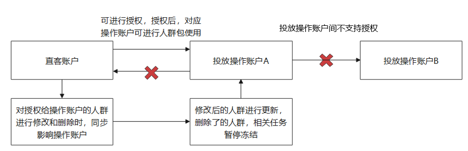
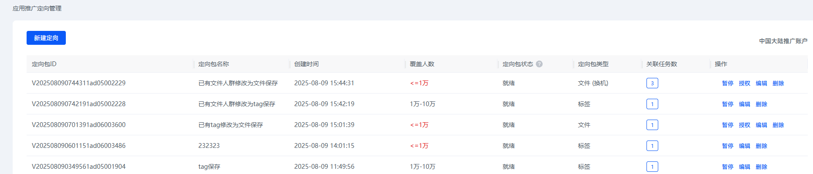
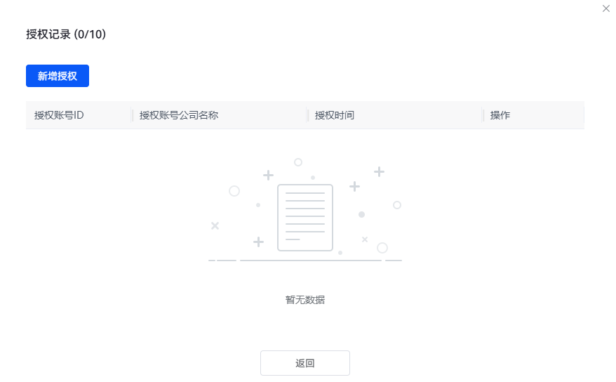
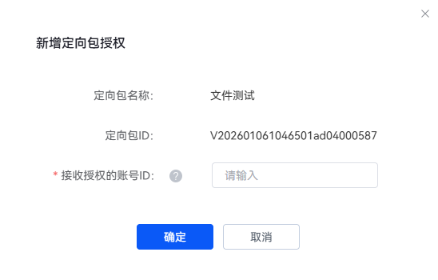
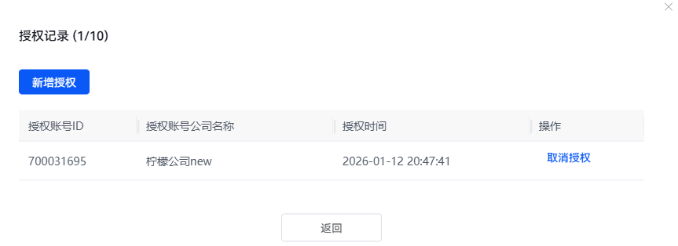
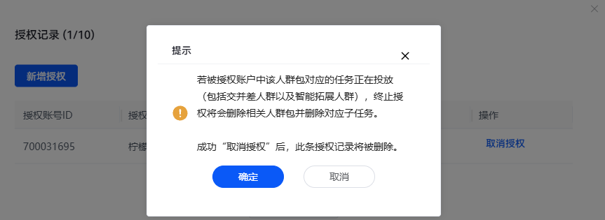
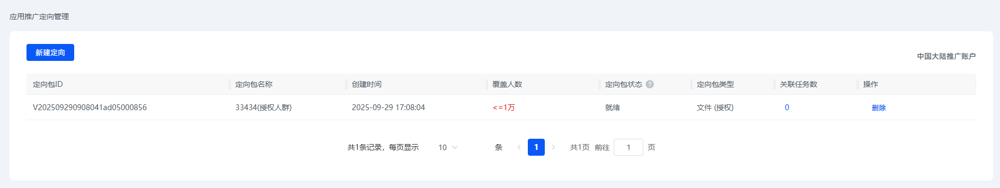
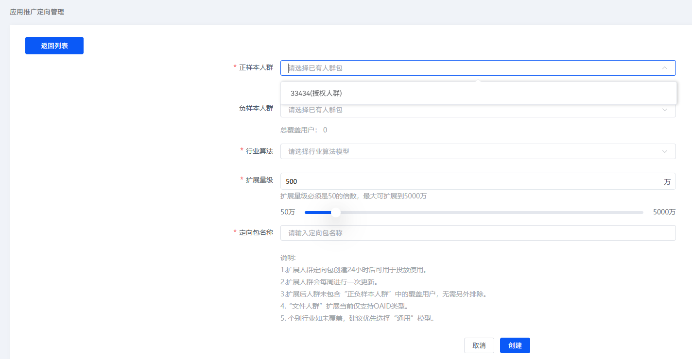
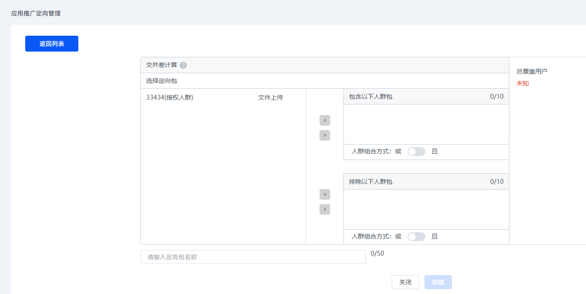

# 文件定向包支持直客授权代理

## 功能介绍

直客（包括直客管理者和普通直客）可以把文件类型定向包授权给代理使用，仅可通过应用推广定向管理页面进行授权操作。具体逻辑如下：

## 支持直客授权投放操作账户使用

1. 登录[华为应用市场应用推广平台](https://ads.huawei.com/cn/)。
2. 点击“工具”页签。
3. 点击“投放辅助”下的 “应用推广定向管理”，进入“应用推广定向管理”页面。
4. 对于定向包类型为“<strong>文件</strong>”定向包，展示“授权”按钮，增加授权给投放操作账户。

   
5. 点击“授权”按钮，弹起对应人群包的授权记录界面，展示已授权的记录，每个人群包可以被授权给10个账号。

    

   授权账号ID：允许使用定向包的投放操作账户的华为账号，从投放操作账户登录界面右上角“我的账号信息-华为账号”可获取；授权时间：对应授权新增的操作时间。

   

   

   
6. 点击“取消授权”按钮，将会有弹框提示影响，点击“确认”后，会将已经授权了的人群包权限收回。

 

- 取消授权后，对应授权账号将无法继续使用该人群包以及其相关人群包（包括被授权的人群包本身，以及可能存在调用关系的交并差人群和拓展人群）。
- 对应的定向子任务会被删除，删除状态下的任务无法进行操作，需重新创建任务投放。
- 直客主动取消授权后，会删除（使用了授权或衍生出的定向包）子任务，此时直客需把该操作及影响及时告知代理。

## 投放操作账户

1. 授权后，投放操作账户的定向包管理列表中，增加相关人群包的展示，同时支持智能扩展人群以及交并差人群的创建。

   

    

   - 被授权的投放操作账户，不支持对应授权人群包的暂停启动和编辑操作，仅支持授权人群包的删除，若存在被调用情况则进行提示，不可直接删除。
   - 删除后，人群包管理列表里的人群包信息消失，同时授权了的直客账户中对应的授权记录删除，直客的人群包仍然存在。
2. 支持智能扩展人群及交并差人群的创建。
   1. 支持智能扩展人群的创建。

      您可选择已授权人群定向包，添加至“正样本人群”或“负样本人群”的选框中，创建智能扩展人群包。

      
   2. 支持交并差人群的创建。

      您可选择已授权人群定向包，添加至“包含以下人群包”或“排除以下人群包”的选框中，并选择每个框内定向包之间的组合方式，创建交并差人群包。

      
