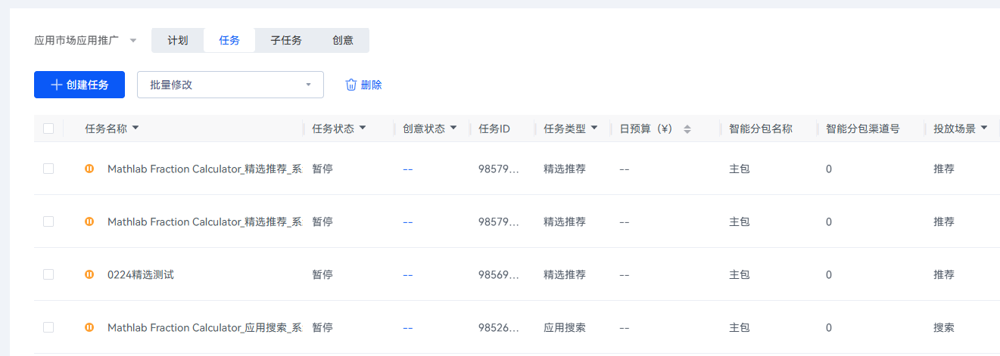
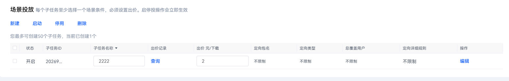
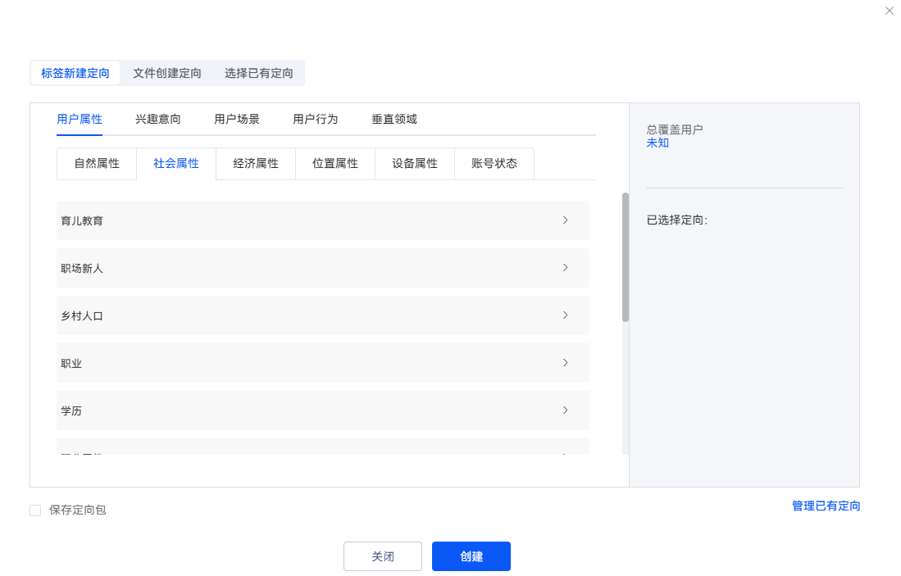

# 新建人群定向任务

1. 登录[华为应用市场应用推广平台](https://ads.huawei.com/cn/)，点击“推广”页签。
2. 点击“创建任务”，进入创建任务页面。

    

   任务信息按需填写，详细步骤可参照：[推荐任务操作步骤](/docs/monetize/promotion/bp-delivery-task-recommend-0000001337110797#操作步骤)。

   
3. 在“场景投放”设置模块，点击子任务的操作按钮“编辑”，进入页面：新建用户定向任务。

   

   根据需要，新建标签定向包、文件定向包，或选择已有定向。新建的标签定向包、文件定向包，可同时保存到工具定向列表。

   
4. 以上设置模块均填写完毕后，点击“提交”，任务即可生效。
