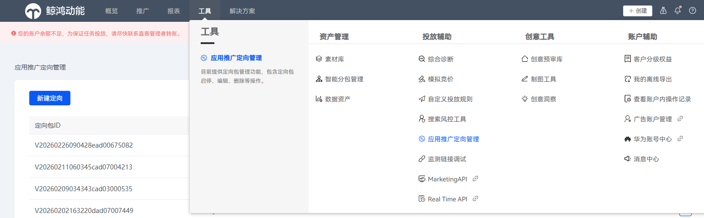
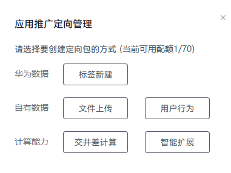
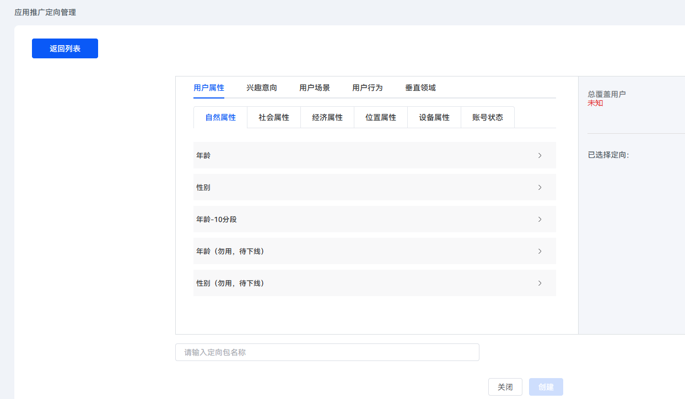
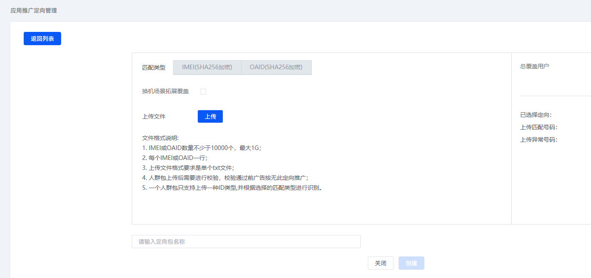
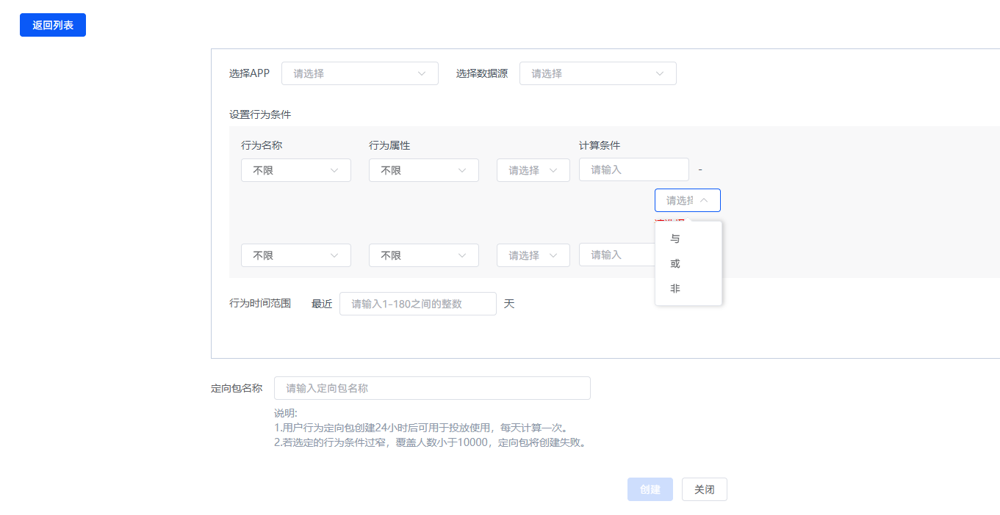
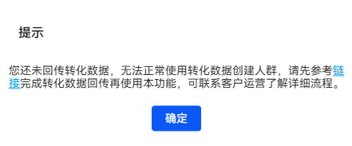
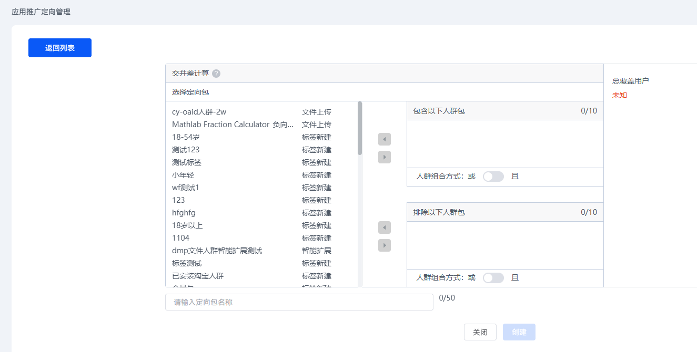
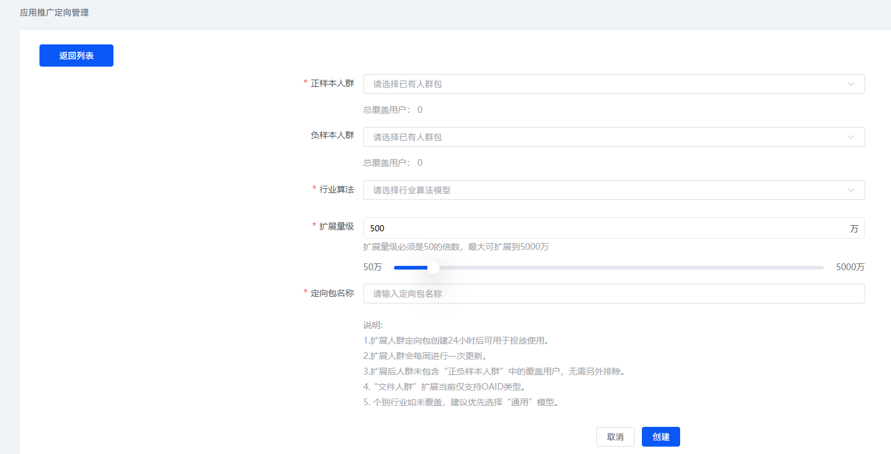

# 创建定向包

## 进入定向管理页面

1. 登录[华为应用市场应用推广平台](https://ads.huawei.com/cn/)。
2. 点击“工具”页签，在“投放辅助”中选择“应用推广定向管理”，进入“应用推广定向管理”页面。

   

## 创建定向

点击“新建定向”，选择创建定向包的方式。



### 标签新建



点击“创建”，随即保存在定向管理页中。

<strong>定向标签类别介绍</strong>：

| <strong>定向标签</strong> | <strong>说明</strong> |
| --- | --- |
| 设备属性 | 基于用户的设备使用信息构建的标签，包含机型信息、硬件信息、设备状态、运营商及流量等。 |
| 用户属性 | 基于用户的基本信息构建的标签，包括用户的自然属性（性别、年龄）、社会属性（职业、育儿状态、婚恋状态、学历等）、消费属性（有车人士、有房人士、高消费程度等）等。 |
| 行为偏好 | 基于用户在各个APP互动行为构建的标签，如APP的安装、使用、关键行为等。 |
| 行业兴趣 | 基于用户在各个行业的浅层兴趣标签，包括电商、房产、家居、游戏、汽车等行业 |
| 购买意向 | 基于用户在各行业的深层意向标签，包括电商、房产、家居、游戏、汽车等行业 |
| 垂直领域 | 各业务自行上线管控的标签。 |

 

- 此时新建的定向包无关联任务。
- 定向包名称非法字符：&lt;>"'[]$%+\/\*;=^，若输入，定向包创建失败；该规则适用所有创建方式。
- 新建后，系统会进行人群计算，通常人群计算需要1~2个小时。以下创建方式均需时间进行人群计算。

### 文件上传

开发者可以自行上传设备OAID列表创建定向包。勾选：换机场景拓展覆盖，表示把换机、同账号的所有设备号，也加到该定向包中。由于隐私合规的原因，文件上传方式创建人群包，不再支持使用IMEI设备号，请使用OAID设备号。



1. 点击“OAID(SHA256加密)”页签。

    

   - 必须在上传文件前，点击 “OAID(SHA256加密)”页签，以便系统将文件类型传递给后端数据处理模块。
   - 一个人群包仅支持上传一种ID类型。
2. 点击“上传”，在弹出的“上传文件”窗口中上传对应的定向文件。

    

   文件人群上传格式要求如下：

   - 请使用<strong>UTF-8</strong>编码的人群包文件，否则可能出现计算匹配问题。
   - 上传文件中不能包含非法字符，例如/\%&&lt;>'$()+#`;=^|[]\{\}~` 等。
   - 每个OAID自成一行，两行中间不能有空行，首行即为ID。多个ID之间使用<strong>Unix (LF)</strong>格式换行。
   - OAID原值参考使用的数据内容格式为xxxxxxxx-xxxx-xxxx-xxxx-xxxxxxxxxxxx，由5部分组成，每段长度分别为8-4-4-4-12，其中每个x是0-9或a-f范围内的一个十六进制数字。字母全部使用小写。
3. 文件上传后，点击“创建”，随即保存在定向管理页中，此时新建的定向包无关联任务。

### 用户行为



具体设置项说明如下表。

| 任务设置项 | 说明 |
| --- | --- |
| 选择APP | <strong>必选项。</strong>  请选择需要使用转化行为数据创建人群功能的APP。 |
| 选择数据源 | <strong>必选项。</strong>  请选择APP对应的数据源。 |
| 设置行为条件 | <strong>选填项。</strong>  依次设置行为条件的“行为名称”、“行为属性”和“计算条件”，并可以通过与或非的关系计算方法，实现多组行为条件的组合。  最多支持设置10组行为条件。   - 行为名称可选范围：基于用户回传数据字段选择，例如：激活、注册、付费等； - 行为属性可选范围：用户行为附带的属性参数，默认不限； - 计算条件：计算条件需要选择计算方法，是行为属性的数值要求。例如回传的转化目标为付费，那用户行为属性可选择付费金额，计算条件选择&gt;100，即筛选出付费金额&gt;100的回传设备数；如无行为属性字段的回传，请勿选择计算条件。   支持按<strong>回传用户行为数据</strong>接口的[<strong>actionParam</strong>](https://developer.huawei.com/consumer/cn/doc/promotion/bp-functions-ocpd-interface-return-0000001238484400#ZH-CN_TOPIC_0000001362028993__p20993112715207)字段值提取对应的行为名称值和行为属性值。  示例如下：   ``` [\{'name':'预约时间','value':1\},\{'name':'预约时间','value':2\}] ``` |
| 行为时间范围 | <strong>必选项。</strong>  请设置最近的时间段。输入10，即表示按最近10天回传的转化数据进行计算。  支持按<strong>回传用户行为数据</strong>接口的<strong>[actionTime](https://developer.huawei.com/consumer/cn/doc/promotion/bp-functions-ocpd-interface-return-0000001238484400#ZH-CN_TOPIC_0000001362028993__p568144412615)</strong>字段值校验时间范围。 |
| 定向包名称 | 请配置此用户行为的定向包名称。 |

 

- 用户行为创建的定向包，仅支持：直客、直客协作者、投放操作账户使用。
- 请先完成转化数据的回传功能。即连续[回传转化数据](https://developer.huawei.com/consumer/cn/doc/promotion/bp-functions-ocpx-return-0000001282520037)等于或大于两天，且每天回传量超过10。

如果进入页面时，界面弹出如下弹框，则表示当前您的账号下没有转化数据的数据源，则需要完成转化数据回传功能。



### 交并差计算

您可选择自己创建并保存或者运营人员提前创建的已有定向包，添加至“包含以下人群包”或者“排除以下人群包”的框中，并选择每个框内定向包之间的组合方式。



### 智能扩展

您可以对有需求的标签人群进行扩展，并控制扩展量级。扩展完形成的最终人群，此人群的创建方式会标记为扩展人群，可以在定向任务的已有人群中被选中进行投放。

 

智能扩展暂不支持交并差计算的能力。



智能扩展定向填写说明：

| <strong>定向参数项</strong> | <strong>说明</strong> |
| --- | --- |
| 正样本人群 | 即种子人群，可选择已创建的标签定向包或文件定向包。建议选择1000~1000万之间的人群定向包。 |
| 负样本人群 | 与种子人群特征相反或相关性不大的人群，可选择已创建的负向标签定向包或文件定向包，不可与“正样本人群”选项一样。建议选择1000~1000万之间的人群定向包。 |
| 行业算法 | 可选项为：通用、电商、泛娱乐、金融、金融授信、旅游、汽车、视频、地产、短剧、游戏、阅读。选择您所在行业相关的算法，若未覆盖您的行业，建议选：通用。 |
| 扩展量级 | 拓展人群的最大扩展人数上限值。单位：万。数值必须是50的倍数，最大可以配置到5000万。如果不是50的倍数，系统会自动向上补齐。例如：如果您配置为59，则系统会向上补齐为100。 |
| 定向包名称 | 请配置此智能扩展的定向包名称。 |

 

- 如果已创建完成智能扩展的定向包需要暂停、修改或删除，请在“应用推广定向管理”页面中，点击对应智能扩展的定向包后的“暂停”、“编辑”或“删除”。
- 如果已创建完成智能扩展的定向包，需要修改时，只能修改“扩展量级”任务设置项。
- 如果种子人群处于扩展计算中，则系统不支持修改，页面会弹出对应的提示窗口告知。

## 定向状态说明

| <strong>定向包状态</strong> | <strong>该状态说明</strong> | <strong>该状态下可进行的操作</strong> |
| --- | --- | --- |
| 就绪 | 人群计算完成，可以开始使用定向包进行任务投放。 | 暂停、授权、编辑、删除 |
| 生成中 | 定向包刚建立或修改，人群正在计算中，一般会在4小时内完成。 | 授权 |
| 暂停 | 主动暂停，或因为长时间没关联任务、关联任务长时间没投放数据被系统暂停，定向包停止计算，人群不再更新。 | 启动、授权、编辑、删除 |
| 即将下线 | 该状态仅在定向包即将被系统自动清退的10天内才会出现，并提示：由于该人群包长期未参与投放，即将在X天后被清退下线。天数每天更新。 | 启动、授权、编辑、删除 |
| 无效 | 人群计算失败。 | 授权、编辑、删除 |

 

仅文件类型定向包可操作授权，其他类型定向包不支持。
