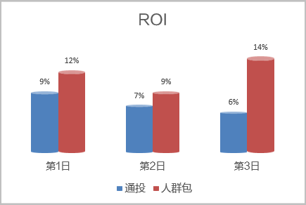
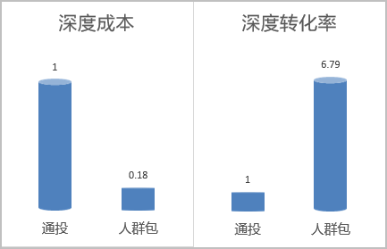

# 成功案例

## 客户需求

应用采用通用人群方式进行投放，由于投放精准度不高，往往ROI（投资回报率）不高。

## 解决方案

采用人群定向方式进行投放，可以精准获取客户群体，提升ROI，大幅降低投放深度成本，大幅提升深度转化率，极为有效的控制激活成本。

- 成功案例一

  某瑜伽应用圈定高意向人群，进行定向投放。

  高意向人群指标为：

  - 瘦身减肥意愿：高、较高、中、较低
  - 沉默天数：0~30天
  - 常驻城市：西安市
  - 排除条件：曾经安装过此APP

  因为定向人群投放更精准，用户付费意愿高，所以相比通用人群方式投放，ROI提升明显如下图所示。

  
- 成功案例二

  某租房买房应用圈定高意向人群，进行定向投放。

  高意向人群指标为：

  - 近期租房意向程度 : 高、较高、中
  - 买房意愿程度 : 高、较高
  - 排除条件：曾经安装过此APP

  定向投放后深度成本降低82%，深度转化率提升6~7倍，如下图所示。

  
