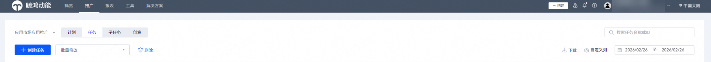
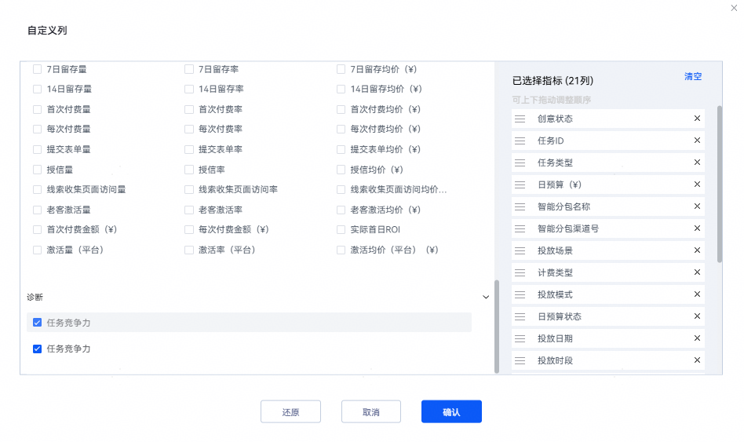
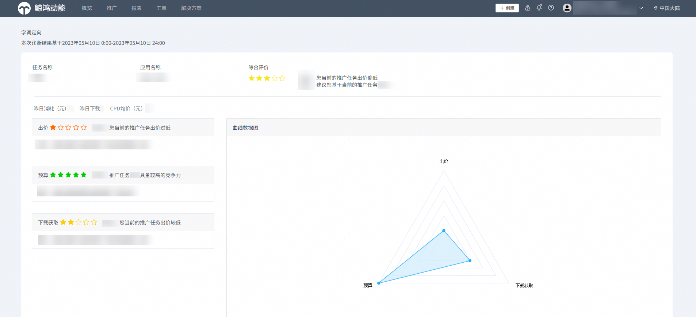

# 综合诊断任务竞争力

1. 登录[华为应用市场应用推广平台](https://ads.huawei.com/cn/)，在顶部菜单栏点击【推广】页签，确认推广范围为“应用市场应用推广”。选择“任务”，点击右侧的“自定义列”。

   
2. 在“自定义列”窗口中勾选“任务竞争力”字段，点击“确认”。

   
3. 在推广任务列表区域，拖动列表底部的滑动条到最后，即可看到对应任务的“任务竞争力”字段。

   

   如果当前任务的“任务竞争力”不佳，可以继续如下步骤进行任务竞争力诊断。
4. 点击【工具】页签，在“投放辅助”中选择“综合诊断”。

   
5. 点击“查询”，查看综合诊断的概览结果。

   

    

   - 也可以选择相关查询条件后，进行精确查询。
   - 当前仅支持诊断CPD以及oCPD任务。

   

   综合诊断的查询结果中展示如下诊断信息：

   - 展示已诊断的推广任务个数。
   - 展示任务的竞争力星级，以及昨日消耗、昨日下载等关键指标。
   - 对于任务的竞争力星级小于3星的，则展示主任务和定向子任务的建议。
6. 点击对应任务卡片右上角的“诊断详情”，进入综合任务详情页，查看综合任务的诊断详情。

   

   综合任务的诊断详情中展示如下诊断信息：

   - 展示诊断结果的统计时间段。
   - 展示主任务、定向子任务和搜索词的昨日消耗、昨日下载、综合竞争力关键指标，以及综合竞争力中各个子项目的得分。
7. 在综合任务详情页中，点击对应任务后“诊断详情”，进入单任务详情页，查看单任务的诊断详情。

   

   分别针对主任务和子任务，基于单任务的诊断详情中展示如下诊断信息：

   - 展示诊断结果的统计时间段。
   - 展示综合竞争力中各个子项目的星级，以及各个子项目的建议。
   - 展示综合竞争力中各个子项目的雷达图。
