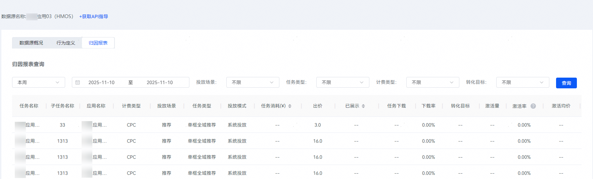

# 查询归因报表

创建任务后，您可以在归因报表中查看您的归因转化报表数据。

## 操作步骤

1. 登录[华为应用市场应用推广平台](https://ads.huawei.com/cn/)。
2. 点击“工具”页签，在“资产管理”中选择“数据资产”，进入“数据资产”页面。

   
3. 在数据源“操作”中点击“详情”。

   
4. 在“归因报表”中可以显示所有已选择归因目标的任务，包括任务的曝光、下载、出价、深度转化成本、注册、激活等数据。报表支持筛选时间周期、任务类型、计费类型、转化目标。
