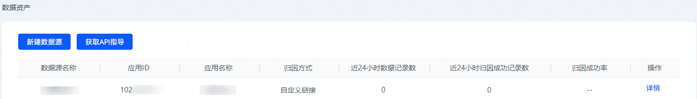
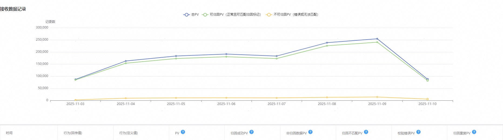

# 查询数据源

## 操作步骤

1. 登录[华为应用市场应用推广平台](https://ads.huawei.com/cn/)。
2. 点击“工具”页签，在“资产管理”中选择“数据资产”，进入“数据资产”页面。

   
3. 在数据源“操作”中点击“详情”。在“数据源概况”中，查看实时数据回传情况。

   

   

   在下方的数据报表可以查看更详细数据报表，关键字段解释如下：

   | <strong>字段</strong> | <strong>含义</strong> |
   | --- | --- |
   | PV | 接口接收到的总请求量。 |
   | 归因成功PV | 请求中callBack格式正确，且成功归因到任务上的请求量。 |
   | 非归因PV | 请求中callBack为0的请求量。 |
   | 归因不匹配PV | 一般是请求中callBack参数的值错误，请检查任务是否回传了callBack原值。 |
   | 校验错误PV | 转化请求格式不对，缺少必填参数或者必填参数拼写错误的请求量。 |
   | 归因重复PV | 多个请求oaid、callBack和actionTime完全一样，即同一用户多次转化，被判定重复。 |
