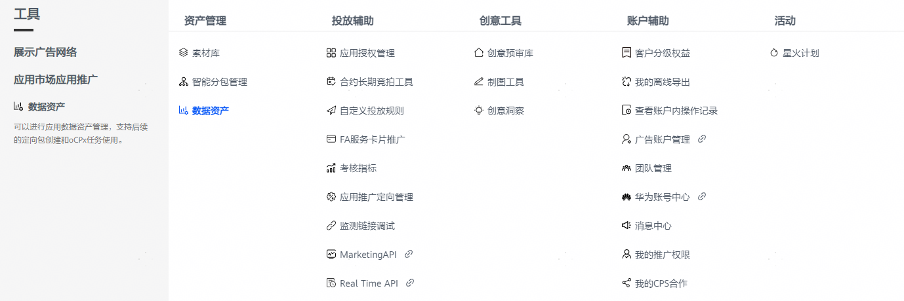
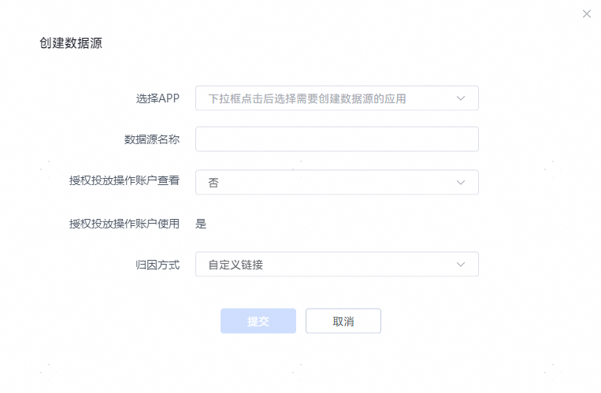
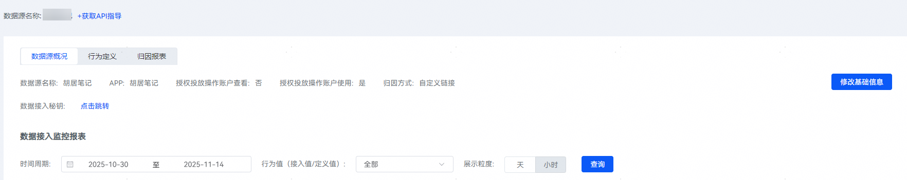
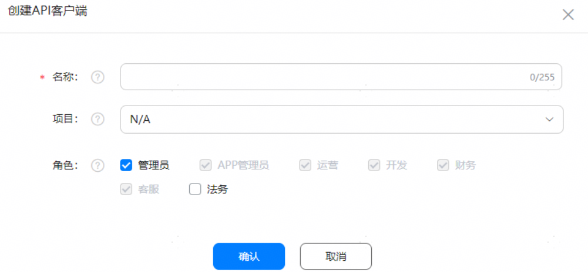
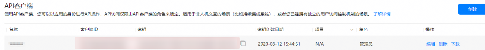

# 回传转化数据

## 前提条件

您已对接归因方案。

## 回传准备

开发者可以通过调用回传用户行为数据接口回传转化数据，回传前，需要完成以下准备工作：

- 创建数据源：用于存储开发者回传的转化数据。
- 创建API客户端：开发者调用API前，需申请[AppGallery Connect平台](https://developer.huawei.com/consumer/cn/service/josp/agc/index.html#/ups/9249519184595983326)的API调用授权凭据。

   

  您需要使用直客账户（即上传应用的开发者账号）完成上述数据回传准备工作。

### 创建数据源

1. 登录[华为应用市场应用推广平台](https://ads.huawei.com/cn/)。
2. 点击“工具”页签，选择“资产管理 &gt; 数据资产”，进入“数据资产”页面。

   
3. 点击“新建数据源”，配置相关任务设置项。

    

   如您对接的归因方式为 “监测链接”，归因方式选择“自定义链接”；如您对接的归因方式为“应用归因”，归因方式选择“应用归因服务”。

   

   | <strong>任务设置项</strong> | <strong>说明</strong> |
   | --- | --- |
   | 选择APP | 选择您需要投放的APP。 |
   | 数据源名称 | 默认为APP名称，创建后支持修改。 |
   | 授权投放操作账户查看 | 若需要代理投放，请选择“是”，授权后客户投放伙伴也可以查看数据回传情况。创建后支持修改。 |
   | 授权投放操作账户使用 | 默认支持。 |
   | 归因方式 | 根据您已对接的归因方案选择：  - 对接归因方案为“监测链接”时，选择“自定义链接”。 - 对接归因方案为“应用归因”时，选择“应用归因服务”。 |
4. 点击“提交”按钮完成数据源创建。若需要修改配置信息，请在数据源“操作”中点击“详情”后，点击“修改基础信息”进行修改。

   

   

### 创建API客户端

1. 登录[AppGallery Connect网站](https://developer.huawei.com/consumer/cn/service/josp/agc/index.html)，选择“用户与访问”。
2. 选择左侧导航栏的“API密钥 &gt; Connect API”，点击“创建”。（注：如鸿蒙应用的直客账号与安卓应用一致，可以共用密钥。如鸿蒙应用的直客账号变动，需要新建。）
3. 在“名称”列输入自定义的客户端名称，“项目”保持默认值“N/A”，“角色”选择“管理员”，点击“确认”。

    

   “项目”或“角色”选择错误会导致接口调用失败。

   
4. 客户端创建成功后在API客户端列表中记录“客户端ID”和“密钥”的值，提供给开发人员用于[回传转化数据](#section59231155142818)。

   

## 回传转化数据

开发者需要将自有归因系统匹配到的转化行为通过数据回传接口进行回传 ，回传步骤如下：

1. 根据[创建API客户端](#section1040426172715)中获取的“客户端ID”和“密钥”调用[获取Token](https://developer.huawei.com/consumer/cn/doc/promotion/bp-hm-token-0000002481641726)接口到华为[AppGallery Connect平台](https://developer.huawei.com/consumer/cn/service/josp/agc/index.html#/)进行鉴权，鉴权通过后将获得用于访问AppGallery Connect API的Access Token。
2. 通过已获取的Access Token作为请求参数，调用[回传用户行为数据接口](https://developer.huawei.com/consumer/cn/doc/promotion/bp-hm-backapi-0000002513681589)进行数据回传。
