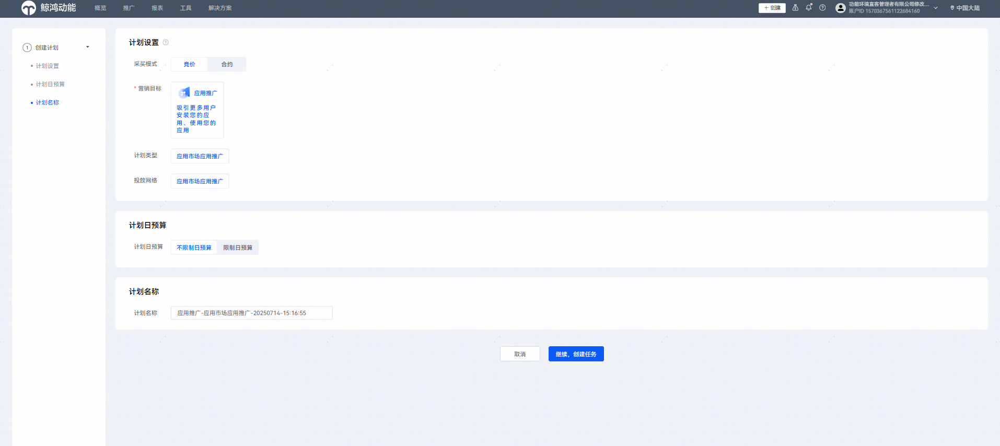
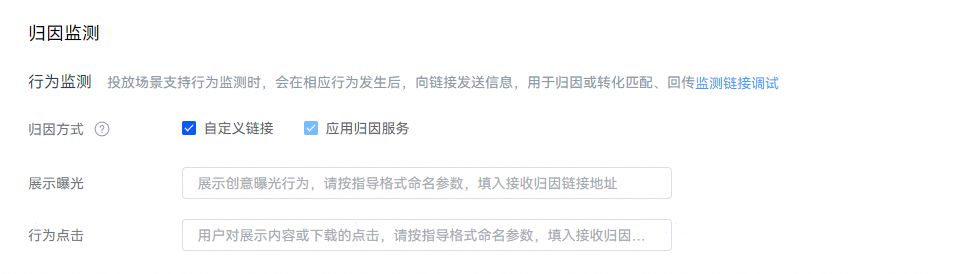
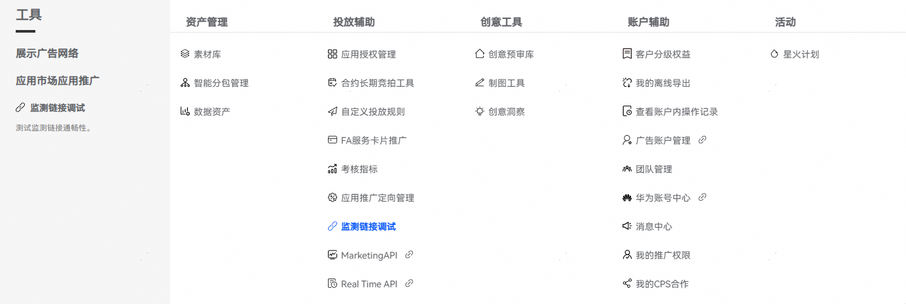
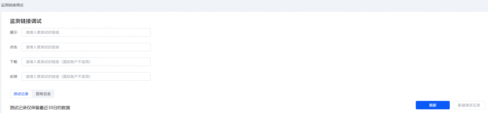
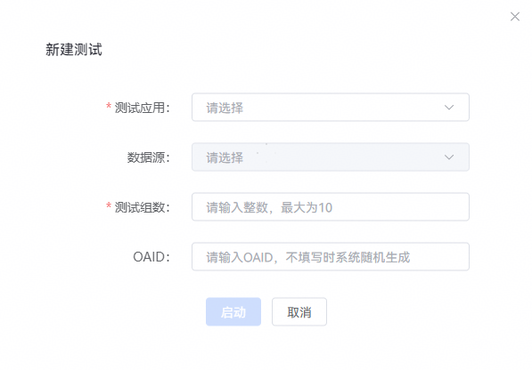
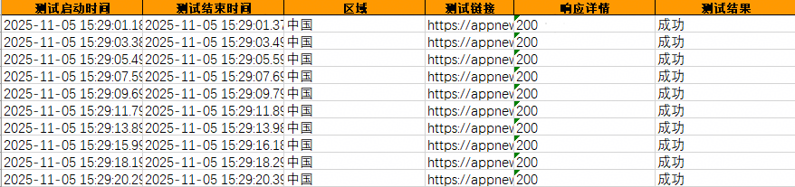

# 监测链接接入指导

## 业务介绍

监测链接发送服务是华为应用市场应用推广平台给开发者提供的针对推广行为的归因服务。开发者和推广平台之间通过服务端方式对接。开发者在创建推广任务时填写监测链接，推广任务正常投放后推广系统将展示曝光、行为点击事件明细发送到开发者服务器。开发者可针对两种事件分别配置不同的监测链接，未配置则不发送。

## 配置监测链接

### 操作步骤

1. 登录[华为应用市场应用推广平台](https://ads.huawei.com/cn/)， 您可以从概览页或者推广——计划入口创建计划。

   | **概览页——右上角——创建计划** | **概览页——总览——创建** | **推广——计划——创建计划** |
   | --- | --- | --- |
   |  |  |  |
2. 点击“创建任务”，进入“推广任务”页面，设置相关内容。

   
3. 在“归因监测”模块，选择“自定义链接”，可分别针对“展示曝光”、“行为点击”事件填写监测链接。

   

 

OAID（开放匿名设备标识符）是设备唯一匿名标识，能够精准匹配用户推广行为与后续转化，是推广归因的核心必需参数。若缺失 OAID，将无法精准追溯推广效果，建议确保监测链接正常接收该参数，保障归因数据准确完整。OAID获取方式请参见《[开放匿名设备标识服务](/docs/dev/app-dev/application-services/ads-kit-guide/oaid-service)》。

您可以提前完成链接测试，详情请参见链接测试。

监测链接格式：**https://***xxx.xxx.xxx/xxx***?***key1=value1&key2=value2&...*

- 监测链接必须为https格式（不支持使用IP地址作为监测链接域名），链接中支持大小写字母、数字以及下划线字符；当前仅支持JDK21的证书。
- 域名和URL路径请根据您的服务器情况自定义，请求方式为GET方式。
- Query参数中key需要您自定义，value为应用推广支持的宏参数，取值请参考[宏参数列表](#section1694535175515)：
  1. 宏参数格式中参数两边为双下划线，即参数左右两边均为两个连续的英文字符'\_'。
  2. 如果宏参数添加的常量携带有特殊字符，请进行URL编码处理。
  3. 链接上报参数中OAID必填，其余参数您可以根据自己的需要填写。
  4. 监测链接中的参数**key**可以重复，**value**不可以重复。
- 如果您的服务器对某些请求IP存在限制，需要开通IP允许清单，请联系运营提供。

  **举例**：参数中的特殊字符和汉字会进行URLEncode

  

### 监测链接所支持的宏参数

在配置监测链接后，华为服务器在给开发者的请求中会将定义链接中的宏参数替换为实际的宏参数值。**监测链接所支持的宏参数如下表所示****。**

| **参数** | **说明** |
| --- | --- |
| \_\_AID\_\_ | 任务ID。 |
| \_\_AID\_NAME\_\_ | 任务名称。 |
| \_\_APP\_ID\_\_ | 投放应用ID。  说明：  可支持获取HarmonyOS版本5.0及以上的鸿蒙应用ID（与HarmonyOS版本低于5.0的应用ID不一样）。需确保云端服务器接收后能够处理并归因。 |
| \_\_APP\_NAME\_\_ | 投放应用名称（默认语言）。 |
| \_\_GROUP\_NAME\_\_ | 定向包名称。  若非定向任务直接返回空。 |
| \_\_GROUP\_ID\_\_ | 定向包ID。  若非定向任务直接返回空。 |
| \_\_OAID\_\_ | 客户端采集上报的OAID信息。  **该参数必选**。 |
| \_\_ACTION\_TYPE\_\_ | 归因类型：   - IMP：对应精准曝光监测链接。 - CLICK：对应点击上报监测链接。 - DEEPLINKCLICK：对应打开跳转deeplink上报监测链接。 |
| \_\_TS\_\_ | 以毫秒为单位时间戳（北京时间），例如：1625714142001。  不同事件TS对应的含义不同：   - 展示曝光：应用市场客户端推广位曝光时间。 - 行为点击：用户点击的时间。具体口径：   1. 点击icon   2. 图片   3. 视频   4. 热词   5. 安装按钮   6. 打开按钮 |
| \_\_CALLBACK\_\_ | 推广请求时生成的归因标识ID用于进行转化数据回传。  参数示例：   ``` "callBack":"security:384330423431434635444431424135413031433739464631353338 4545413042:B4559624D440788AC9.....7D43E5DDCB68820" ``` |
| \_\_SUB\_TASKID\_\_ | 子任务ID。  若为定向字词子任务直接返回空。 |

## 链路测试

通过链路测试，可以对监测链接、数据回传进行联调测试。

### 操作步骤

1. 登陆[投放端](https://developer.huawei.com/consumer/cn/service/apcs/promote/chassis/home)， 点击“工具”页签，在“投放辅助”中选择“监测链接调试”，进入“监测链接调试”页面。

   
2. 按格式要求，填写1个或2个监测链接后，点击“新建测试记录”。鸿蒙应用仅需调试展示、点击监测链接。

   
3. 进入“新建测试”页面，设置“测试应用”、“数据源”、“测试组数”和“OAID”，完成后，点击“启动”。

   

   | **任务设置项** | **说明** |
   | --- | --- |
   | 测试应用 | 选择您需要测试的应用。 |
   | 数据源 | 当测试应用名下无数据源时，此筛选框置灰，系统自动为应用创建临时数据源进行测试；当测试应用名下有数据源时，此筛选项可选，可选项为全部名下已建立的数据源。 |
   | 测试组数 | 设定下发的归因信息次数，比如填写2，则会向监测链接发两次信息。 |
   | OAID | 设定下发的设备OAID。可以填写开发者运营设备的OAID，可以测试该OAID发生转化后，开发者系统是否把转化回转到华为。如果正确回传，则在回传日志中可以看到数据回传量数据，并且会显示回传请求是否正确和匹配异常状态。  说明：  如您没有填写OAID，则转发默认值。  开放匿名设备标识符（OAID）的获取方式：设置>隐私和安全>跨应用关联>查看OAID。 |
4. 测试记录保留最近30日的数据，可以查看测试的启动时间、结束时间、测试组数、测试成功率。点击“详情”，可以下载本次测试的详细记录，详细信息包括“测试启动时间”、“测试结束时间”、“测试链接”、“响应详情”、“测试结果”。

   

   
