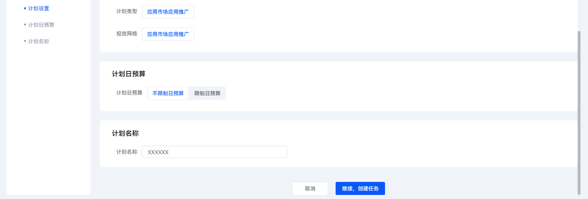
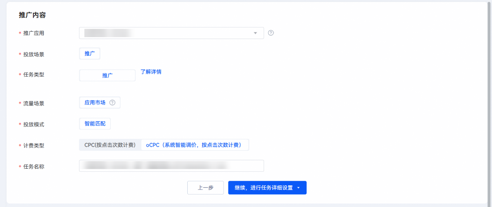
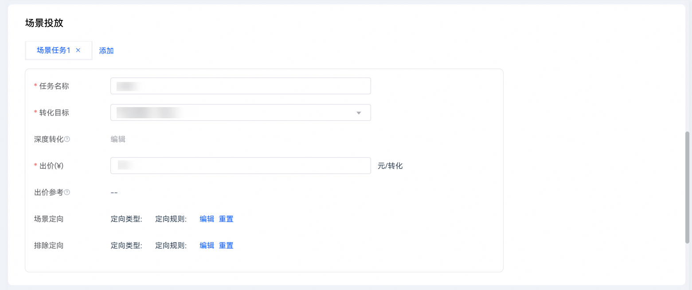
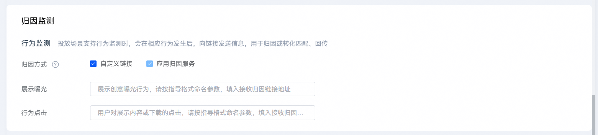

# 创建oCPC任务

## 前提条件

连续[回传转化数据](https://developer.huawei.com/consumer/cn/doc/promotion/bp-hm-callback-0000002513681587)等于或大于4天，且每天回传量超过5个。

 

下载、平台激活目标不涉及回传。

## 操作步骤

1. 登录[华为应用市场应用推广平台](https://ads.huawei.com/cn/)，进入“概览”主页面，点击左上角“创建”按钮，下拉框中选择“创建任务”。
2. 在“计划设置”模块，为新建任务设置日预算。填写计划名称，点击“继续，创建任务”。

   
3. 在“计划设置”模块，选择“计费类型”为“oCPC”。填写新任务名称，点击“继续，进行任务详细设置”。

   
4. 在“场景投放”栏目新建oCPC任务，设置任务名称、选择转化目标并出价。

    

   以投放“激活”为例，出价按照应用考核的激活成本填写，出价过低会导致oCPC量级较少。前期为更好起量，建议激活出价&gt;=当前CPC任务的激活成本\*120%，每日预算建议设置为5000以上。

   
5. 在“归因监测”栏目选择“自定义监测”，并按监测链接要求填写，请至少填写一个链接。

   
