# HarmonyOS应用推广任务

 

<strong>文中HarmonyOS应用指HarmonyOS 5.0及以上版本应用。</strong>

需先完成申请或授权步骤，否则无法进行HarmonyOS应用（HMOS）推广，请参考：

直客：确认HarmonyOS应用（HMOS）已开通推广评测权限；若未申请，请参考[推广评测申请指南](https://developer.huawei.com/consumer/cn/doc/promotion/bp-start-guest-apply-evaluation-0000001346654709)。

客户投放伙伴：确认直客已开通推广评测权限，并完成应用授权给客户投放伙伴投放操作账户，请参考[应用授权指南](https://developer.huawei.com/consumer/cn/doc/promotion/bp-start-guest-authorize-0000001346774281)。

## 操作步骤

1. 登录[推广平台](https://developer.huawei.com/consumer/cn/service/apcs/promote/chassis/memberCenter/promotion)，点击右上角“登录”，进入“账户登录”页面，选择已有HarmonyOS应用授权的推广账号，点击“进入系统”。
2. 点击“创建计划”，完成竞价模式，日预算配置。

   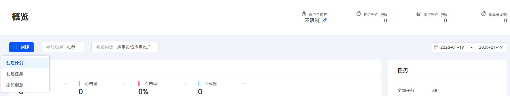

   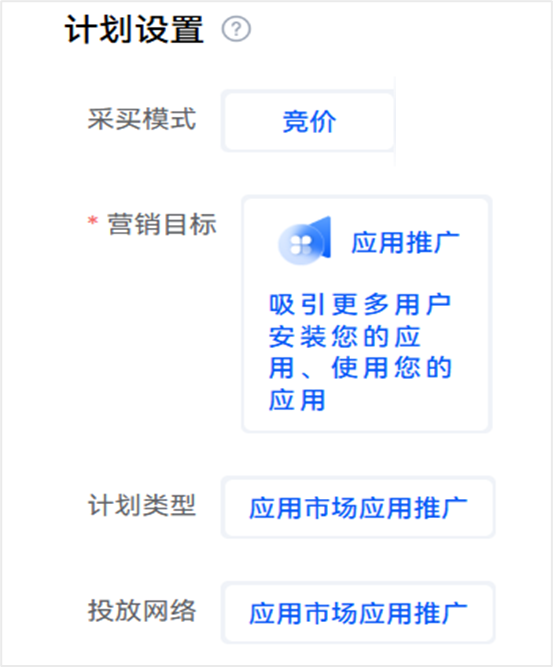

   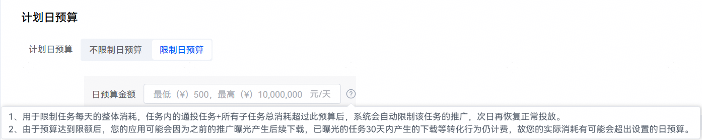

   |  |  |
   | --- | --- |
   | 计划设置项 | 说明 |
   | 采买模式 | 选择“竞价”。 |
   | 营销目标 | 默认选择“应用推广”。 |
   | 计划类型 | 默认选择“应用市场应用推广”。 |
   | 投放网络 | 默认选择“应用市场应用推广”。 |
   | 计划日预算 | 最低（￥）500 – 最高（￥）10,000,000  1. 用于限制任务每天的整体消耗，任务内的通投任务+所有子任务总消耗超过此预算后，系统会自动限制该任务的推广，次日再恢复正常投放。 2. 由于预算达到限额后，您的应用可能会因为之前的推广曝光产生后续点击，已曝光的任务24小时内产生的点击等转化行为仍计费，故您的实际消耗有可能会超出设置的日预算。 |
3. 选择HarmonyOS应用（含‘HMOS’标识）创建推荐任务，选择“推广”任务类型，在推广内容模块，配置相关任务设置项。

   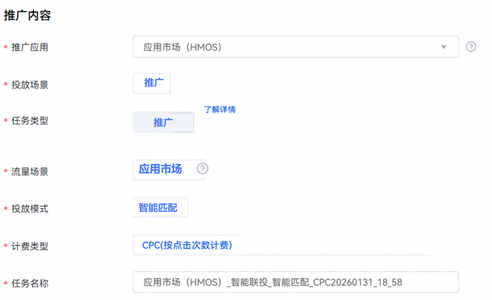

   |  |  |
   | --- | --- |
   | <strong>任务设置项</strong> | <strong>说明</strong> |
   | 被推广应用 | 选择您需要推广的应用。 |
   | 投放场景 | 默认选择“推广”。 |
   | 任务类型 | 默认选择“推广”。 |
   | 流量场景 | 默认投放到HarmonyOS应用市场。 |
   | 投放模式 | 默认选择“智能匹配”。 |
   | 计费类型 | CPC，采用按点击次数计费。  oCPC，采用oCPC智能出价模式。 |
   | 任务名称 | 命名格式建议：应用名称+任务类型+投放模式+任务创建日期，长度不超过50个字符。 |
4. 配置完成后，点击“继续，进行任务详细设置”。
5. 在“投放控制”设置模块，配置相关任务设置项。

   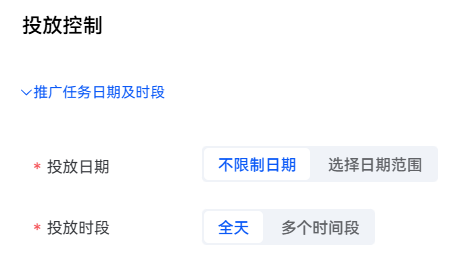

   |  |  |
   | --- | --- |
   | 任务设置项 | 说明 |
   | 投放日期 | 取值范围：  - 长期投放：该任务不限时间。 - 选定日期：设置任务执行的开始和结束时间。 |
   | 投放时段 | 取值范围：  - 不限时段：一周内每天全时段（7×24小时）任务都在投放。 - 选定时段：选定想要的时间段进行任务投放。 |
6. 在“场景投放”设置模块，配置相关任务设置项。

   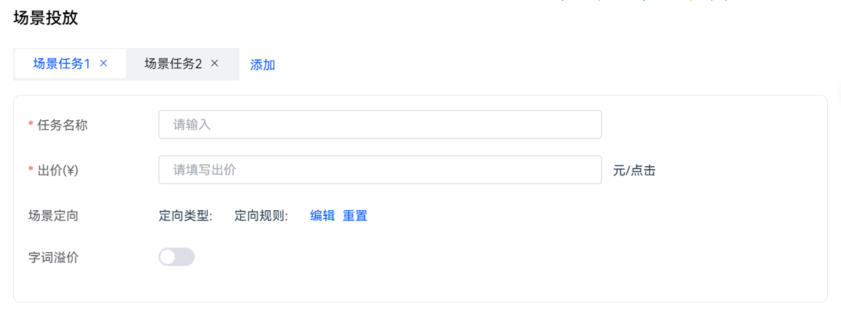

    

   添加场景任务数量，请点击“添加”按钮；对应场景子任务数的上限是10个。

   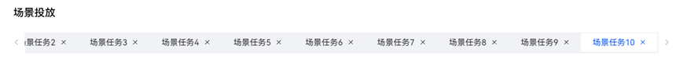

   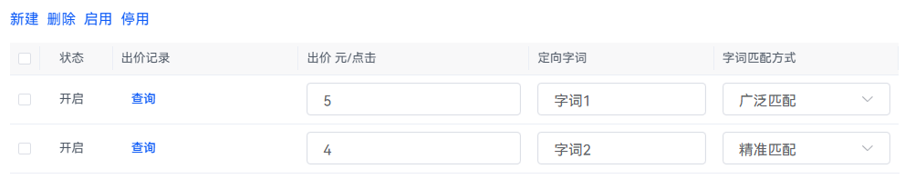

   |  |  |
   | --- | --- |
   | <strong>任务设置项</strong> | <strong>说明</strong> |
   | 任务名称 | 推荐任务所在的场景子任务名称。同一任务内的场景子任务名称唯一、不能重复，命名格式建议：应用(HMOS)+推广+CPC。 |
   | 场景任务出价 | 子任务的出价是单独出价，参与竞价，每次点击会按照您设置的出价进行扣费。  HarmonyOS应用推广投放出价最低2元。 |
   | 定向人群相关 | 默认不限制；建议不圈选定向人群，否则可能推广曝光较少。 |
   | 字词溢价 | 最大可创建10个搜索词子任务；支持定向字词溢价出价，建议大于场景任务出价；如场景任务出价2元，定向字词溢价出价大于2元。 |
   | 定向字词 | 设置需投放的字词，支持单独出价。 |
   | 字词匹配方式 | 支持精准匹配、广泛匹配。 |

    

   字词溢价需要高于场景出价，否则影响字词投放效果。
7. 在“归因监测”模块，默认勾选“自定义链接”，可分别针对“展示曝光”、“行为点击”事件填写监测链接。点击详见[HarmonyOS应用监测链接指南](https://developer.huawei.com/consumer/cn/doc/promotion/bp-hm-monitoring-link-0000002481479774)。

   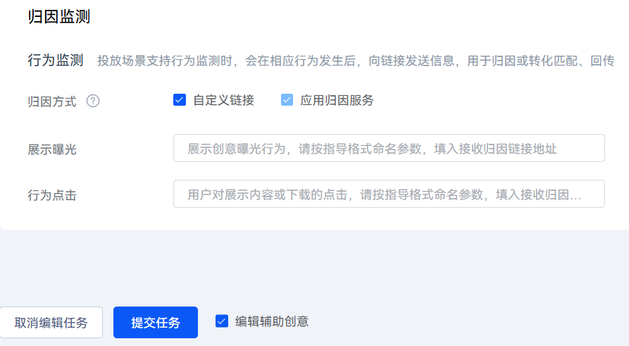
8. 以上设置模块均填写完毕后，默认勾选”编辑辅助创意”，点击“提交任务”，进入“推广创意”设置模块，配置相关任务设置项。

   |  |  |
   | --- | --- |
   | 任务设置项 | 说明 |
   | 展示类型 | 默认ICON。 |
   | 应用一句话简介 | 如果您  - 不填，默认使用上架时的“应用一句话简介”。 - 自定义，不能为空，支持最多80个汉字，160个英文字符，不允许输入特殊字符。 |
   | 应用介绍 | 默认支持应用详情。 |

   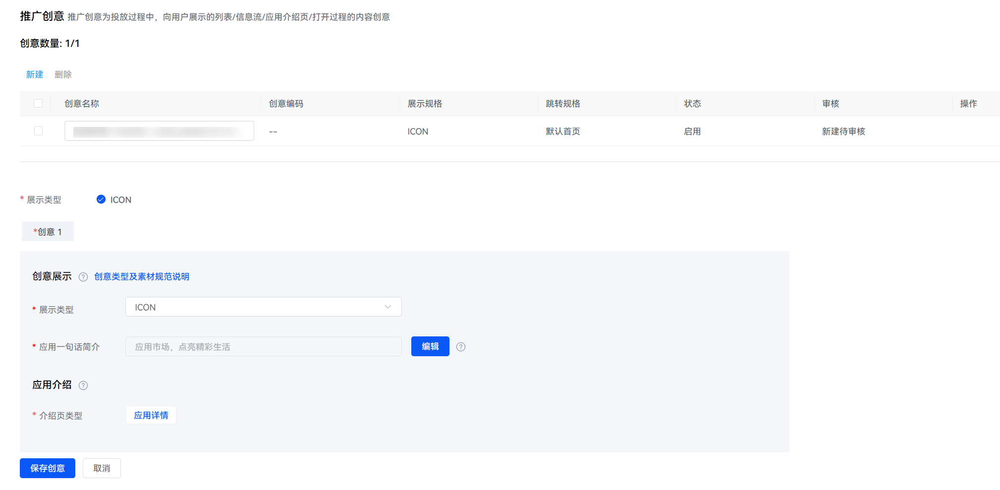
9. 如果您输入自定义文案，需要点击“保存创意”，并点击 “提交任务辅助信息”。

   如您不自定义文案，不需要保存创意，点击“保留任务，取消编辑任务辅助信息”即可。

   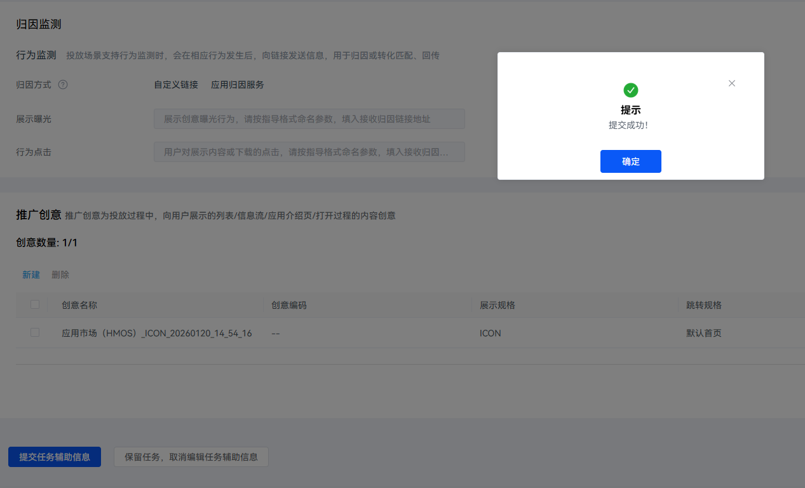

## <strong>您可能会遇到其他问题：</strong>

<strong>1.“计划已关联任务”弹窗提醒，无法提交任务。</strong>

因为一个计划，只能关联一个任务，故只需重新创建计划，即可提交任务。

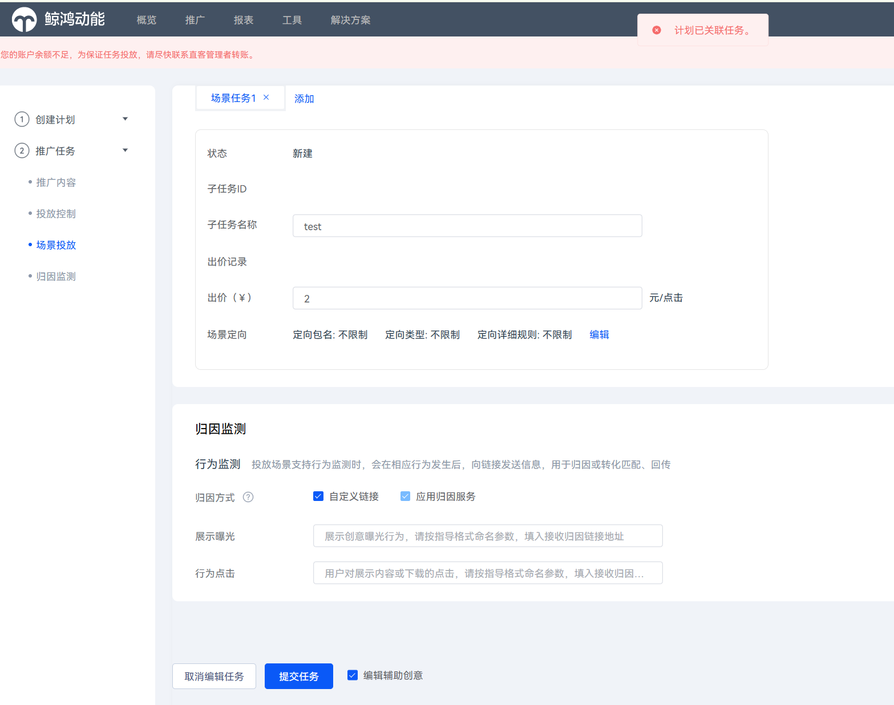

<strong>2.“子任务必须大于等于¥2，小于等于¥1,000。保留两位小数。”弹窗提醒，无法提交任务。</strong>

请检查是否每个“场景任务”均有出价信息，若无，则补齐后提交。

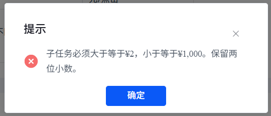

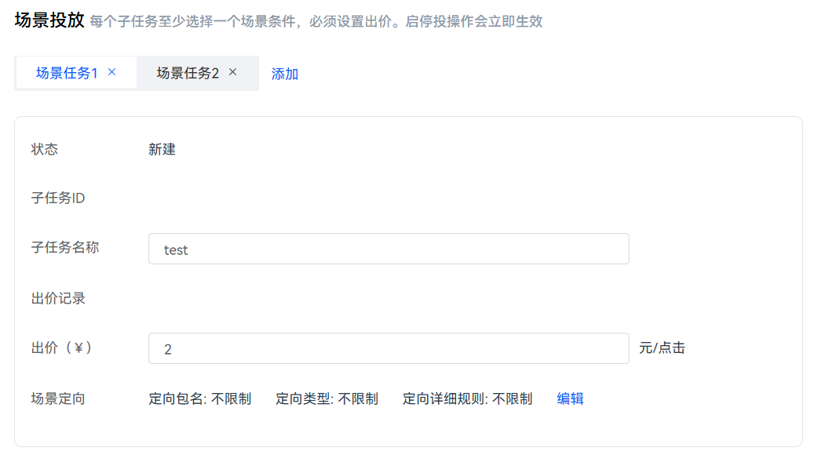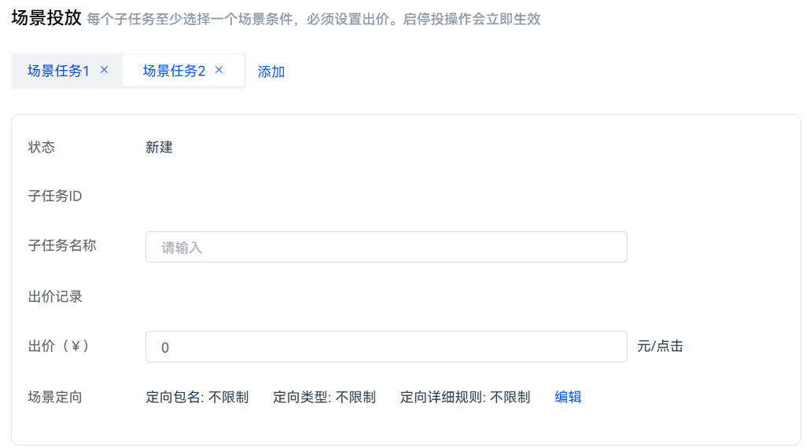
