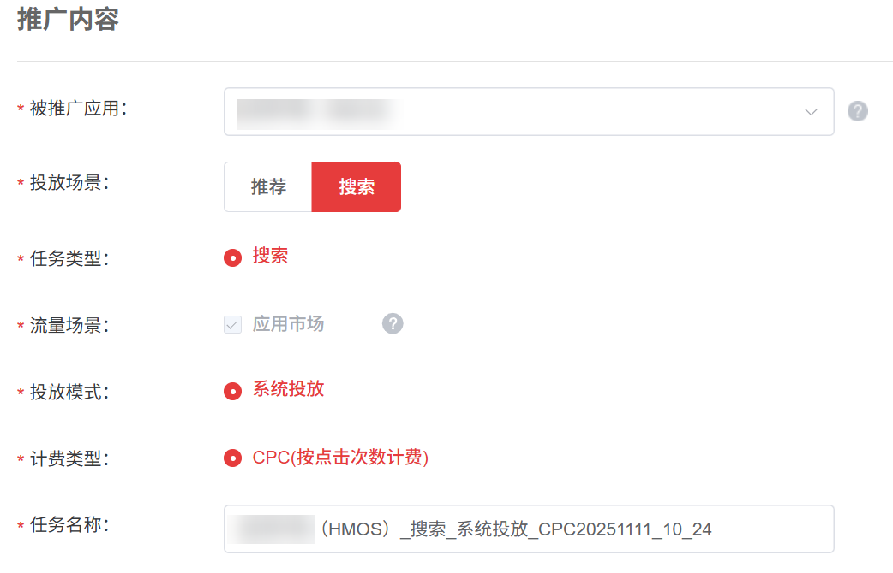
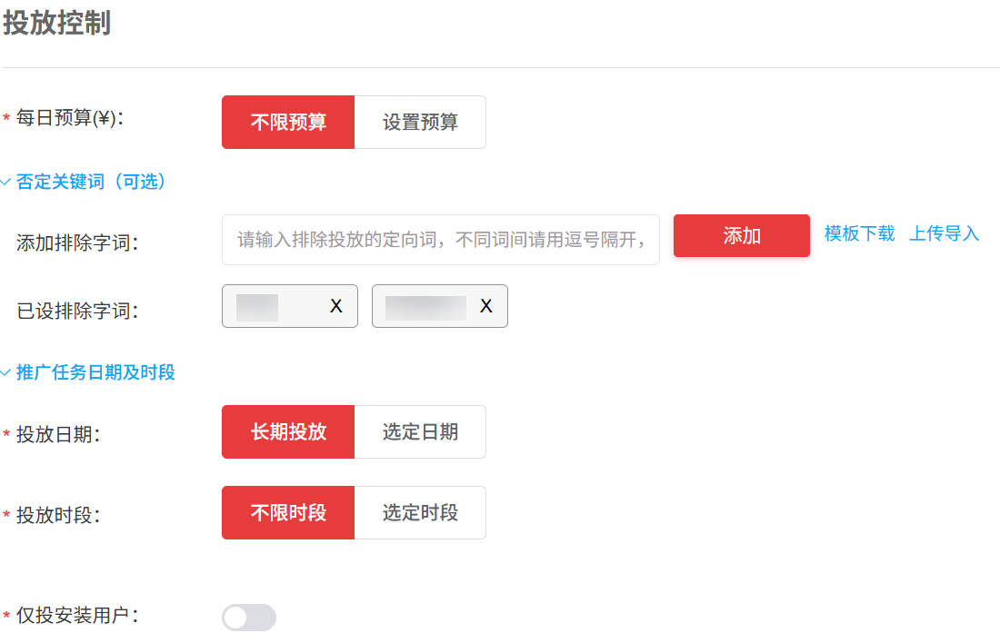
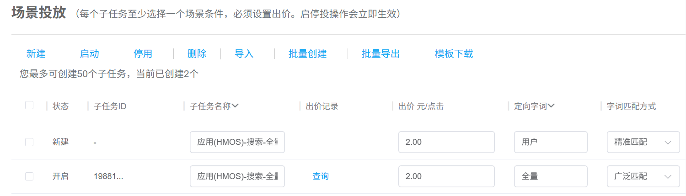
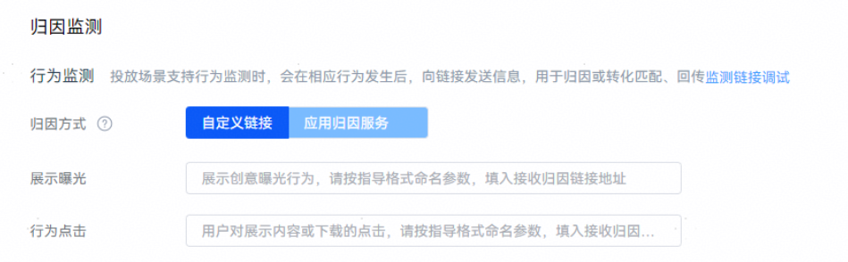
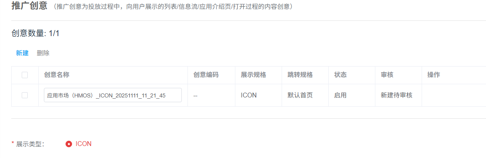
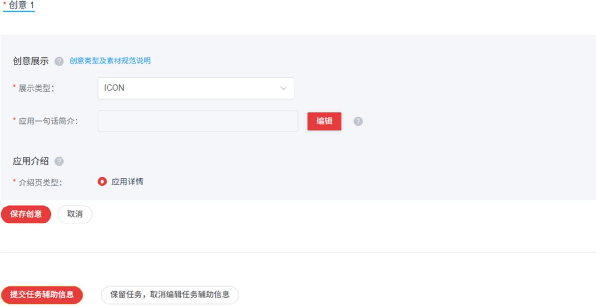

# 鸿蒙应用搜索任务

1. 登录[推广平台](https://developer.huawei.com/consumer/cn/service/apcs/promote/chassis/memberCenter/promotion)，点击右上角“登录”，进入“账户登录”页面，选择已有HMOS鸿蒙应用授权的推广账号，点击“进入系统”。
2. 选择鸿蒙应用 (含‘HMOS’标识）创建搜索任务，在推广内容模块，配置相关任务设置项。

   

   |  |  |
   | --- | --- |
   | <strong>任务设置项</strong> | <strong>说明</strong> |
   | <strong>被推广应用</strong> | 选择您需要推广的应用。 |
   | <strong>投放场景</strong> | 选择“搜索”。 |
   | <strong>任务类型</strong> | 选择“搜索”。 |
   | <strong>流量场景</strong> | 投放到华为应用市场。 |
   | <strong>投放模式</strong> | 系统投放：应用推广主要投放方式，投放系统通过各类算法将应用推送至客户端展示。 |
   | <strong>计费类型</strong> | CPC，采用按点击量计费。 |
   | <strong>任务名称</strong> | 命名格式建议：应用名称+任务类型+投放模式+任务创建日期，长度不超过50个字符。 |
3. 配置完成后，点击“继续，进行任务详细设置”。
4. 在<strong>“投放控制”</strong>设置模块，配置相关任务设置项。

   

   |  |  |
   | --- | --- |
   | <strong>任务设置项</strong> | <strong>说明</strong> |
   | 每日预算 | 推广任务每日（自然日）目标消耗的金额，每天的实际消耗接近本预算时，系统会自动限制推广，第二天再启动推广。由于到达预算限额后，您的应用可能会因为之前的推广曝光产生后续下载，这部分下载量仍计费，所以您的实际消耗有可能会超出设置的日预算。 |
   | 否定关键词 | 取值范围：  - 添加排除字词： 方法一：直接输入，不同词间，支持中文/英文逗号隔开  方法二：通过下载模版，完成填写后上传，即可 - 已设排除字词：一个任务最多填写200个字词，超过的系统将自动过滤不展示 |
   | 投放日期 | 取值范围：  - 长期投放：该任务不限时间。 - 选定日期：设置任务执行的开始和结束时间。 |
   | 投放时段 | 取值范围：  - 不限时段：一周内每天全时段（7×24小时）任务都在投放。 - 选定时段：选定想要的时间段进行任务投放。 |
   | 仅投放安装用户 | 默认关闭，覆盖已安装与无安装用户；如需促活，则开启 |
5. 在<strong>“场景投放</strong>”设置模块，配置相关任务设置项。

    

   搜索任务对应子任务数的上限是50个。

   

   |  |  |
   | --- | --- |
   | <strong>任务设置项</strong> | <strong>说明</strong> |
   | 子任务名称 | 关键词所在的子任务名称。  同一任务内的子任务名称唯一、不能重复，命名格式建议：应用（HMOS）+关键词+匹配方式。 |
   | 出价 | 可针对关键词的广泛匹配和精准匹配分别出价。系统将使用您设置的出价去进行竞价，每次下载会按照您设置的关键词出价进行扣费。  鸿蒙应用推广投放建议出价1元以上，否则可能竞得曝光较少。 |
   | 定向字词 | 设置投放的关键词。 |
   | 匹配方式 | 匹配方式分为广泛匹配和精准匹配。  - 匹配方式为广泛匹配时，用户搜索词与您的投放关键词高度相关时，即使您并未提交这些词，您的推广应用也可能获得展现机会。可能触发的搜索词包括：同义词、包含投放关键词的搜索词、变体形式（如：加空格，错别字等）。 - 匹配方式为精确匹配时，用户搜索词必须与您的投放关键词一致，您的应用才有可能展现出来。添加关键词时，系统默认匹配方式为广泛匹配，您可以根据推广需求设置关键词的匹配方式。 |
   | 建议定向内容 | 建议定向内容即为推荐关键词，是系统匹配到的用户可能会在找您的产品或者服务时使用的搜索词及其热度，直接点击“添加”添加合适的关键词。同时可以在搜索框里搜索关键词，快速获取想投放的关键词是否在系统推荐的关键词内及其热度。 |
6. 在<strong>“归因监测”</strong>模块，勾选“自定义链接”，可分别针对“展示曝光”、“行为点击”事件填写监测链接。点击详见[鸿蒙应用监测链接指南](https://developer.huawei.com/consumer/cn/doc/promotion/bp-hm-monitoring-link-0000002481479774)。

   
7. 以上设置模块均填写完毕后，默认勾选”<strong>编辑辅助创意</strong>”，点击<strong>“提交任务”</strong>，进入“<strong>推广创意”</strong>设置模块，配置相关任务设置项。

   |  |  |
   | --- | --- |
   | <strong>任务设置项</strong> | <strong>说明</strong> |
   | 展示类型 | ICON类任务。如果您不需要任何创意可以直接点击“提交创意”或“提交，不编辑创意”，不会影响您的任务正常投放。 |
   | 应用一句话简介 | 必填项。不超过80个全角（汉字），160个半角（英文）字符，不允许输入特殊字符。不填，则显示上架时的默认文案。 |
   | 应用介绍 | 默认支持应用详情。 |

   

   
8. 点击<strong>“保存创意”</strong>，再点击<strong>“提交任务辅助信息”</strong> ，完成任务创建。
