# 鸿蒙应用推广激励查询

鸿蒙应用/游戏“新投激励”和“消耗返利”发放后，客户在“开发者联盟”、“鲸鸿动能广告平台”的财务信息、鸿蒙应用新投激励页面及“鲸鸿动能-服务商管理平台”的返利金账户详情及鸿蒙应用市场激励金页面，均可查看激励发放情况，以下将针对这四个入口进行详细的查询说明。

## 一、在开发者联盟查询新投激励和消耗返利

首先需明确，只有直客和一级服务商可以在开发者联盟查询到金额明细。

1. 在[华为开发者联盟](https://developer.huawei.com/consumer/cn/)，登录直客/一级服务商账号。
2. 进入我的账户-余额-充值记录，“充值用途”筛选“鸿蒙应用市场推广基金”，在“订单类型”下， 可查看“消耗返利-鸿蒙应用新投激励”和“消耗返利-鸿蒙应用新投激励”两类订单。

   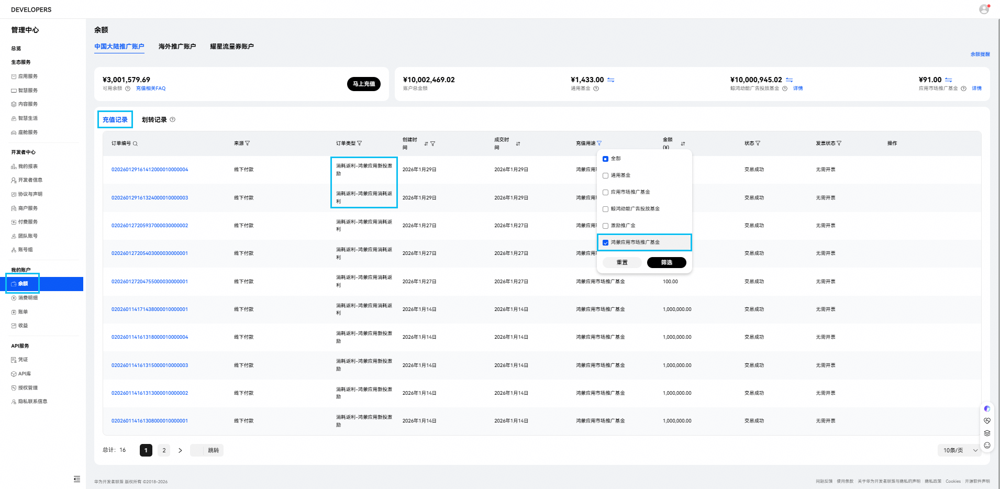
3. 点击“订单编号”，可进入订单详情，查看该订单具体发放的应用及金额等信息。

   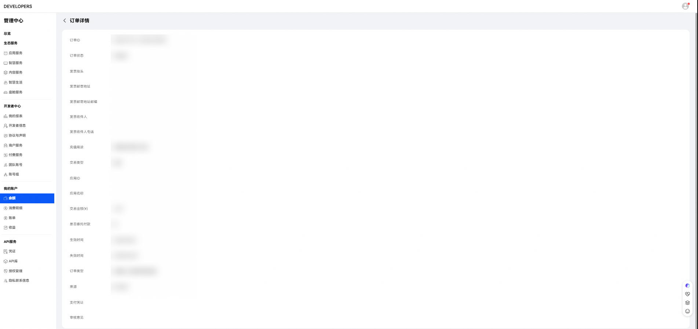

## 二、在鲸鸿动能广告平台-财务信息查询新投激励和消耗返利

1. 在鲸鸿动能广告平台，登录直客/子客账号，点击账户-查看财务信息。

   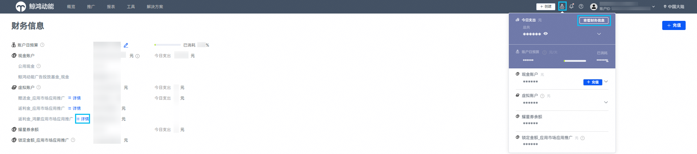
2. 找到虚拟账户-返利金\_鸿蒙应用市场应用推广，点击“详情”，可查看“鸿蒙应用新投激励”和“鸿蒙应用消耗返利”。

    

   子客的鸿蒙应用消耗返利默认发放至一级服务商账户，需在服务商完成转账后，才可在对应子客账户里查看到消耗返利余额。

   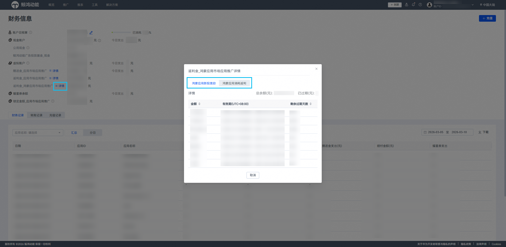
3. 直客：在财务信息-充值记录-充值用途选择“虚拟金账户充值”，在资金账户类型下，可查看到“返利金账户\_鸿蒙应用新投激励”和“返利金账户\_鸿蒙应用消耗返利”两类充值订单。

   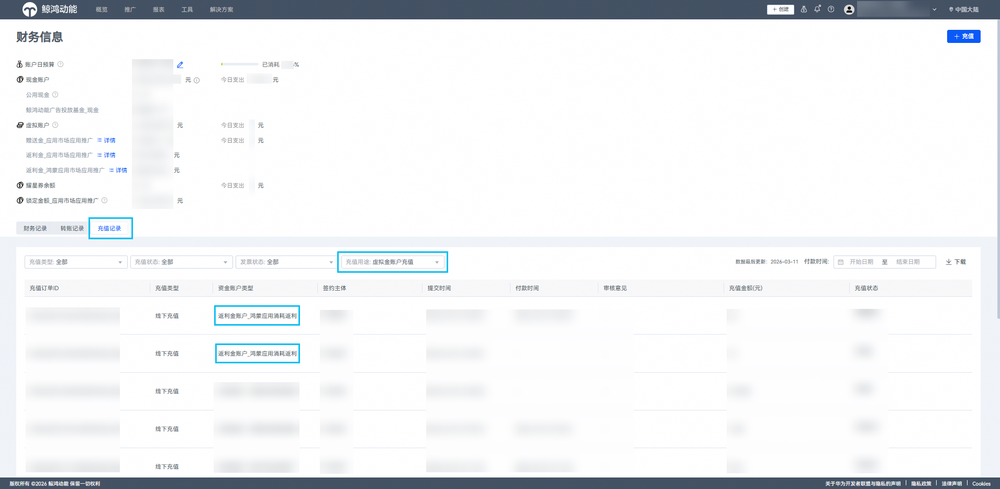
4. 子客：在财务信息-转账记录-账户类型选择“鸿蒙应用新投激励”或“鸿蒙应用消耗返利”，可查看这两类激励订单的转账情况。

    

   鸿蒙消耗返利默认发放至一级服务商账户，需在服务商完成转账后，才可在对应子客账户里查看到转账记录。

   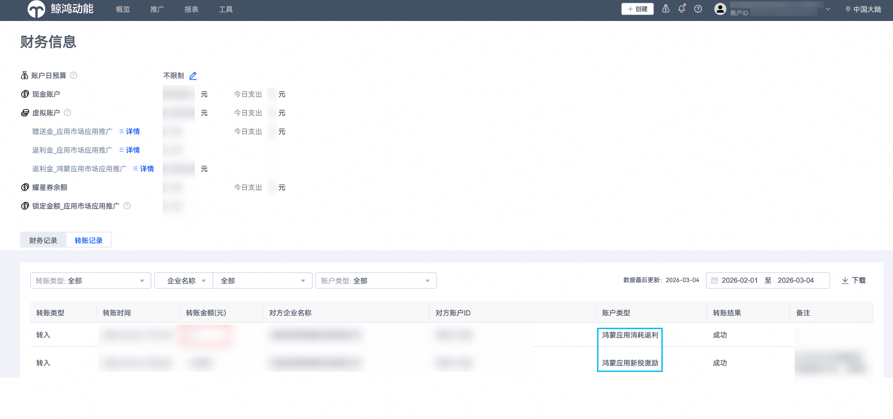

## 三、在鲸鸿动能广告平台-鸿蒙应用新投激励页面查询新投激励

- 在鲸鸿动能广告平台，登录直客/子客账号，点击工具-活动-鸿蒙应用新投激励，可查看分应用的鸿蒙新投激励发放情况。

  

   

  1. 在应用新投激励发放前，直客可对应用进行新投激励授权（详见下文：[鸿蒙新投激励授权指引](https://developer.huawei.com/consumer/cn/doc/promotion/bp-query-0000002558498301#section141031047228)），即可将新投激励发放至指定直客/投放操作账户；另，直客可看到账户下全部应用的新投激励情况，而子客只能看到账户下在投或者被进行激励授权的应用的新投激励明细。
  2. 新投激励发放前，激励金状态会显示“未达标”，达到激励门槛发放激励金后，激励金状态会显示“已激活”。

  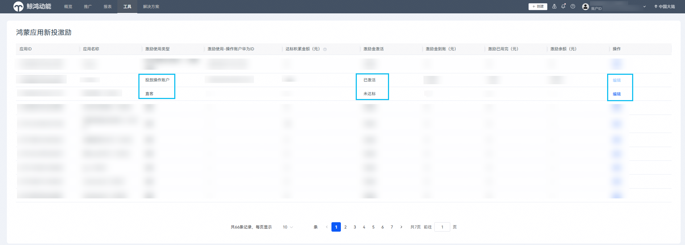

## 四、在鲸鸿动能-服务商管理平台查询新投激励和消耗返利

- 路径①：在鲸鸿动能广告平台，登录一级服务商/子客服务商账号，在首页-返利金账户详情里，可查看“鸿蒙应用新投激励账户”和“鸿蒙应用消耗返利账户”两个资金账户类型的金额和有效期。

   

  消耗返利默认发放至一级服务商账户，待一级服务商转账给子客服务商后，子客服务商才可按当前路径查看到对应的金额。

  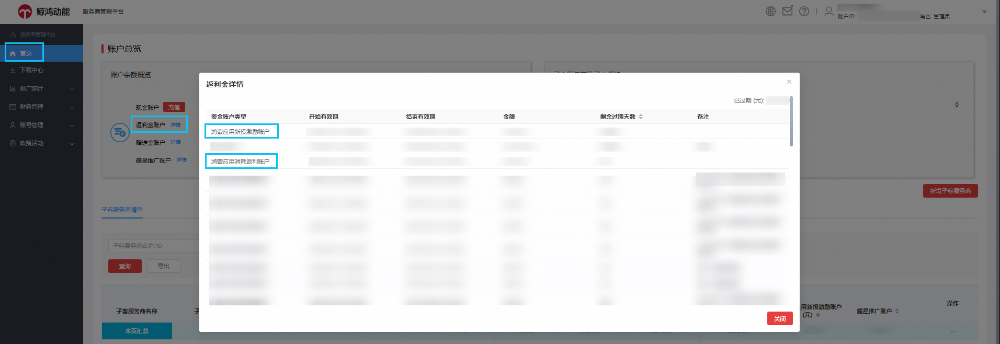
- 路径②：在鲸鸿动能广告平台，登录一级服务商/子客服务商账号，在首页-子客服务商/子客清单-余额，可查看“鸿蒙应用新投激励账户”和“鸿蒙应用消耗返利账户”两个资金账户类型的金额，也可在此进行转账操作。

   

  消耗返利默认发放至一级服务商账户，待一级服务商转账给子客服务商后，子客服务商才可按当前路径查看到对应的金额。

  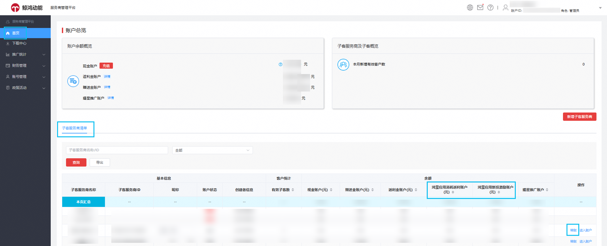
- 路径③：在鲸鸿动能广告平台，登录一级服务商/子客服务商账号，在政策活动-鸿蒙应用市场激励金页面，可查看分应用的“鸿蒙应用新投激励”详情。

  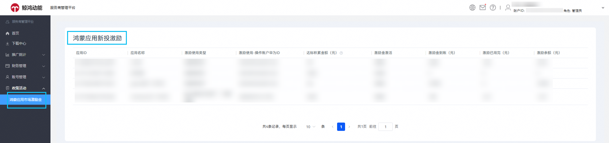

## 五、鸿蒙新投激励授权指引

1. 打开鲸鸿动能广告平台，登录直客账户，点击工具-活动-鸿蒙应用新投激励，进入新投激励页面。

   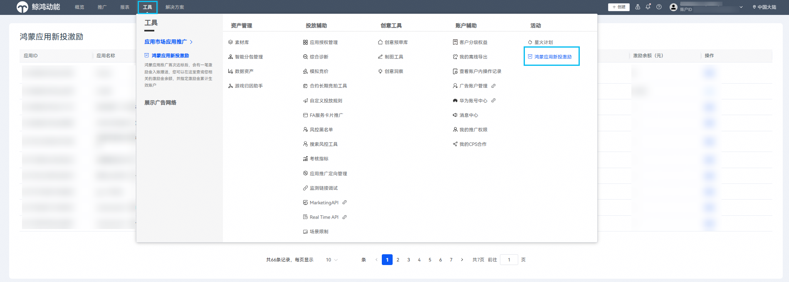
2. 找到要进行激励授权的应用，最左侧点击“编辑”。

   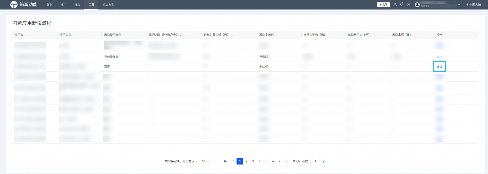
3. 在“激励使用类型”下，可下拉选择“直客”或“投放操作账户”，若选择投放操作账户，则需填写对应的投放操作账户ID，填写完成后，点击左侧“完成”按钮。

   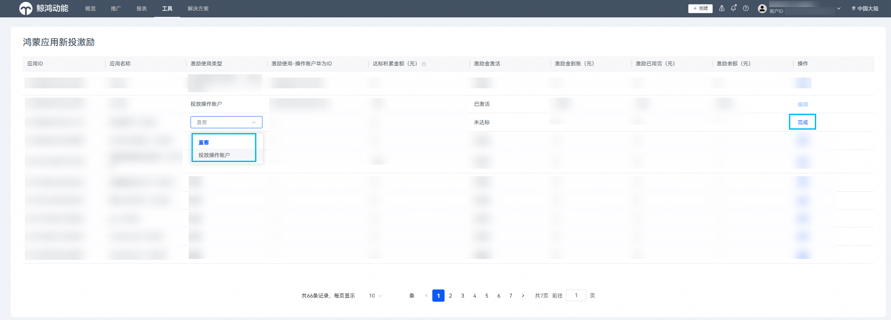
4. 完成激励授权后，登录“被授权”的“投放操作账户”，点击工具-活动-鸿蒙应用新投激励，进入新投激励页面，查看是否有被授权应用的相关激励信息。

   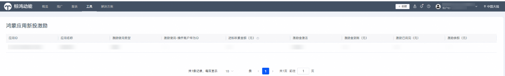

 

<strong>鸿蒙应用新投激励发放规则</strong>：

- 若应用已进行鸿蒙新投激励授权，则对应应用的新投激励将发放至授权账户；
- 若未进行激励授权，且该应用只有唯一的在投账户，则新投激励将发放至该应用在投的直客/投放操作账户；
- 若一个应用授权给多个投放操作账户投放，则一定要进行新投激励授权。
