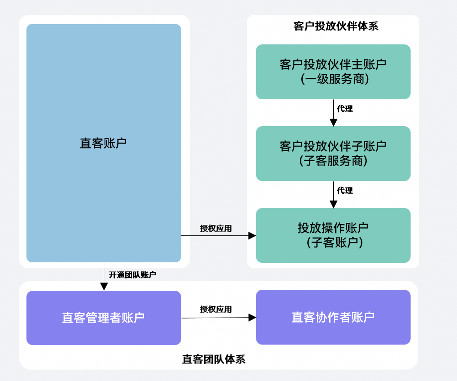
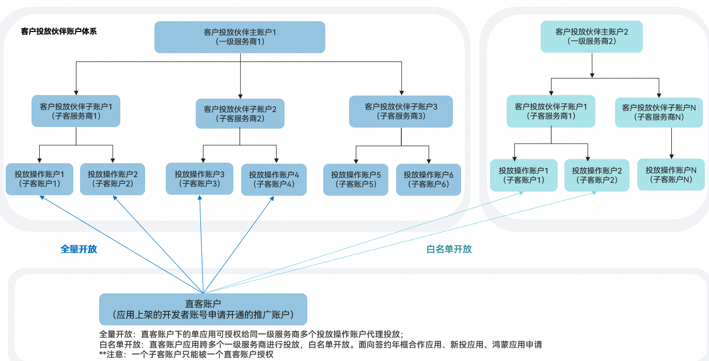

# 账户体系概述

## 华为账号

华为账号是个人或企业的统一身份账号，用于登录华为开发者联盟 / AppGallery Connect / 应用推广账户等。您可以在华为开发者联盟注册，支持手机、电子邮箱两种注册方式。详见：[开发者注册](https://developer.huawei.com/consumer/cn/doc/start/registration-and-verification-0000001053628148)。

1. 一个华为账号只能绑定一个应用推广账户，绑定推广账户的华为账号[企业实名认证](https://developer.huawei.com/consumer/cn/doc/start/edrna-0000001062678489)要求如下：
   - 注册申请直客账户或者客户投放伙伴主账户的华为账号，必须完成企业实名认证。
   - 被授权为客户投放伙伴子账户（子客服务商），投放操作账户（子客账户），直客协作者账户等推广账户的管理员/操作员，对应的华为账号无需完成企业实名认证，未绑定过其他推广账户即可。
2. 华为账号 ≠ 应用推广账户

   华为账号只是“登录身份”，华为账号必须绑定关联推广账户才可进行推广投放。

## 应用推广账户

应用推广账户是实际进行广告投放的主体。支持查看推广任务、投放效果、消耗统计等。一个推广账户只能绑定一种账户类型，如：不存在既是直客账户又是客户投放伙伴账户的应用推广账户。

### 账号体系：

1. 直客主体（开发者自己投）：直客、直客团队账户（直客升级后的账户体系，包含直客管理者账户、直客协作者账户）。
2. 客户投放伙伴主体（服务商代理投放）：包含客户投放伙伴主账户（一级服务商），客户投放伙伴子账户（子客服务商），投放操作账户（子客账户）。

## 华为账号和应用推广账户关系

华为账号是登录推广的凭证，如已绑定推广账户，使用华为账号的账密登录推广账户进行操作。一个华为账号只可绑定一个应用推广账户。

开启推广前必须进行开发者注册，使用开发者上架应用的华为账号，注册成为直客账户开启推广。如应用授权代理投放，注册成为直客账户后，将名下的应用授权给服务商的投放操作账户（子客账户）投放。

 

如您的华为账号在开发者联盟已开启团队账号服务，请使用账号持有人角色的华为账号申请开通推广账户。详见：[开发者联盟团队账号角色与权限](https://developer.huawei.com/consumer/cn/doc/start/tarap-0000001059365850)。

华为应用市场应用推广平台的账户体系示意图如下图所示。

具体说明如下：

- 直客账户（即开发者）可以自行投放推广任务，对名下的应用进行应用推广。
- 直客账户可灵活选择客户投放伙伴，在线授权客户投放伙伴，实时划款到账，高效管理推广任务。代理账户体系内三级操作账户独立管理。直客账户可将名下的应用授权给投放操作账户，由投放操作账户（即投放优化师）对该应用进行应用推广。

  多级代理实现投放推广费用的垫付，以及通过激励政策牵引更多的下级代理和投放优化师加入。代理是应用的全权代理投放，由上级代理商进行直接管理。

  应用市场应用推广支持直客账户下的单应用可授权给同一级服务商多个投放操作账户代理投放。
- 直客账户可在线开通团队账户，升级为直客管理者账户。在线授权功能权限给协作者账户实现共同协作管理同一应用的推广投放操作。

  直客团队内直客管理者账户和协作者账户可以对同一应用基于不同投放目的、不同预算/ROI、不同报表统计需求各自独立操作，各自的创意资产、数据是隔离的，账户间互不干扰。
- 客户投放伙伴体系已支持多账户投放能力，全量开放支持授权单个直客应用给同一客户投放伙伴体系下多个投放操作账户投放。单个直客应用授权给跨一级服务商的多个投放操作账户投放，限制白名单开放。仅限签约合作年框应用、新投应用、鸿蒙应用申请使用。

   

  鸿蒙应用申请跨一级服务商的多账户投放功能时，避免后续鸿蒙应用新投激励发放后无法使用，必须先提前完成鸿蒙新投激励授权。授权步骤详见：[鸿蒙新投激励授权指引](https://developer.huawei.com/consumer/cn/doc/promotion/bp-query-0000002558498301#section141031047228)。

## 整合升级后，账户类型对应如下：

| <strong>Before</strong> | <strong>After</strong> |
| --- | --- |
| 直客账户 | 直客账户 |
| 直客管理者账户 | 直客账户+直客管理者账户（经理账户平台） |
| 直客协作者账户 | 直客协作者账户 |
| 客户投放伙伴主账户 | 一级服务商 |
| 客户投放伙伴子账户 | 子客服务商 |
| 投放操作账户 | 子客账户 |
