# 客户投放伙伴主账户（一级服务商）

## 账号注册

您需要在华为开发者联盟注册一个账号作为客户投放伙伴主账户。

具体请参见[注册认证](https://developer.huawei.com/consumer/cn/doc/start/registration-and-verification-0000001053628148)。

 

在华为开发者联盟注册支持手机、电子邮箱两种注册方式。

## 申请客户投放伙伴主账户（一级服务商）

1. 使用已注册的华为账号，登录[华为应用市场应用推广平台](https://ads.huawei.com/cn/)，选择投放区域-中国大陆。

   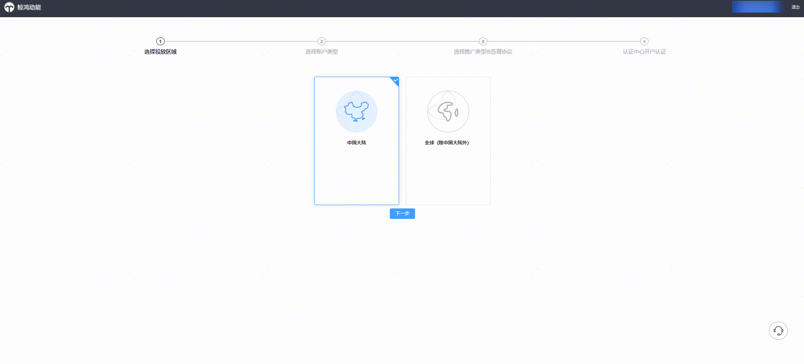
2. 选择账户类型：一级服务商。

   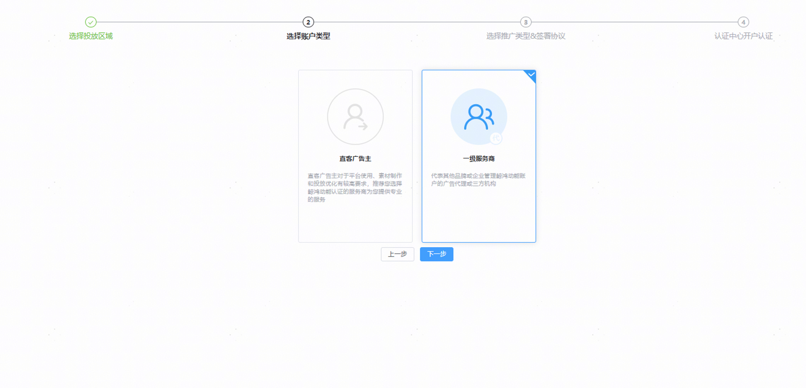
3. 选择推广类型&签署协议。

   开通应用市场应用推广和鲸鸿动能广告的一级服务商所需要签署协议不同，一个开发者账号，您只可以选择开通“应用市场应用推广”、“展示广告网络” 其中一个推广范围的一级服务商账户。如您需分别开通鲸鸿动能广告和应用市场应用推广的一级服务商账号，需要分别注册开通。以开通应用市场应用推广的一级服务商为例。

   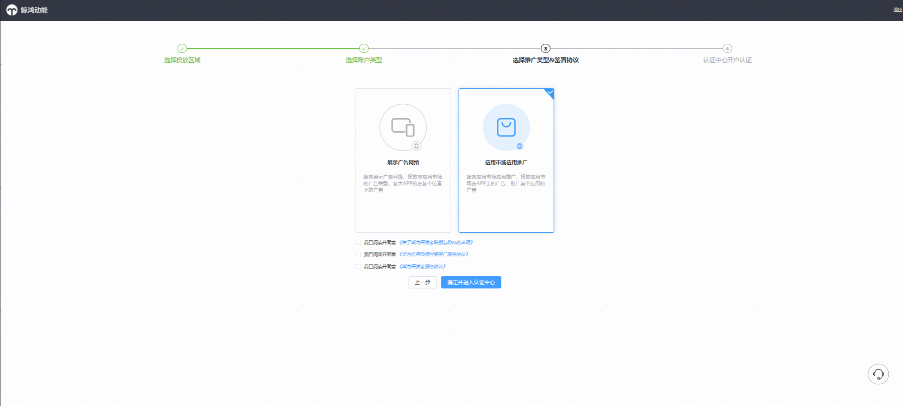
4. 进入认证中心，完成[实名认证](https://developer.huawei.com/consumer/cn/doc/start/edrna-0000001062678489)并[补充发票信息](https://developer.huawei.com/consumer/cn/doc/start/payment-service-0000001052865979)后，即可完成开户。工作人员将在2个工作日内完成审核。审核通过后，可在[华为应用市场应用推广平台](https://ads.huawei.com/cn/)，点击右上角“登录”进行操作。

   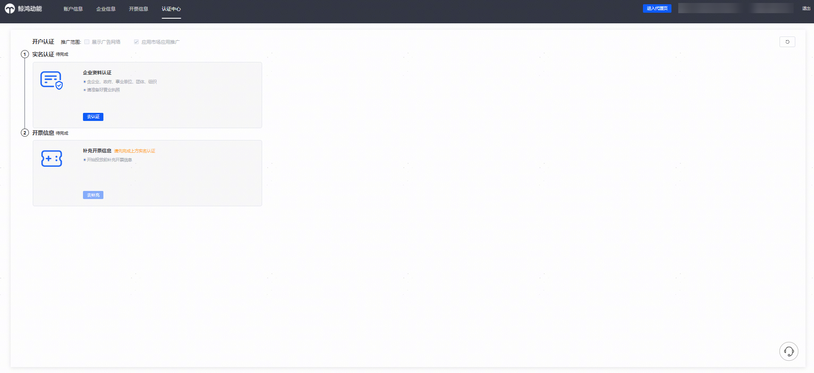

## 新建客户投放伙伴子账户（子客服务商）

使用一级服务商（客户投放伙伴主账户）新建子客服务商（客户投放伙伴子账户）。

1. 以客户投放伙伴主账户登录[华为应用市场应用推广平台](https://ads.huawei.com/cn/)，进入服务商管理平台。

   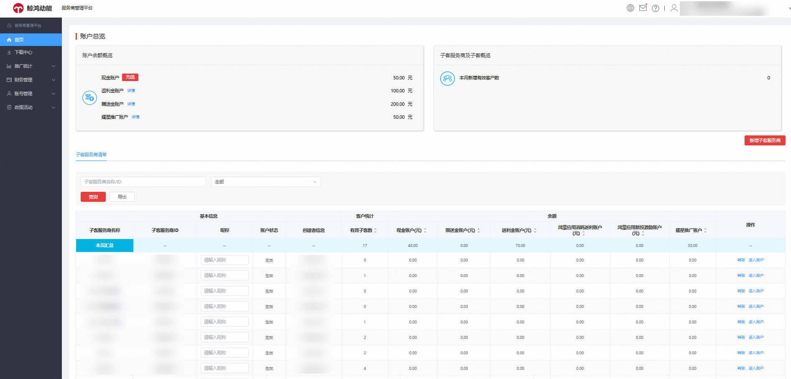
2. “首页”点击“新增”“新建客户投放伙伴子账户”，进入子客服务商新增页面。填写子客服务商的企业相关信息后，上传双方签署完成的授权证明，点击“提交”进行提交审核。

    

   - 工作人员将在2个工作日内完成审核，审核通过后，子客服务商创建成功。
   - 如果一级服务商（客户投放伙伴主账户）和子客服务商（客户投放伙伴子账户）属于同一个公司主体，授权证明处上传公司营业执照扫描件。
   - 授权证明模板：
     1. 点击下载：[华为应用推广授权客户投放伙伴子账户确认函](https://alliance-communityfile-drcn.dbankcdn.com/FileServer/getFile/cmtyPub/011/111/111/0000000000011111111.20260319110907.19749494866897246393344425805502:20260531101722:2800:18D72F1CB7CD88E9BC5945BA0729BB2E72DD1777A786AD3BC19D8C348269481E.docx?needInitFileName=true)模板。
     2. 甲方：客户投放伙伴主账户（一级服务商）公司名称。
     3. 乙方：客户投放伙伴子账户（子客服务商）公司名称。
     4. 授权确认函上需要盖双方公司的公章。

   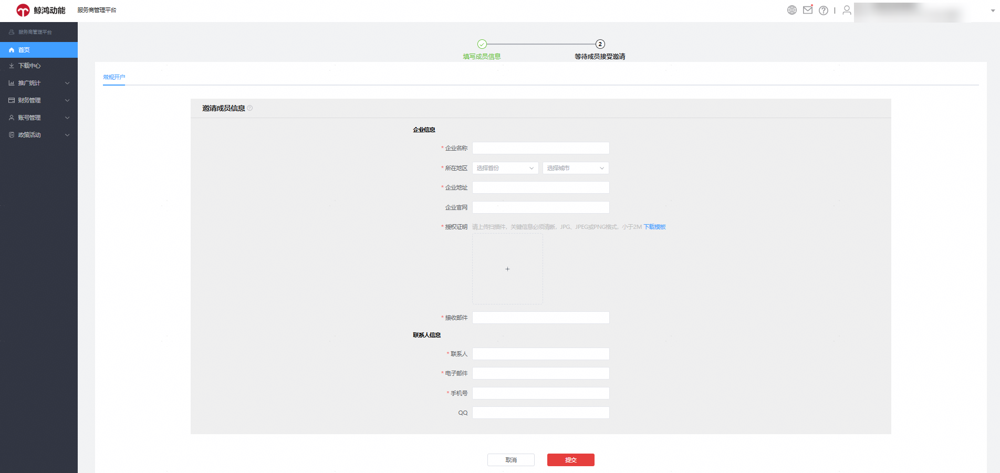

## 管理客户投放伙伴子账户（子客服务商）

使用一级服务商账户可以对创建的子客服务商进行管理操作。

以客户投放伙伴主账户的华为账号登录[华为应用市场应用推广平台](https://ads.huawei.com/cn/)，进入一级服务商管理平台首页。点击页面“充值”，即可给客户投放伙伴主账户充值，充值流程详见[财务管理](#section179058596168)。充值完成后，资金可划转至其名下所管理的客户投放伙伴子账户，用于后续投放操作账户投放使用。

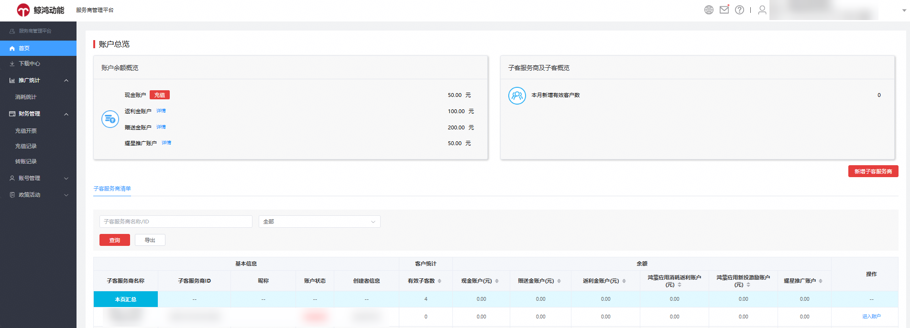

### 进入子客服务商

1. 登录[华为应用市场应用推广平台](https://ads.huawei.com/cn/)，默认进入一级服务商管理平台首页。选择跳转进入的子客服务商，点击“进入账户”进入对应子客服务商管理界面。

   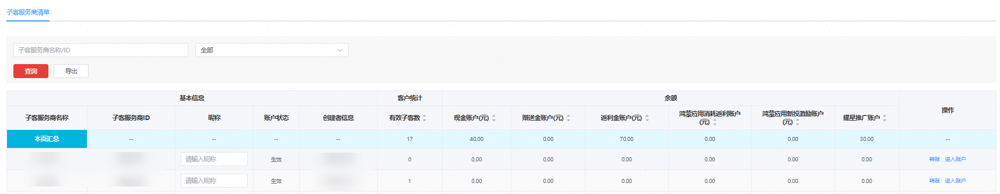
2. 以一级服务商的身份跳转进入子客服务商，默认进入子客服务商首页，可查看子客服务商管理的子客清单及账户余额等信息。

   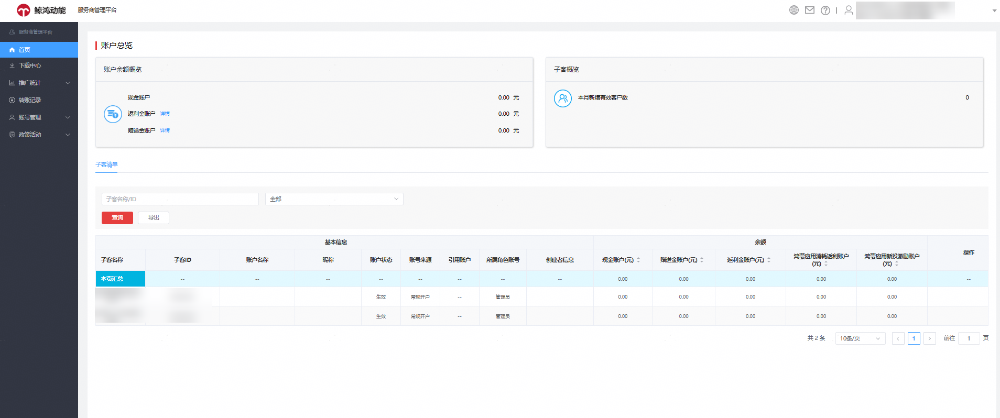
3. 右上角账户信息，选择“返回上级账户”，即可返回一级服务商管理页面。

   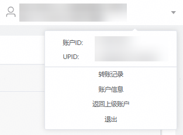

### 转账

1. 选择对应子客服务商后，点击“转账”，进入“转账”窗口。

   
2. 选择需要转账的资金类型，点击页面的“详情” 。

   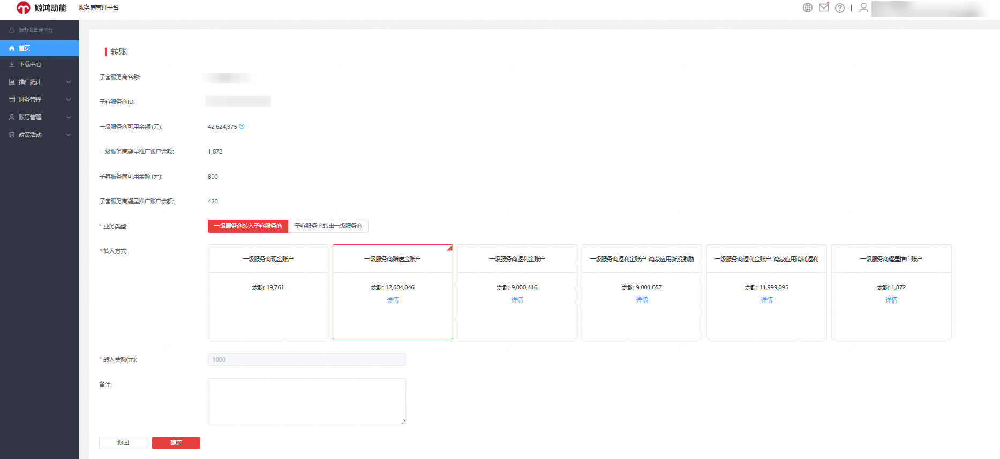
3. 输入转账金额。

   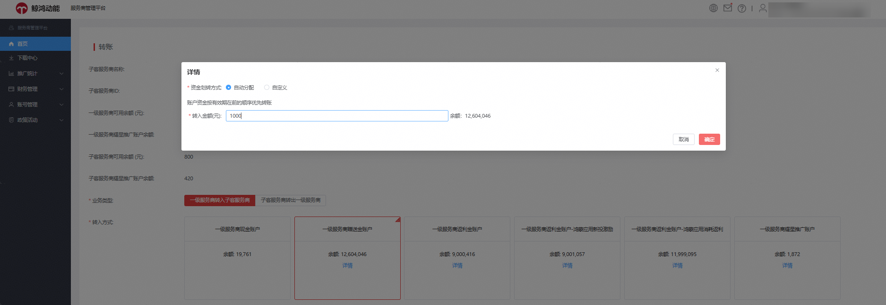
4. 点击“确定”。

   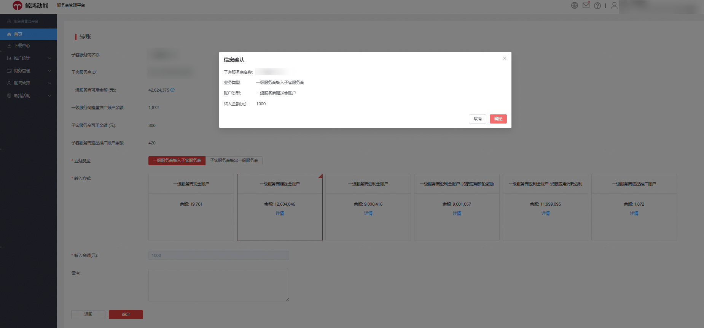
5. 转账成功后，系统将自动从账户余额中扣除本次转账金额。可继续选择其他资金类型转账，或点击“返回”回到一级服务商首页。

   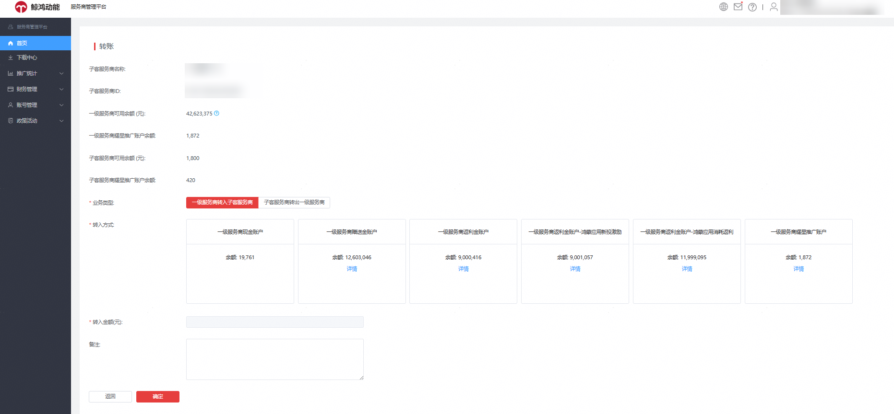

### 消耗统计

推广统计-消耗统计：支持查看一级服务商名下所有子客服务商的总体消耗及按资金类型拆分的消耗明细，例如：现金消耗、赠送金、耀星券等。

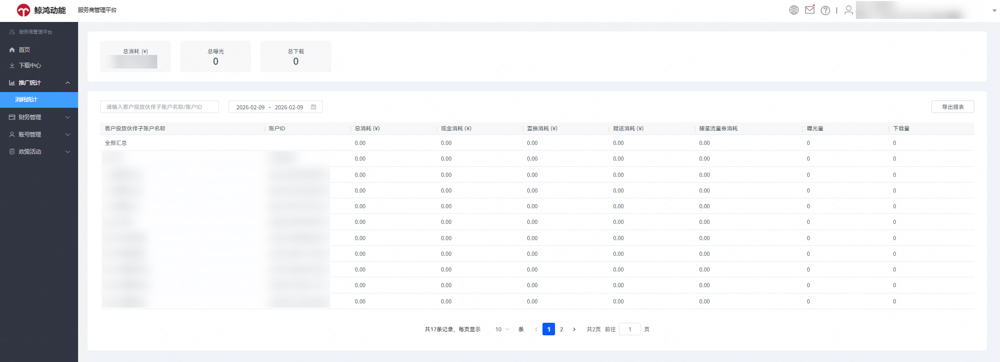

### 财务管理

服务商平台财务管理包含：充值开票、充值记录、转账记录。

1. 充值开票：给一级服务商充值的入口，支持线上充值和线下充值。

   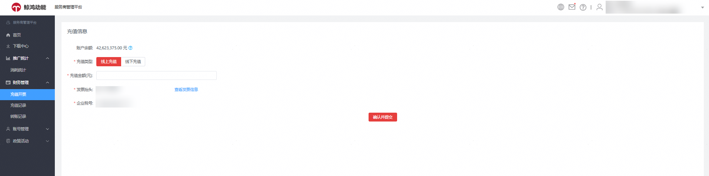

   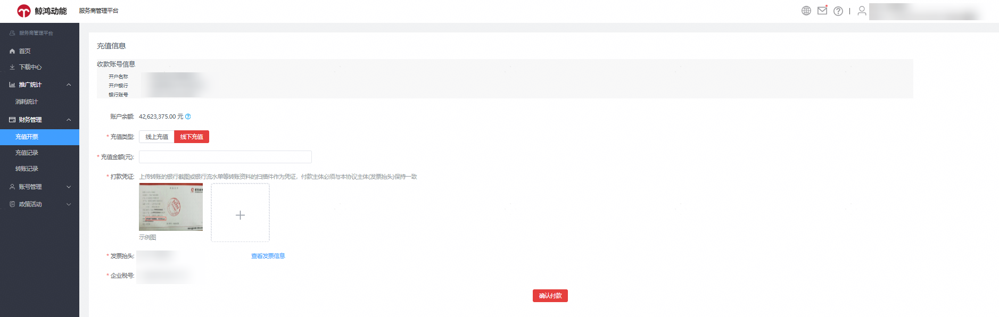
2. 充值记录：支持查看一级服务商历史充值记录。您也可以通过[开发者联盟入口](https://developer.huawei.com/consumer/cn/console/account/myBalance/0)充值或查询历史充值信息。

   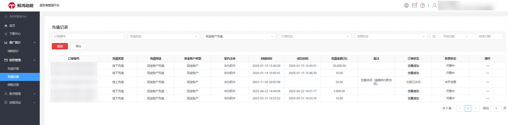
3. 转账记录： 支持查看一级服务商与其子客服务商之间的资金往来明细，包含每笔转账的金额、时间、资金类型等信息。

   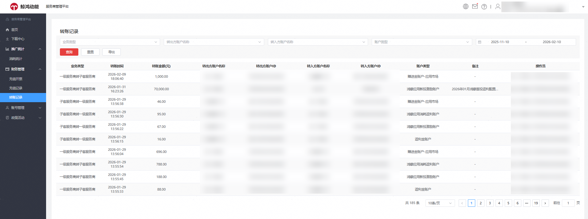

### 账号管理

账号管理包含：账户信息、发票信息、操作日志、消息设置。

1. 账户信息：默认跳转认证中心，支持查看一级服务商对应的开户推广范围，及账户企业实名认证和开票信息。

   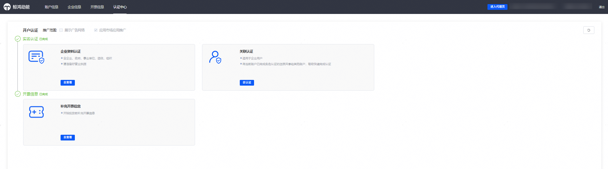
2. 发票信息：查看一级服务商对应的发票信息，支持重新编辑更新。

   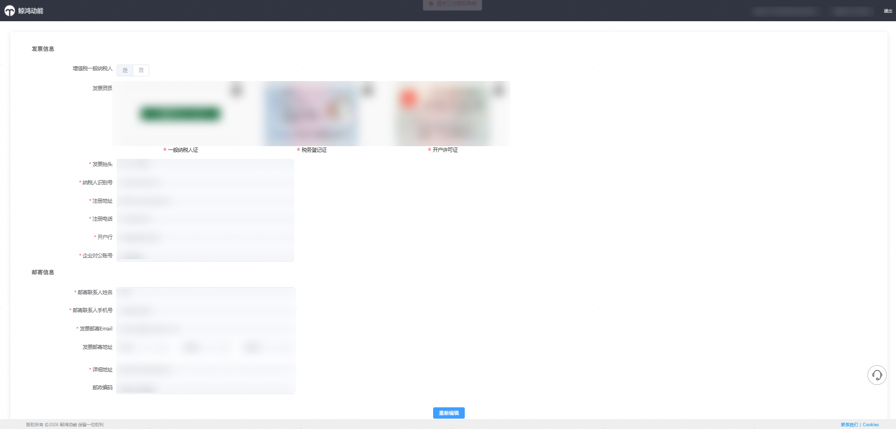
3. 操作日志：记录一级服务商的协议签署记录及子客服务商添加记录。子客服务商添加时，会默认继承一级服务商的币种信息。

   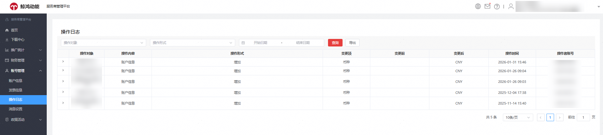
4. 消息设置：可设置邮箱、手机等接受重要消息提醒，如：月度消耗报表及相关激励政策信息等。

   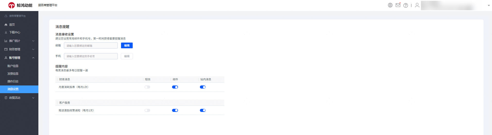

### 子客服务商持有人绑定及解绑管理

新建子客服务商后，如果子客服务商注册时未使用开户邀请邮件地址，绑定账户持有人。可通过一级服务商绑定子客服务商持有人，通过添加制完成持有人首次绑定，也支持一级服务商给子客服务商换绑子客服务商持有人。

1. 首次绑定：
   1. 一级服务商首页——选择需修改持有人的子客服务商，点击“进入账户”。

      
   2. 如子客服务商未绑定持有人，系统默认弹出绑定华为账号提醒弹窗，点击“前往绑定”。

      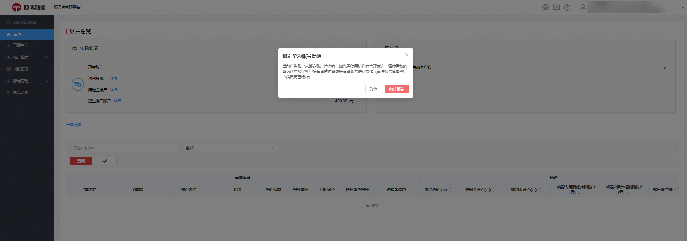
   3. 子客服务商账户信息，点击“绑定”。

      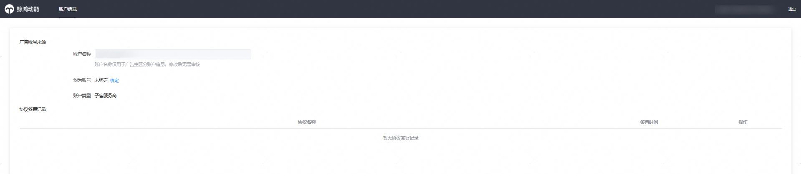
   4. 绑定子客服务商新注册的华为账号，请点击[注册账号](https://developer.huawei.com/consumer/cn/doc/start/registration-and-verification-0000001053628148)。每个华为账号仅限绑定一个推广账户。请注意，所绑定的华为账号须为新注册账号，且未绑定其他推广账户。

      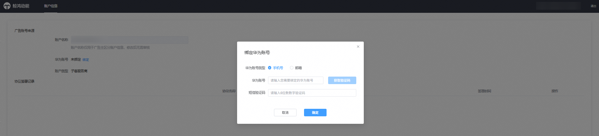
2. 持有人解绑、换绑：
   1. 一级服务商首页——选择需修改持有人的子客服务商，点击“进入账户”。

      
   2. 进入子客服务商后，选择账号管理-账户信息，点击跳转。

      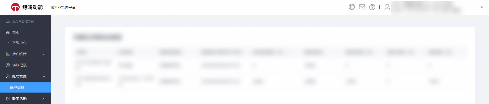
   3. 选择更换绑定或者解绑。为避免错误操作账户持有人更换，影响子客服务商操作。一级服务商跳转进入子客服务商，需填写一级服务商的华为账号进行验证。

      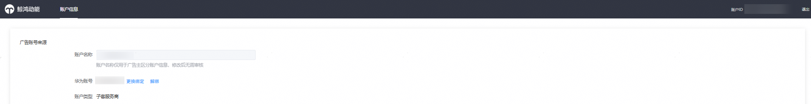

      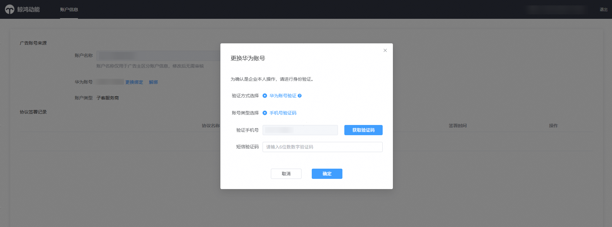

 

- 客户投放伙伴主账户创建客户投放伙伴子账户后，必须点击“授权”，授权至少一个华为账号作为管理员操作客户投放伙伴子账户，否则客户投放伙伴子账户内的部分功能将不能正常使用。
- 新创建的子客服务商账户，必须绑定新注册的华为账号作为登录账号。该华为账号需满足以下条件：
  - 未曾授权绑定过服务商账户：一级服务商、子客服务商或其他子客账户。
  - 未绑定任何其他应用市场应用推广账户或鲸鸿动能展示广告网络账户。
