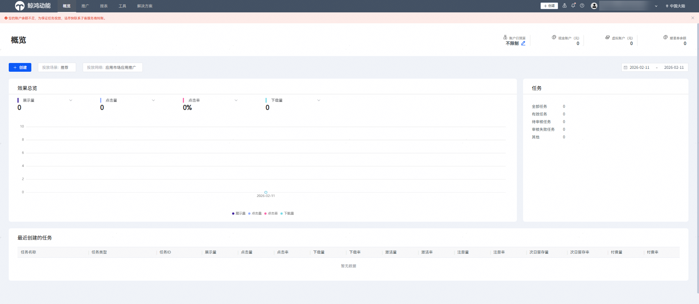
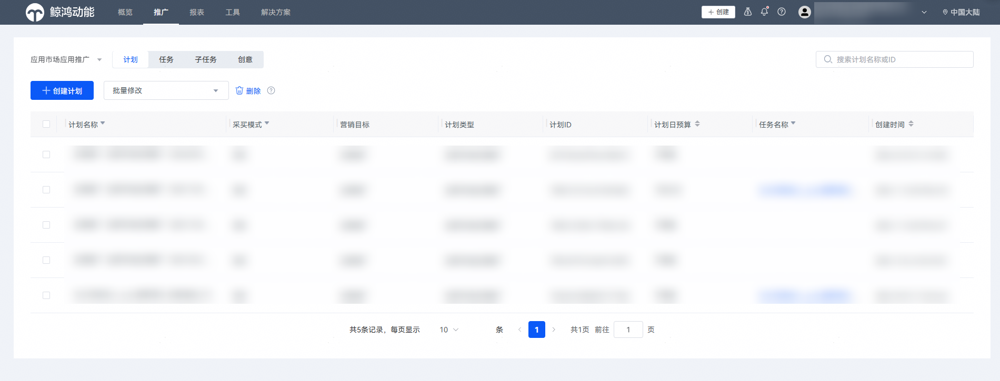

# 投放操作账户

## 前提条件

- 已完成[新建投放操作账户（子客账户）](https://developer.huawei.com/consumer/cn/doc/promotion/bp-start-customer-partner-sub-account-0000001346575385#section15799173145410)。
- 投放操作子账户已绑定账户持有人。
- 开发者账户名下的应用授权给投放操作账户，具体授权操作请参见[(可选)授权客户投放伙伴管理账户](https://developer.huawei.com/consumer/cn/doc/promotion/bp-start-guest-authorize-0000001346774281)。

## 操作步骤

1. 以投放操作账户账号（子客账户）登录[华为应用市场应用推广平台](https://ads.huawei.com/cn/)。

   
2. 对开发者名下的应用进行推广，点击页面顶部推广，创建推广计划。

   
