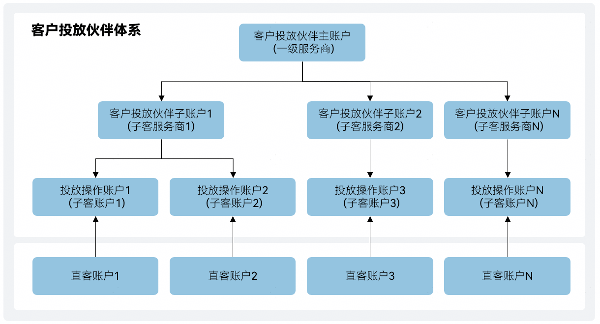

# 概述

## 客户投放伙伴体系特点

- 账户体系健全

  客户投放伙伴体系包含客户投放伙伴主账户、子账户及投放操作账户，客户可灵活选择客户投放伙伴。
- 管理高效

  在线授权客户投放伙伴，实时划款到账，高效管理推广任务。
- 账户安全

  三级操作账户独立管理，具有推广任务管理、资金变动、数据查看权限。

## 客户投放伙伴体系角色说明

客户投放伙伴体系示意图如下图所示。

具体说明如下表所示。

| 角色 | 定义 |
| --- | --- |
| 客户投放伙伴主账户  （一级服务商） | 通过开发者联盟企业认证，经推广应用授权后，服务推广应用进行投放。 |
| 客户投放伙伴子账户  （子客服务商） | 经客户投放伙伴主账户授权且华为应用市场应用推广审核通过，帮助客户投放伙伴主账户管理投放操作账户。 |
| 投放操作账户  （子客账户） | 客户投放伙伴子账户创建的投放操作账户，投放操作账户用于管理操作对应的推广应用投放。 |
| 直客账户 | 账户里有上架应用的开发者，申请应用推广的推广账号（登录后在账号信息上查看账号类型为直客的账号）。 |

各个角色之间的关系如下：

- 客户投放伙伴主账户管理客户投放伙伴子账户，客户投放伙伴子账户管理投放操作账户。
- 客户投放伙伴子账户需将投放操作账户分配给优化师，优化师可使用此投放操作账户。
- 每个投放操作账户拥有独立的登录账号，具有推广任务管理、资金变动、数据查看权限。
- 开发者名下的应用需授权给投放操作账户，则优化师有权对该应用进行应用推广。

下面会针对从客户投放伙伴主账户、客户投放伙伴子账户和投放操作账户三种账户分别展开说明。

 

- 客户投放伙伴相关的介绍和操作，具体请参见[视频课程](https://developer.huawei.com/consumer/cn/training/course/video/C101678331706327247)。
- 对于直客账号如果需要客户投放伙伴推广，则授权投放操作账户。具体授权操作请参见[(可选)授权客户投放伙伴管理账户](https://developer.huawei.com/consumer/cn/doc/promotion/bp-start-guest-authorize-0000001346774281)。
