# 客户投放伙伴子账户（子客服务商）

## 前提条件

- 已完成[新建客户投放伙伴子账户（子客服务商）](https://developer.huawei.com/consumer/cn/doc/promotion/bp-start-customer-partner-master-0000001293695534#section13769103814386)。
- 子客服务商已完成开户并绑定持有人。如需一级服务商给子客服务商绑定账户持有人，操作详见[子客服务商持有人绑定或更改](https://developer.huawei.com/consumer/cn/doc/promotion/bp-start-customer-partner-master-0000001293695534)。

## 新建投放操作账户

1. 以客户投放伙伴子账户（子客服务商）登录[华为应用市场应用推广平台](https://ads.huawei.com/cn/)，默认进入服务商管理平台首页 。
2. 点击“新建子客”，进入新建投放操作账户（子客账户）页面。

   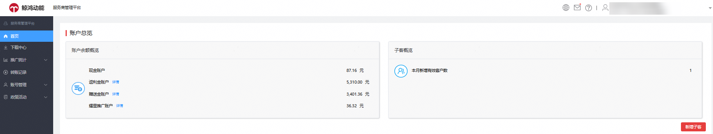
3. 填写客户的企业相关信息后，点击“提交”进行提交审核。

   其中“企业名称”设置项请填写直客企业名称。提交创建投放操作账户后，请联系直客账户进行应用授权。

   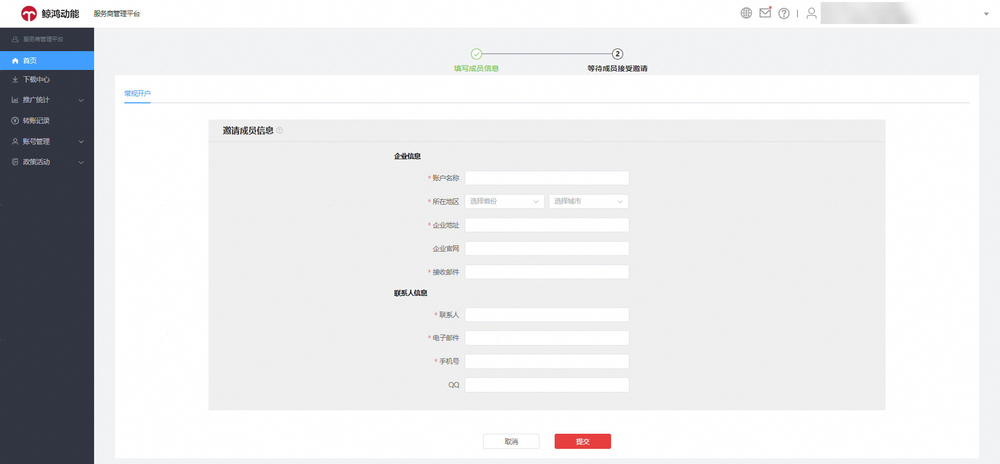

## 管理投放操作账户（子客账户）

### 进入管理页面

以客户投放伙伴子账户（子客服务商）登录[华为应用市场应用推广平台](https://ads.huawei.com/cn/)。

首页—子客清单：支持查看子客服务商下所管理的所有子客账户的账户信息及账户余额。选择要跳转进入的子客账户，点击“进入账户”进到子客账户内。子客服务商仅能操作子客账户部分功能。

### 转账

点击对应子客账户后的“转账”，进入“转账”窗口。页面支持查看子客服务商和子客账户的可用余额，支持按照资金类型转账。

- “余额”表示当前账户的可用余额(不包含竞价任务和CPT任务冻结的部分)。
- “可释放冻结金额”为竞价过程中系统自动冻结的一部分资金，如需释放金额请点击下方“解冻释放”进行释放。

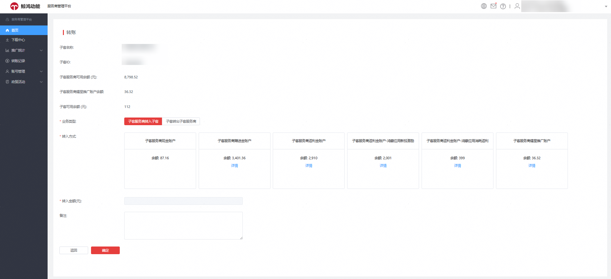

如果子客账户资金需要全部资金转账给子客服务商，选择资金账户类型，点击下方“解冻释放”，资金释放期间子客账户任务暂停5分钟，5分钟后任务会自动恢复。

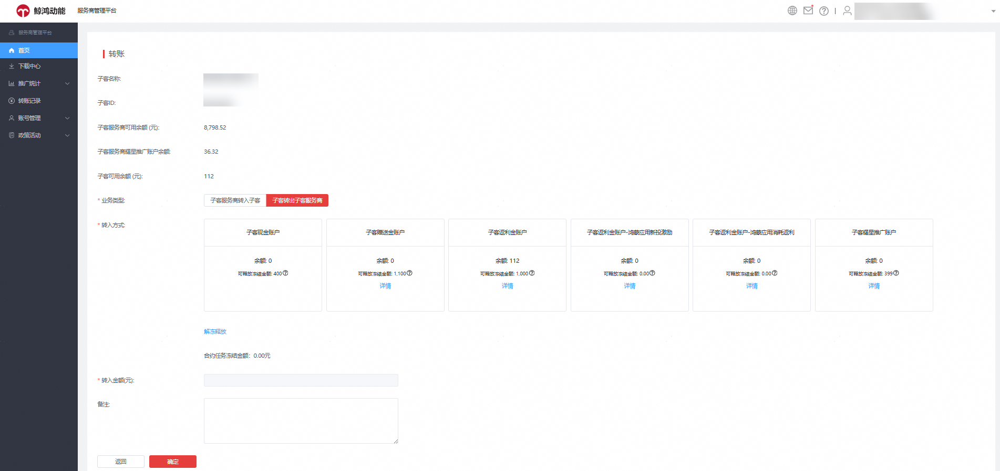

### 下载中心

下载中心记录子客服务商的报表导出情况。

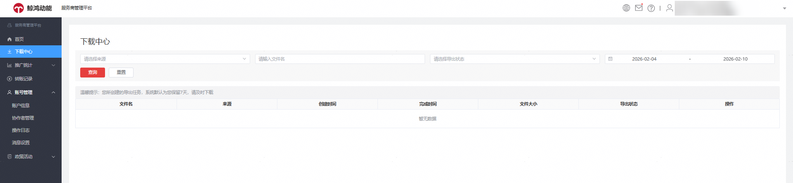

### 消耗统计

消耗统计页面支持查询子客服务商管理的全部子客账户（投放操作账户）的消耗明细。

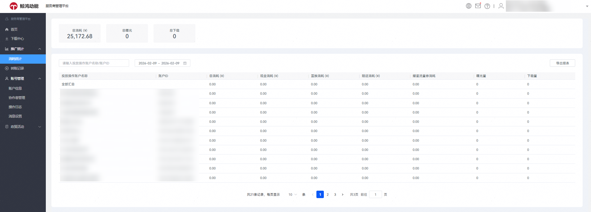

### 转账记录

转账记录页面支持查看子客服务商和一级服务商、子客账户的资金流转。

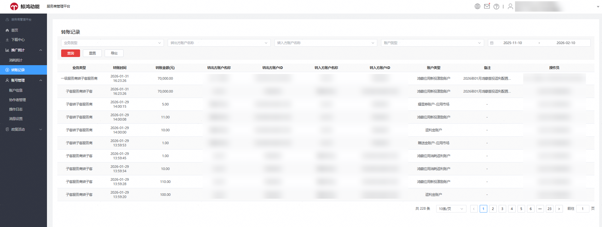

### 账号管理

账号管理包含：账户信息、协作者管理、操作日志、消息设置等。

1. 账户信息：点击跳转支持查看子客服务商的账户持有人信息，账户类型；企业信息，支持查看子客服务商开户时填写的企业信息和联系人信息。

   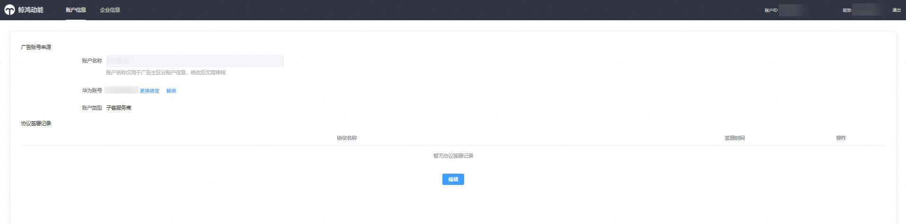
2. 协作者管理：除了开户时授权的持有人华为账号，还希望授权其他华为账号登录共同管理子客服务商账户。可通过协作者管理入口授权其他华为账号，支持授权的角色：操作员（管理员角色，可操作子客账户进行广告投放、查看数据等）、观察员（仅可进行数据查看）。

   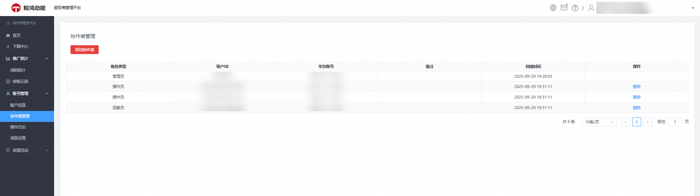

   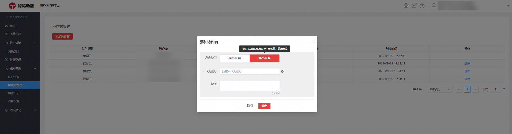

### 操作日志

查看子客服务商协作者管理的新增，删除。

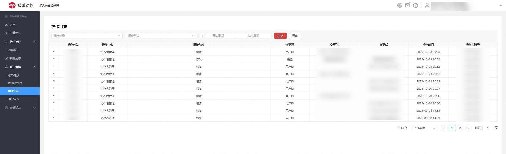

### 消息设置

支持设置邮箱、手机号等接收月度消耗报表，激励政策相关信息。

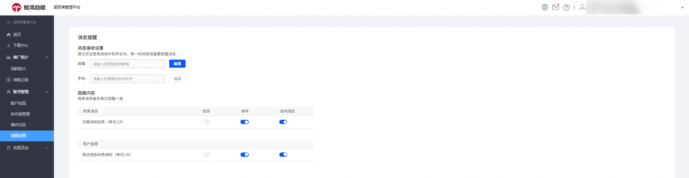

### 鸿蒙应用市场激励金

支持查看服务商管理投放应用的鸿蒙应用返利激励数据。

### 子客账户持有人绑定及解绑管理

新建子客账户后，如果子客账户注册时未使用开户邀请邮件绑定账户持有人。可通过子客服务商绑定子客账户持有人，通过添加制完成持有人账号首次绑定，也支持子客服务商给子客账户换绑持有人。

1. 首次绑定：
   1. 子客服务商首页——选择未绑定持有人的子客账户，点击“进入账户”。

      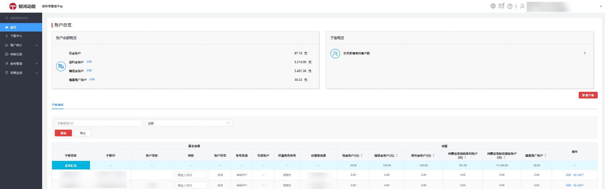
   2. 子客账户工具-账户辅助，点击 “广告账户管理”。

      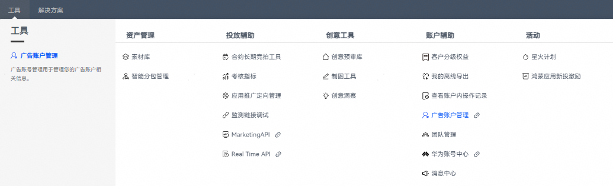
   3. 绑定华为账号作为子客账户持有人。
   4. 绑定子客账户新注册的华为账号，请点击[注册账号](https://developer.huawei.com/consumer/cn/doc/start/registration-and-verification-0000001053628148)。每个华为账号仅限绑定一个推广账户。

       

      所绑定的华为账号须为新注册账号，且未绑定其他推广账户。

      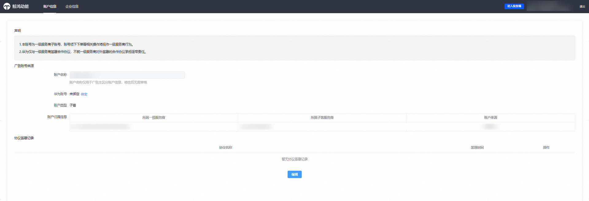

      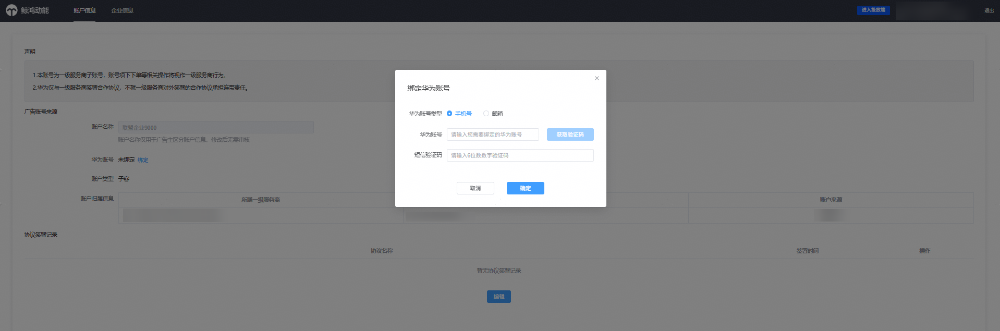
2. 子客账户持有人换绑、解绑：
   1. 子客服务商首页——选择需修改持有人的子客账户，点击“进入账户”。

      
   2. 子客账户工具-账户辅助，点击 “广告账户管理”。

      
   3. 选择“更改绑定”：子客服务商为对应子客账户更换账户持有人。需先完成子客服务商身份验证，验证通过后方可进行换绑。
   4. 选择“解绑”：解除当前账户持有人的华为账号绑定关系。

      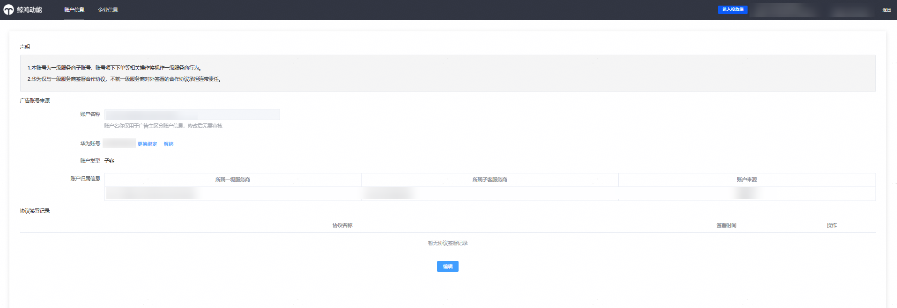

      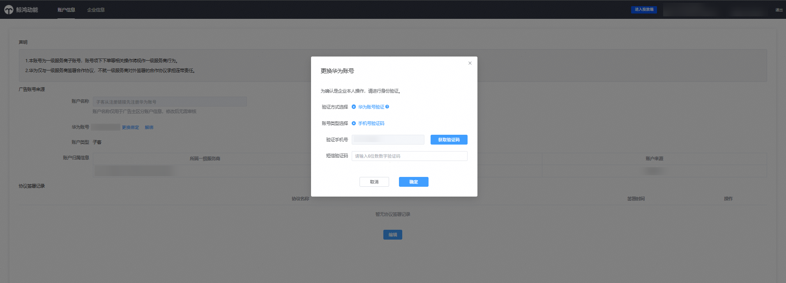

      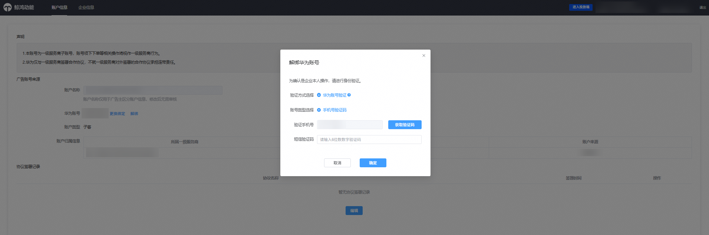

 

- 为避免应用推广平台登录问题，新的华为账号注册成功后，无需选择个人/企业角色，请直接退出该账号。
- 创建新的子客账户，必须绑定新注册的华为账号作为登录账号。该华为账号需满足以下条件：
  - 未曾授权绑定过服务商账户：一级服务商、子客服务商或其他子客账户。
  - 未绑定任何其他应用市场应用推广账户或鲸鸿动能展示广告网络账户。
- 子客服务商（客户投放伙伴子账户）创建子客账户（投放操作账户）后，需绑定新注册的华为账号作为子客账户持有人。即：至少一个华为账号作为管理子客账户的账号，否则子客账户内的部分功能将不能正常使用。
- 绑定子客账户持有人后，如需授权多个华为账号共同管理子客账户，请由账户持有人在【工具】&gt;【团队管理】中添加其他华为账号，实现共同管理。
