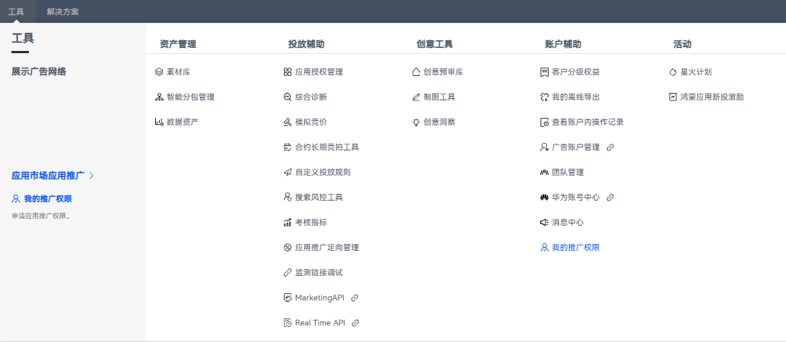
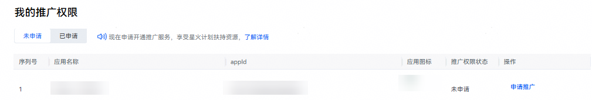
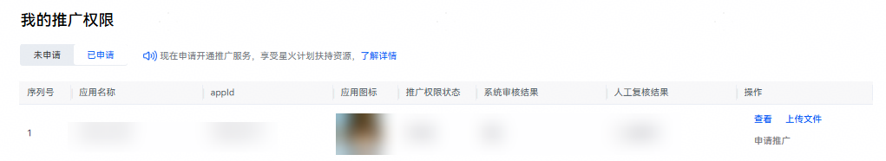

# 申请推广评测

您的应用在上架后开启推广功能，需先申请“推广评测权限”。

仅限直客账户申请，直客团队账户须由直客管理者账户发起申请。

## 操作步骤

1. 登录[华为应用市场应用推广平台](https://ads.huawei.com/cn/)，点击“工具”—“账户辅助”—“我的推广权限”，进入推广评测页面。

    

   如果您的直客账户同时开通了“应用市场应用推广”和“鲸鸿动能展示广告网络”推广权限，请在工具页先选择“应用市场应用推广”，再选择“我的推广权限”，提交推广权限申请。

   

2. 点击“未申请”，找到需开通推广应用，点击“申请推广”。

    

   提交评测申请时，暂无需上传资质，请直接点击“申请推广”。提交评审申请后，系统自动审核。等待1-2分钟，刷新页面在【已申请】列表，查看推广评测申请状态。

   

3. 针对已申请开通推广的应用，可以点击“已申请”页签，及时了解应用推广评测的情况。

    

   - 推广评测操作，仅涉及直客账户申请，客投伙伴账户无需操作。
   - <strong>未开通应用推广服务前请勿充值</strong>，以免导致充值资金无法使用。
   - 应用下架再上架，需要直客在推广后台再次申请推广评测才可以重新推广。
   - 开通应用推广服务后申请获取新客福利-星火计划，享受免费优质激励资源。详情请查看[新客福利-星火计划](https://developer.huawei.com/consumer/cn/doc/promotion/bp-campaigns-spark-0000001309549670)。

   

   已申请页签，各类操作的含义：
   - 点击对应应用后的“查看”，了解评测进度及评测结果。
   - 点击对应应用后的“上传文件”，补充上传相关资质。
   - 点击对应应用后的“申请推广”，再次提交推广评测申请。
