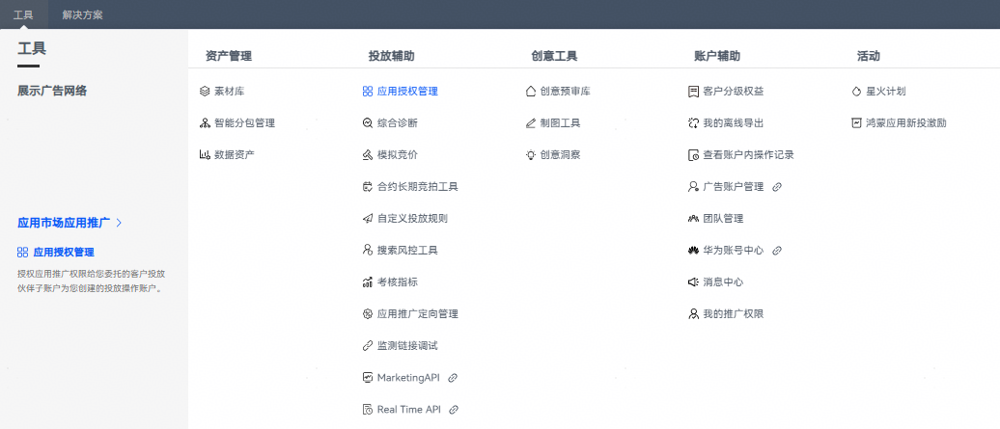
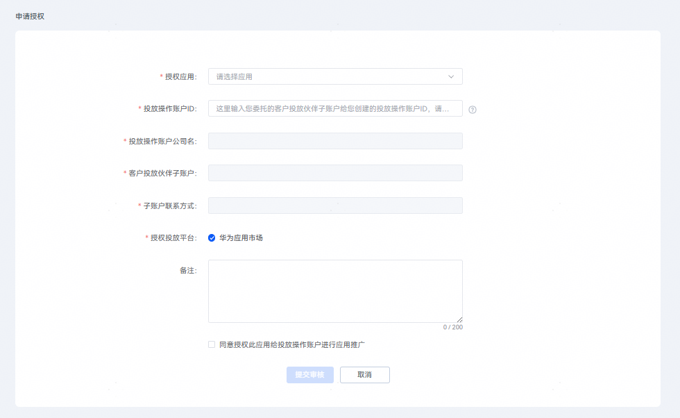
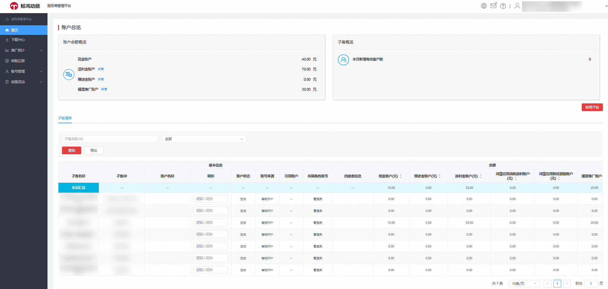

# (可选)授权客户投放伙伴管理账户

 

在进行授权前，需要先申请获得推广权限，具体请参见[申请推广评测](https://developer.huawei.com/consumer/cn/doc/promotion/bp-start-guest-apply-evaluation-0000001346654709)。

<strong>授权应用参加客户激励活动获得的激励金（如：星火计划、月度激励等）将通过被授权的客户投放伙伴发放。</strong>

应用授权前，需要暂停所有“执行”状态的推广任务。同样，应用取消授权给客户投放伙伴，也需要客户投放伙伴投放操作账户暂停所有“执行”状态的推广任务。

直客如果需要客户投放伙伴推广，则进行如下操作。

## 操作步骤

1. 以直客账户登录[华为应用市场应用推广平台](https://ads.huawei.com/cn/)，点击“工具”—“投放辅助”—“应用授权管理”，进入授权页面。

   
2. 点击“申请授权”，填写相关授权信息后，点击“提交审核”。当审核通过后，即可由授权的客户投放伙伴投放操作账户（子客账户）进行应用推广。

   

   

    

   “投放操作账户ID”配置项可由客户投放伙伴子账户（子客服务商）登录[服务商管理平台](https://ads.huawei.com/cn/)，点击“首页”—“子客清单”，查看子客ID字段获取。

   
3. 如果直客账户已完成授权后，想取消授权，则点击“取消授权”即可。

   
