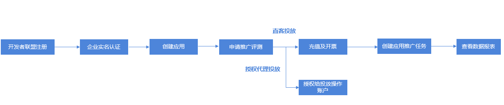

# 概述

目前仅支持企业开发者作为直客在华为应用市场应用推广平台申请注册。

具体华为应用市场应用推广平台申请注册流程如下图所示。

 

应用推广审核原则具体请参见[应用推广审核原则](https://developer.huawei.com/consumer/cn/doc/promotion/bp-appendix-audit-0000001293855106)。华为应用市场推广服务暂不合作应用类型请参见[不合作应用类型](https://developer.huawei.com/consumer/cn/doc/promotion/bp-appendix-not-cooperating-0000001346574993)。

具体直客操作流程如下所示。

| 序号 | 步骤 | 详情 |
| --- | --- | --- |
| 1 | 开发者注册 | 您需要在华为开发者联盟注册。  具体请参见[注册认证](https://developer.huawei.com/consumer/cn/doc/start/registration-and-verification-0000001053628148)。  说明：  在华为开发者联盟注册支持手机、电子邮箱两种注册方式。 |
| 2 | 企业实名认证 | 注册后您需要完善企业实名认证所需资料，并提交审核。  具体请参见[实名认证](https://developer.huawei.com/consumer/cn/doc/start/itrna-0000001076878172)。 |
| 3 | 创建应用 | 使用应用推广服务最基本原则是应用必须已经在华为应用市场上架，上架审核通过后方可申请推广评测。  具体请参见[创建应用](https://developer.huawei.com/consumer/cn/doc/app/agc-help-createapp-0000001146718717)。 |
| 4 | 申请推广评测 | 申请应用推广的应用完成上架后，您可以在华为应用市场应用推广平台申请推广评测。  具体请参见[申请推广评测](https://developer.huawei.com/consumer/cn/doc/promotion/bp-start-guest-apply-evaluation-0000001346654709)。  说明：  评测周期约2~3个工作日。 |
| 5 | 充值及开票 | 充值推广基金，以及首次开票及发票相关申请。  直客可以在开发者联盟进行充值及开票操作。  具体请参见[充值及开票](https://developer.huawei.com/consumer/cn/doc/promotion/bp-start-guest-recharge-0000001346454833)。  说明：  具体充值开票操作请参见[视频课程](https://developer.huawei.com/consumer/cn/training/course/video/C101679626182909999)。 |
| 6 | 创建应用推广任务 | - |
| 7 | 查看数据报表 | 即通过查看数据报表，监测推广效果。 |
| 8 | (可选)授权客户投放伙伴管理账户 | 开发者可以将名下的应用授权给客户投放伙伴，客户投放伙伴投放操作账户有权对该应用进行应用推广。  如果开发者授权给客户投放伙伴投放操作账户，则可不用操作充值、开票。  具体请参见[(可选)授权客户投放伙伴管理账户](https://developer.huawei.com/consumer/cn/doc/promotion/bp-start-guest-authorize-0000001346774281)。 |
