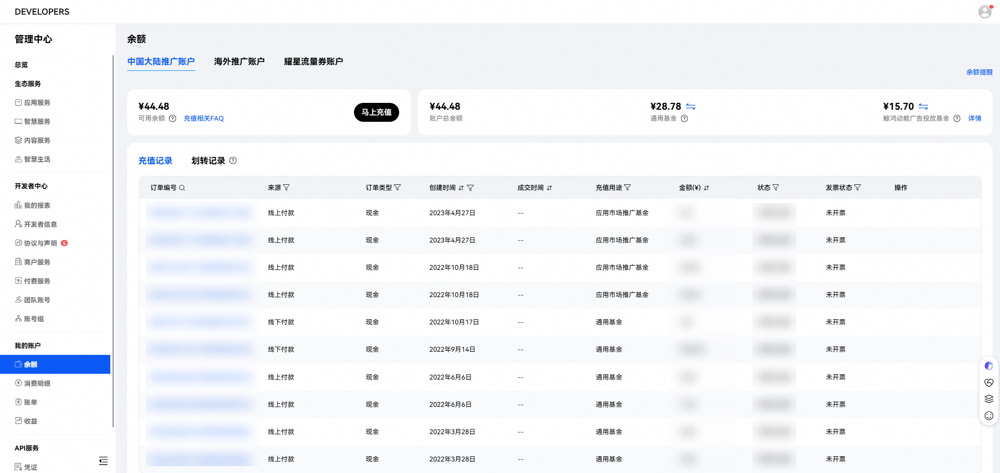
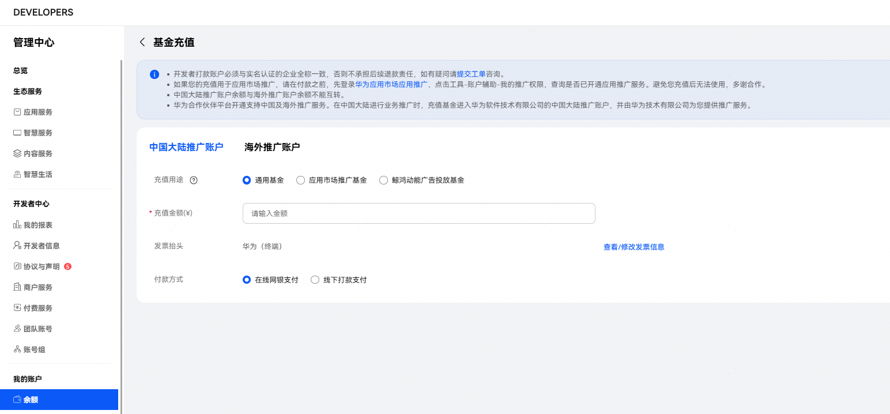
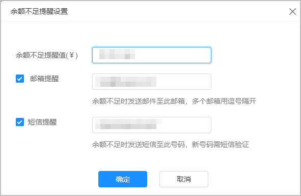
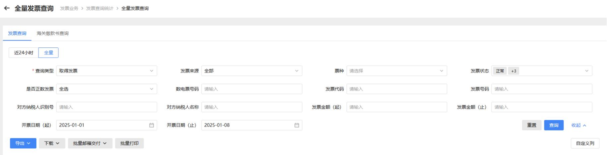

# 充值及开票

## 充值推广基金

应用通过推广评测后，可进行推广充值，首次充值需签约《华为开发者付费服务协议》并[维护发票信息](https://developer.huawei.com/consumer/cn/doc/start/payment-service-0000001052865979)。

充值支持线上、线下2种付款方式。线下充值需在我的账户中创建充值订单并上传打款凭证，银行到账及财务审核需2个工作日。充值无门槛要求，建议充值整数。

1. 申请充值。
   1. 登录[开发者联盟网站](https://developer.huawei.com/consumer/cn/console#/serviceCards/AppService)，在左侧导航栏中选择“开发者中心 &gt; 我的账户 &gt; 余额”，进入“余额”页面。
   2. 点击“马上充值”。

      如果未签约付费服务协议则会跳转至签约与发票信息页面，完善页面信息后方可进行充值。

      
2. 选择付款方式。

   选择线上或线下付款并确认发票信息，打款公司名必须与注册账号公司一致。

   - 线上充值。

     填写需充值金额，使用网银直接支付，充值款项即时到账。

     
   - 线下充值。

     填写充值金额，每笔订单充值金额应与银行实际每笔付款金额相同。例如线下付款2笔，需分别建立2个订单对应2笔充值金额。银行账号下方将显示您的付款备注，在线下付款时必须填写，正确填写付款备注的充值可在2个工作日到账。如果遇节假日您可以请提前3个工作日充值。

     线下充值账户信息具体如下：

     <strong>开户名称</strong>：华为软件技术有限公司

     <strong>开户银行</strong>：中国招商银行深圳新安支行

     <strong>账号</strong>：755917350310505

     <strong>请备注</strong>：（线下付款时必须填写在银行转账的备注栏里, 说明款项的业务及用途，如应用市场应用推广充值、鲸鸿动能业务充值。）
3. 上传打款凭证<strong>。</strong>

   及时上传打款凭证（即银行水单）可减少审核周期，先充值后建订单可在这一步选择“立即上传”，先建订单后充值可选择“尚未打款，稍后再传”。
4. 完成充值订单创建。

   获得充值订单编号，付款后点击“确认付款”可上传打款凭证，创建相同或错误订单可选择“取消”。

   确认付款后可在“开发者中心 &gt; 我的账户 &gt; 余额”页面中点击相应充值订单右侧的“导出合同”下载合同。

   如果需要盖章合同请联系商务合同人员，更改发票信息也可在这一步操作。
5. 推广基金到账。

   “推广基金余额”会显示所充值到账的款项，创建推广任务后即可参与投放。

    

   系统支持余额不足提醒。开发者充值周期可以设置至少高于2天的推广预算。您可选择邮箱、短信提醒（首次设置短信提醒需验证手机号码），开启提醒功能可有效防止应用断投。

   

## 首次开票申请及发票相关

1. 首次开票申请。

   请在联盟后台付费服务中，根据页面内容填写发票信息，确保开票信息准确无误，如果因为开发者问题填写错误的发票将暂无法开票。
2. 申请发票。

   充值推广基金时需确认发票信息，根据选择的发票类型（数电票增值税专用发票、数电票增值税普通发票）填写对应内容（一般纳税人信息选择是或否）。

   - 开票发票抬头/内容

     抬头默认为企业认证名称，发票内容为信息费服务费。
   - 开票时间

     订单充值成功后，开发者可点击“申请开票”或等系统于15个工作日后自动触发开票申请。如果开发者有多条订单，当月订单会进行合并开票。开票周期为当月充值次月开出发票。
   - 发票信息更新

     如果出现公司主体变更、三证合一营业执照更换、发票类型变更等特殊情况，请在联盟后台立即刷新发票信息，将之前未触发开票申请的订单内开票信息同步更新，已触发开票申请的订单则按旧的开票信息开票，如果因为开发者问题填写错误的发票将暂无法开票。
3. 发票接收。

   2025年上线数电发票，不再进行纸质发票的邮寄。已开具的数电发票将通过电子发票服务平台自动交付。开发者登录自己的电子发票服务平台后，可进行发票查验以及用途勾选等系列操作。（发票业务-发票查询统计-全量发票查询-查询类型：取得发票，可通过开票日期或数电票号码等进行查询下载）

   
   - FAQ：

     数电发票是什么类型的发票？

     数电发票是《中华人民共和国发票管理办法》中“电子发票”的一种，是将发票的票面要素全面数字化、号码全国统一赋予、开票额度智能授予、信息通过税务数字账户等方式在征纳主体之间自动流转的新型发票。数电发票与纸质发票具有同等法律效力。

     数电发票的票面内容有什么？

     数电发票的票面基本内容包括：发票名称、发票号码、开票日期、购买方信息、销售方信息、项目名称、规格型号、单位、数量、单价、金额、税率/征收率、税额、合计、价税合计、备注、开票人等。

     数电票号码编码规则是什么？

     数电发票的号码为20位，其中：第1-2位代表公历年度的后两位，第3-4位代表开票方所在的省级税务局区域代码，第5位代表开具渠道等信息，第6-20位为顺序编码。

     有哪些官方途径可以获得发票？

     单位和个人可以登录自有的税务数字账户、个人所得税APP，免费查询、下载、打印、导出已开具或接受的数电发票；可以通过税务数字账户，对数电发票入账与否打上标识；可以通过电子发票服务平台或全国增值税发票查验平台，免费查验数电发票信息。
