# 直客管理者账户

## 直客账户升级直客管理者账户

1. 以直客账户登录[华为应用市场应用推广平台](https://ads.huawei.com/cn/)，顶部工具栏选中应用市场应用推广，点击“应用推广直客团队账户”，升级直客团队账户。

    

   直客团队账户升级入口仅在账户中存在具备推广权限的应用时显示，请确认直客账户内上架应用已[申请推广评测权限](/docs/monetize/promotion/bp-start-guest-apply-evaluation-0000001346654709)。

   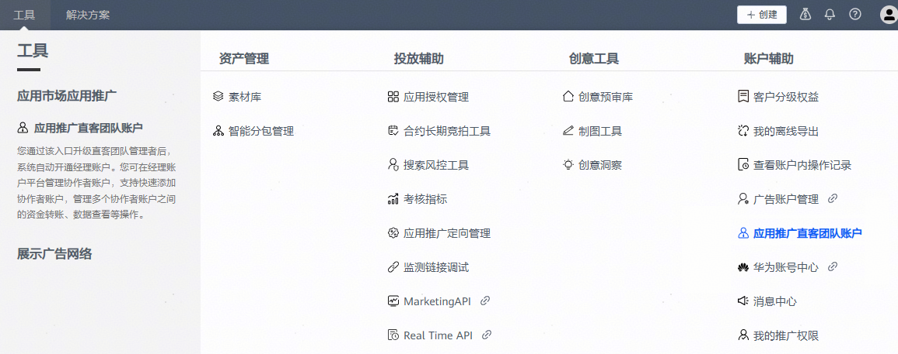
2. 确认开通直客团队账户。

   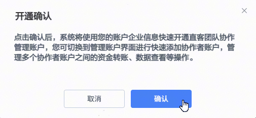
3. 确认开通直客团队账户后，直客账户默认升级成直客管理者账户。可在账户右上角点击“切换账号”，登陆经理账户平台新增或管理直客协作者账户。

   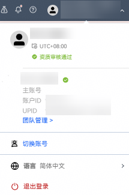
4. 直客账户升级为“直客管理者账户”后，登录页将展示同一账户ID下的两类角色入口：
   - 角色类型-直客管理者：用于承载直客管理账户管理能力，包括直客协作者账号的新增、修改、删除，以及资金划转等管理操作，均从此入口进入。
   - 角色类型-普通直客：直客管理者账户进行投放操作的入口，进入系统后直达投放端管理平台，用于任务创建与投放相关操作等。

     

 

只有未升级直客团队的直客账户工具栏才可见“应用市场直客团队账户”入口。

## 邀请协作者

1. 使用直客管理者账号登录[华为应用市场应用推广平台](https://ads.huawei.com/cn/)，选择推广类型为“应用市场应用推广”，角色类型为“直客管理者”，点击【进入系统】。

   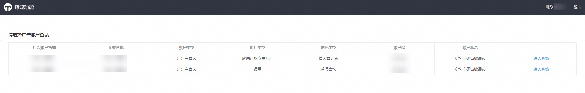
2. 进入经理账户平台首页，点击左上角【关联账户】；填写直客协作者的华为账号及昵称，并选择授权协作者投放的应用，勾选同意授权提交。选择授权的应用时，支持授权多个应用。

   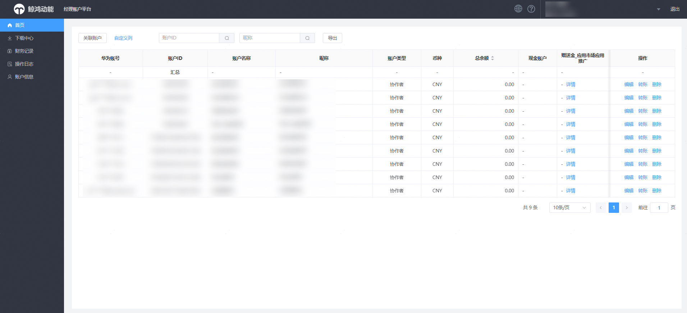

   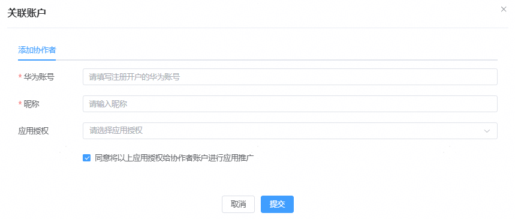

## 管理协作者

1. 首页可查看已创建的协作者账户余额。

   
2. 创建直客协作者账户后，支持编辑和删除。
   - 点击【编辑】后，可修改对应直客协作者账户的授权华为账号、昵称及授权应用信息；
   - 点击【删除】后，直客协作者账户无法登录操作推广，请谨慎操作。

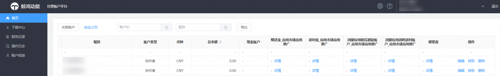

 

- <strong>一个直客管理者账户最多支持邀请10个协作者。</strong>

- 被邀请的协作者必须已经注册华为账号，此华为账号无需实名认证。此华为账号未被授权给其他账户。

- 当直客管理者账户将应用授权给协作者账户后，不允许再授权对应应用给代理。如果该应用没有被授权给任何协作者账户，则该应用可以被授权给投放操作账户（子客账户）进行投放，授权给代理投放后直客对该应用不再有推广权限。

- 在删除协作者账户前，需要确认该协作者账户下无正在执行投放任务。如果有正在执行投放任务，需要先停止全部投放任务并转出余额。否则系统将无法删除协作者账户。

- 删除协作者账户后，团队账户管理页面则不再展示已删除的协作者账户。

- 删除协作者账户后，该协作者账户即无法登录。该协作者账户原有投放报表数据保留，可供直客管理者账户查阅。删除协作者账户后，在邀请协作者页面重新再填入该协作者账户后，之前历史报表数据不支持展示。

## 向协作者账户转账

1. 以直客管理者账户登录[华为应用市场应用推广平台](https://ads.huawei.com/cn/)，在经理账户平台首页，选中直客协作者账户，点击【转账】。

   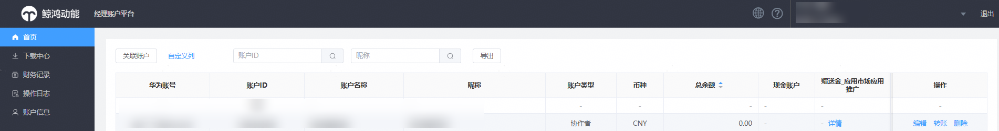
2. 进入转账页面，支持直客管理员账户与协作者账户之间互转：直客管理员账户向协作者账户转账，也可将协作者账户资金转出。转账界面的“可释放金额”为竞价投放过程中系统自动预留的金额，支持释放。如需释放冻结金额请点击下方“解冻释放”进行释放。资金释放期间任务暂停5分钟，5分钟后任务会自动恢复。

   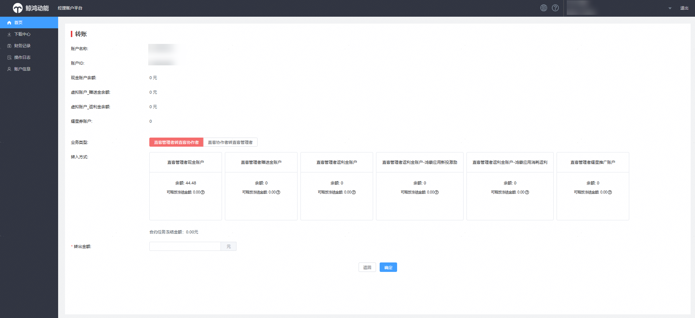

   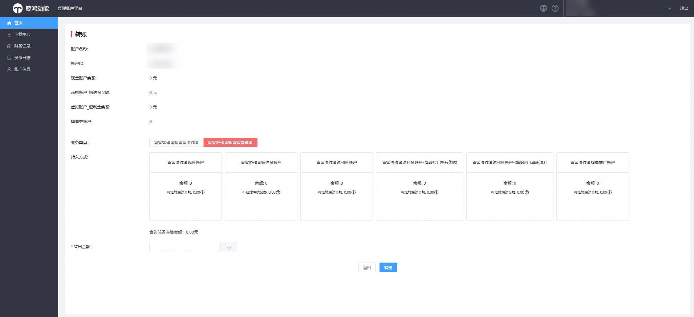
3. 点击【财务记录】查看转账记录和协作者账户的消耗统计。
   - 【转账记录】页面您可以下拉选择转出账户，转入账户，选择账户信息进行详细的查询。

     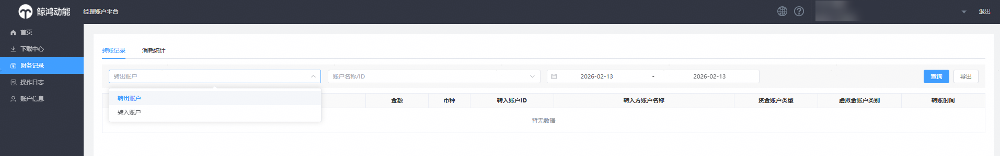
   - 经理账户平台的【消耗统计】只统计直客协作者账户的消耗记录，如需查看直客管理者账户投放产生的消耗记录，请切换账号进入“普通直客”账户，点击小钱包查看财务记录。

     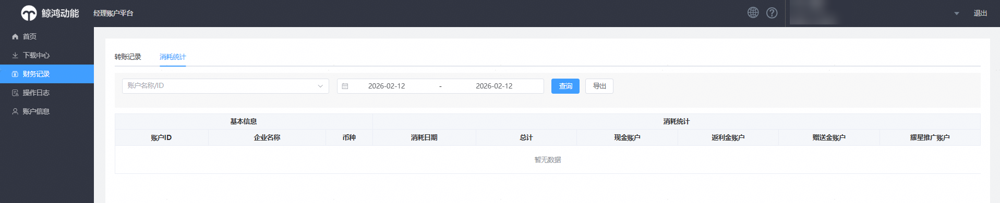

## 查看协作者账户投放数据

直客管理者账户右上角切换账号，选择角色类型“普通直客”，进入投放端，在【报表】页查看协作者投放数据。查看操作与直客账户相同，具体请参见[查询整体数据报表](/docs/monetize/promotion/bp-delivery-task-management-overall-data-0000001294054000)。

直客管理者账户的报表与直客账户区别如下：

- 在报表的“数据范围”区域，您可以选择全部账户数据：xxx（团队管理者）、xxx（协作者）类别，来筛选查看对应账户的报表数据。
- 在报表页面可以通过“账户名称”列，查看团队中对应协作者账户的投放数据。“账户名称”列支持选择多个账户来会汇总呈现报表数据。整体数据、子任务数据、搜索数据、创意数据均支持此报表功能。

  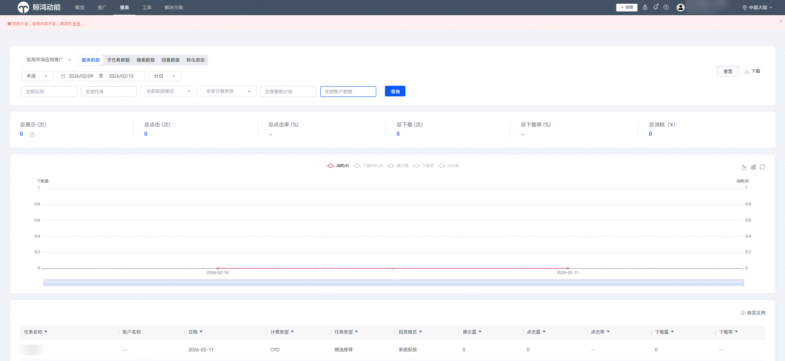

## 下载中心

查看首页清单和转账记录的导出信息。

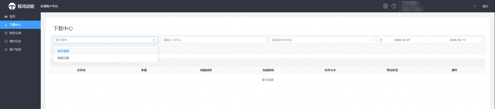

## 操作日志

支持查看直客管理者账户对协作者账户的新增，删除，编辑等操作记录。

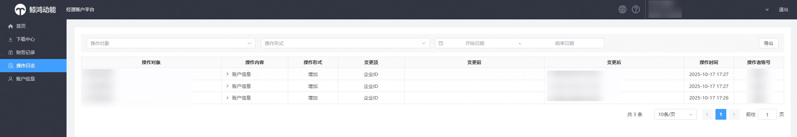

## 账户信息

点击经理账户的【账户信息】，默认跳转认证中心，查看直客管理者账户的开户认证信息、推广评测信息、开票信息等。

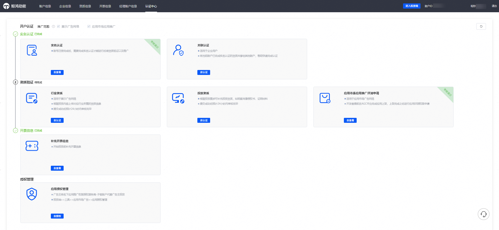

## 切换账号

经理账户平台点击右上角的【切换账号】后，页面返回登录页，可选择角色类型“普通直客”进入系统。

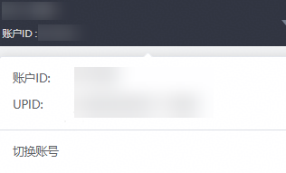

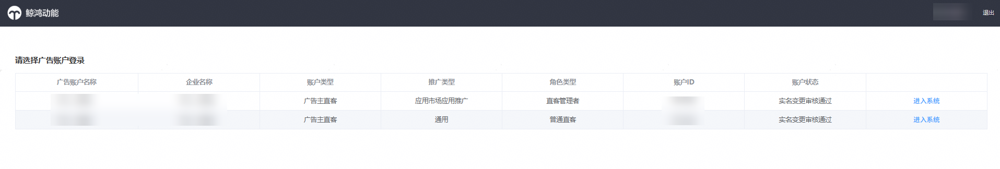
