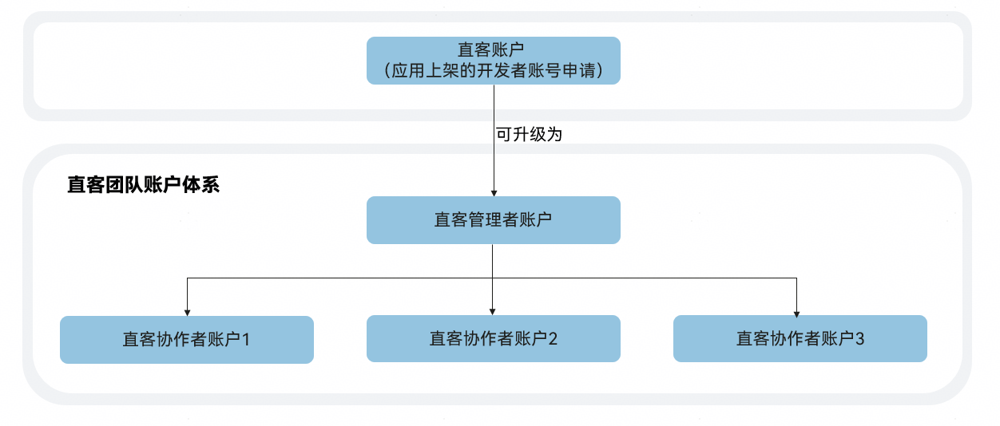

# 概述

## 直客团队体系特点

- 账户在线升级

  直客账户可在线升级为直客管理者账户，快速构建直客团队账户体系。

   

  直客账户升级为直客管理者账户后，不支持再回退为直客账户。账户升级不影响直客账户原有的功能和权限。
- 管理高效

  在线授权协作者账户，实现直客管理者账户和协作者账户共同管理同一应用的推广投放操作。
- 多账户操作互不干扰

  直客团队内直客管理者账户和协作者账户可以对同一应用基于不同投放目的、不同预算/ROI、不同报表各自独立操作，多个协作者账户间互不干扰。

## 直客团队体系角色说明

直客团队体系角色示意图如下图所示。

具体说明如下表所示。

| 角色 | 定义 |
| --- | --- |
| 直客管理者账户 | 直客账户可以升级为直客管理者账户，即直客团队账户的管理者。  直客管理者账户可授权华为账号为协作者账户，进行应用的协作投放。 |
| 直客协作者账户 | 经直客管理者账户授权，帮助直客管理者账户共同协作完成推广创建、优化和数据分析等工作。  说明：  直客协作者登录账号必须是无绑定其他任何角色（例如：客户投放伙伴主账户、客户投放伙伴子账户、投放操作账户、直客账户、鲸鸿动能广告账户等）的华为账号。 |

各个角色之间的关系如下：

- 直客管理者账户管理协作者账户。直客管理者账户能查看协作者账户的数据。
- 直客管理者账户授权协作者账户后，仍可以与协作者账户共同操作同一个应用，进行投放等操作。但只能各自操作各自账户创建的投放任务。
- 协作者账户拥有和直客管理者账户一样的推广投放、报表查看、财务管理等功能操作权限，但没有应用授权功能权限。对于同一直客团队账户下的多个协作者账户，协作者账户只能查看各自的数据。
