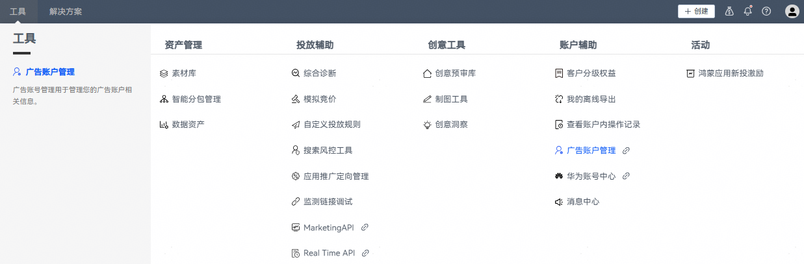
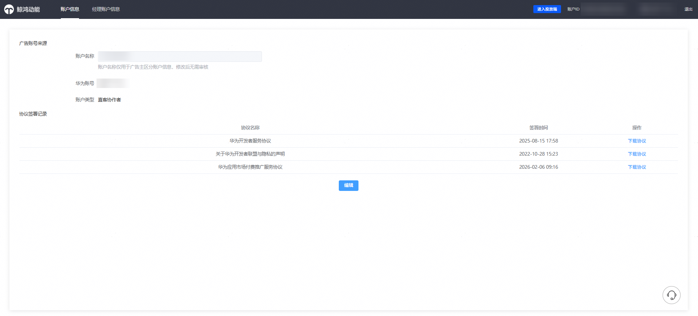
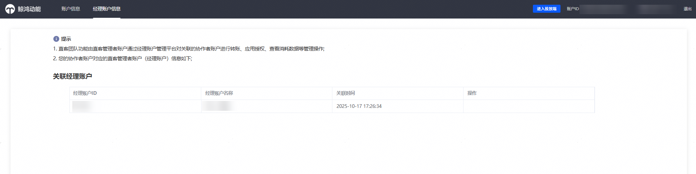
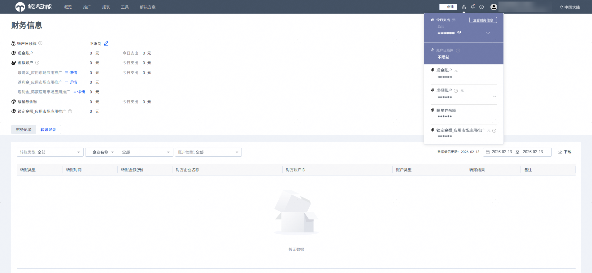
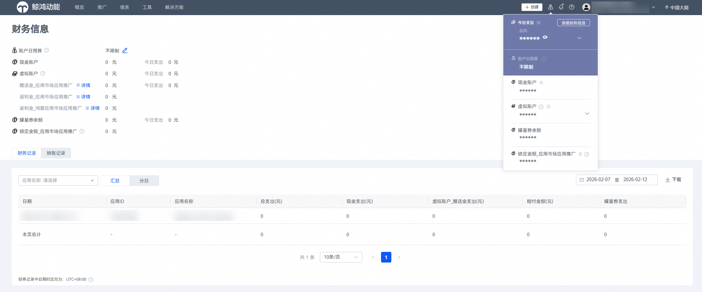
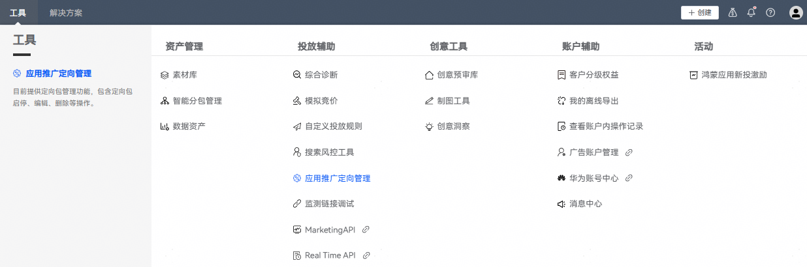
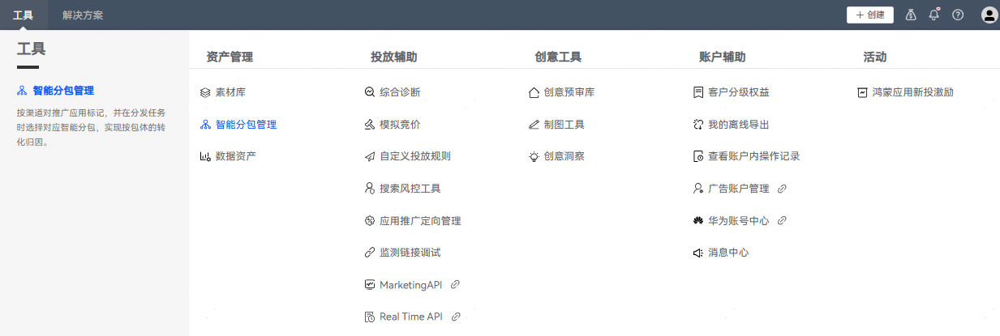
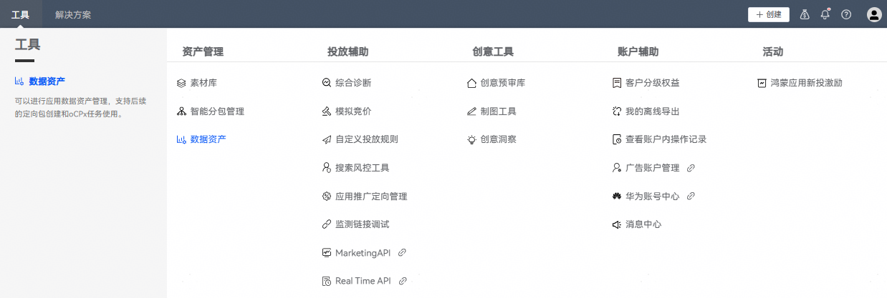
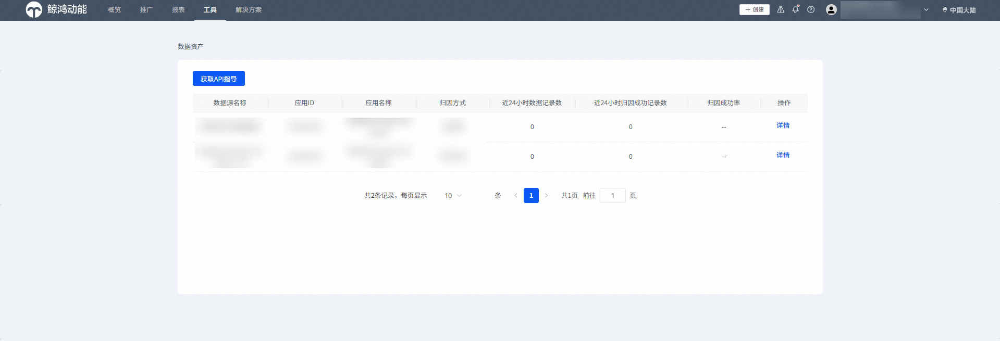
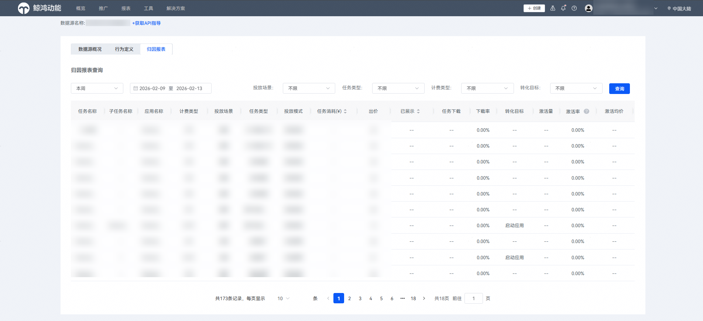

# 直客协作者账户

## 前提条件

- 直客协作者已申请华为账号，具体请参见[注册账号](https://developer.huawei.com/consumer/cn/doc/start/registration-and-verification-0000001053628148)。
- 已被直客管理者账户关联绑定，并授权应用。

   

  协作者账户关联的华为账号不需要进行实名认证。

## 查看协作者账户信息

1. 以协作者账户登录[华为应用市场应用推广平台](https://ads.huawei.com/cn/)。
2. 点击【工具】，在【账户辅助】中选择【广告账户管理】，即可查看当前账户的账户类型及其对应的直客管理者归属信息。

   

   “账户名称”是直客管理者账户邀请时设置的名称，“华为账号”即协作者账户关联的手机号或邮箱。

   

   点击【经理账户信息】，可查看协作者账户所归属的直客管理者账户ID、账户名称、关联时间。

   

## 查看转账记录、消耗记录

1. 以直客协作者账户登录[华为应用市场应用推广平台](https://ads.huawei.com/cn/)。
2. 在顶部菜单栏右上角点击“小钱包”图标，进入【财务管理】-【转账记录】，查看转账记录。可通过以下条件筛选转账记录：转账类型（转出/转入）、账户ID及账户类型（现金账户、赠送账户、返利账户、新投激励等）。

   
3. 在财务信息页面点击【财务记录】，可查看协作者账户的消耗明细。默认展示该直客协作者账户下所有应用的汇总消耗；可通过下拉选择应用名称，查看单个应用的消耗情况。数据支持按“汇总”或“按日”两种维度查看。

   

协作者账户可以查看本账户的投放数据，查看操作与直客账户相同，具体请参见[查询整体数据报表](https://developer.huawei.com/consumer/cn/doc/promotion/bp-delivery-task-management-overall-data-0000001294054000)。

## 卸载召回解决方案任务投放说明

协作者投放卸载召回解决方案任务时，需要注意如下约束。

如果当前应用无通投任务时，则卸载召回任务为冻结状态；如果当前应用有通投任务时，则卸载召回任务为正常状态。

- 如果当前应用在直客团队任意账户内有一个通投任务，则该应用的卸载召回任务可以正常投放。
- 如果当前应用在直客团队内无通投任务，则该应用的卸载召回任务为冻结状态，无法正常投放。

## 协作者工具使用说明

### 应用推广定向管理

以直客协作者账户登录[华为应用市场应用推广平台](https://ads.huawei.com/cn/) , 点击【工具】-【应用推广定向管理】，管理定向策略。

 

- 详细的管理定向策略操作，请参考[创建定向包](https://developer.huawei.com/consumer/cn/doc/promotion/bp-functions-target-strategy-0000001337229437)。
- 协作者可以自行新建定向包，并且其他协作者能看到并使用。

### 智能分包管理

以直客协作者账户登录[华为应用市场应用推广平台](https://ads.huawei.com/cn/)， 点击【工具】-【智能分包管理】，进入智能分包管理页面。

 

- 详细的智能分包管理操作，请参考[新建智能分包](https://developer.huawei.com/consumer/cn/doc/promotion/bp-functions-intelligent-subcontract-create-0000001337248557)。
- 协作者可自行新建智能分包，并且其他协作者能看到并使用。

### 数据资产

以直客协作者账户登录[华为应用市场应用推广平台](https://ads.huawei.com/cn/)， 点击【工具】-【数据资产】，可查看被授权投放应用创建的数据源。

 

协作者可在“数据源概况”里查看到被授权应用的整体数据回传概况。在“归因报表”中能看到自己创建的任务相关数据。

选择某个数据源，点击【详情】，跳转可查看数据源概况、行为定义、归因报表。

