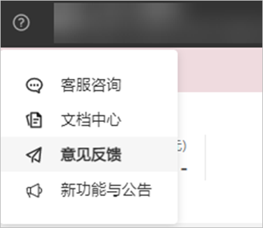
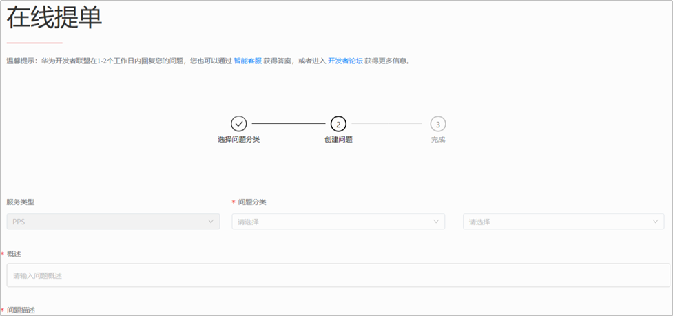

# 联系方式

<strong>1.</strong> <strong>智能客服</strong>

智能客服为您提供7\*24小时在线咨询服务，无论是广告投放前还是广告投放后，遇到任何问题均可联系[智能客服](https://smartrobot-drcn.platform.dbankcloud.cn/?appId=31001)，我们会即刻响应为您解答处理。

<strong>2.在线提单</strong>

链接：https://developer.huawei.com/consumer/cn/support/feedback/#/

2.1点击鲸鸿动能广告账户界面的““，选择“意见反馈”。

2.2在线提单。

在“在线提单”页面，依次输入服务类型，问题类型，概述和问题描述，并提交。

2.3查看结果。

问题提交后，您可以在此页面上点击进入“进入问题列表”查看问题的状态及反馈结果。

同时系统也会给您的联系人邮箱发送邮件通知，您可以打开邮件中的链接查看问题的状态及反馈结果。
