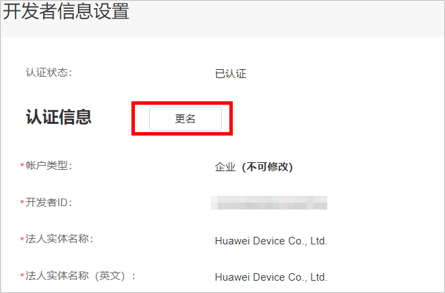
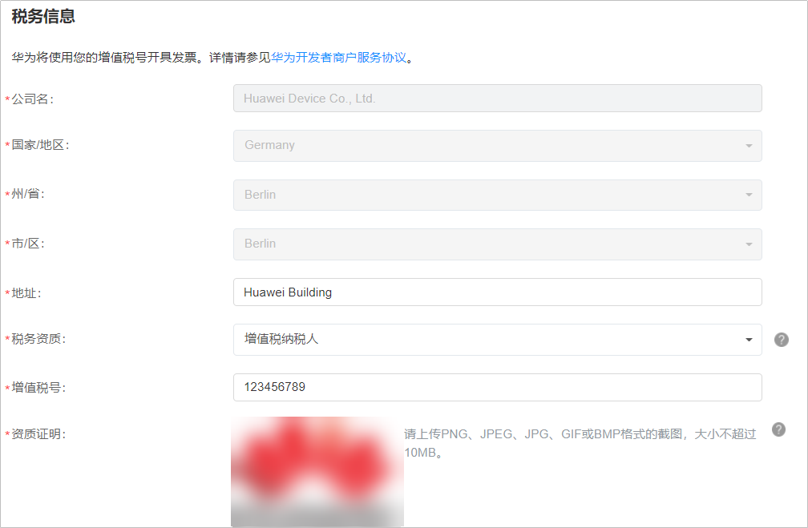
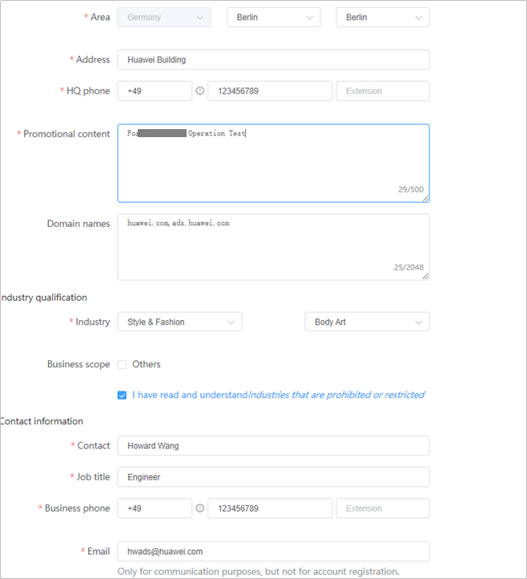
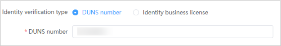
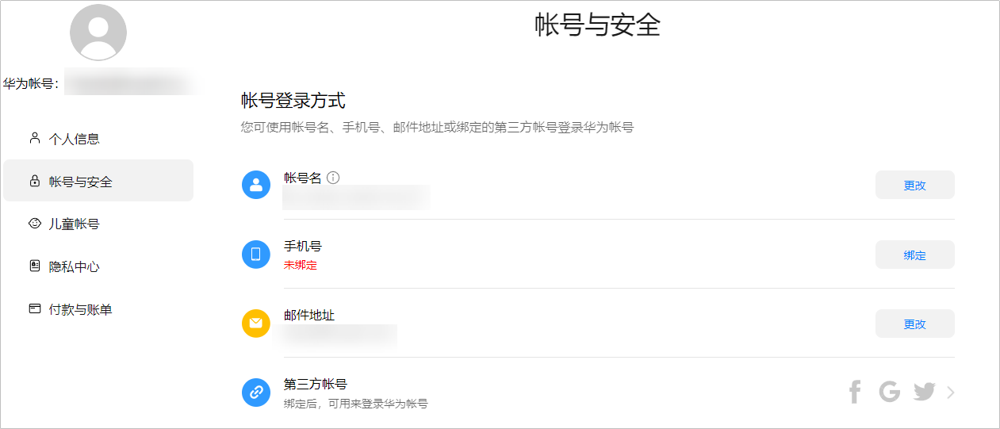
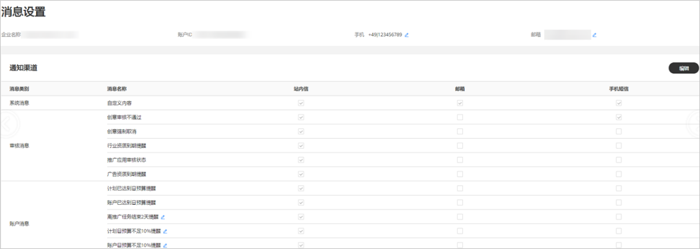

# 查看/修改账户基本信息

- <strong>广告账户企业名称修改</strong>：登录[华为开发者联盟管理中心](https://developer.huawei.com/consumer/cn/console#/serviceCards/)&gt;“<strong>设置</strong>”&gt;“<strong>开发者信息</strong>”&gt;“<strong>更名</strong>”即可修改企业认证信息名称，具体可参考：[变更企业名称](https://developer.huawei.com/consumer/cn/doc/start/information-modification-0000001053145467)。

  
- <strong>税务信息修改</strong>：登录[华为开发者联盟管理中心](https://developer.huawei.com/consumer/cn/console#/serviceCards/)&gt;“<strong>设置</strong>”&gt;“<strong>付费服务</strong>”，即可修改税务信息。

  
- <strong>广告账号管理</strong>：登录[鲸鸿动能广告](https://ads.huawei.com/ppsdspportal/index.html#/home)，点击“<strong>工具</strong>“&gt;“<strong>广告账号管理</strong>“，支持查看、修改广告账户信息，其中修改邓白氏号码/营业执照、区域和地址会触发审核。

  
- <strong>广告账户实名认证</strong>：
  - <strong>需要实名认证的场景如下：</strong>
    - 若您没有华为账号或者从未向华为开发者联盟提交过实名认证，注册鲸鸿动能广告账户无需实名认证；若任务审核被判定为涉及敏感行业，需要完成实名认证再进行广告投放。
    - 如果您在华为开发者联盟官网平台已经提交实名审核，但被驳回了，您需要根据驳回理由，在广告开户时<strong>重新修改实名信息</strong>，并提交审核，此时您可以进入广告账户试用，但审核通过后即可进行充值投放等操作。
    - 若您在华为开发者联盟平台提交的实名认证还在审核中，您需要等待实名通过后，才能开通鲸鸿动能广告广告账户。
  - <strong>操作方法</strong>：

    点击“<strong>工具</strong>”&gt;“<strong>广告账号管理</strong>”，您可以通过邓白氏号码或者营业执照号码进行实名认证，实名审核时间为1-2个工作日，审核结果将会发送到您的[联系人邮箱](/docs/monetize/promotion/bpos-start-guest-register-0000001328677526#ZH-CN_TOPIC_0000001328677526__li4641112612506)。

    
- <strong>华为账号管理</strong>：点击“<strong>工具</strong>“&gt;“<strong>华为账号管理</strong>“，支持查看、修改华为账号信息，具体可参考：[华为帐号信息设置](https://developer.huawei.com/consumer/cn/doc/start/account-management-0000001052865467)。

  
- <strong>消息设置</strong>：点击“<strong>工具</strong>“&gt;“<strong>消息设置</strong>“，支持查看、修改接收消息的手机号和邮箱号，点击“<strong>编辑</strong>”支持自定义消息接收渠道。

  
