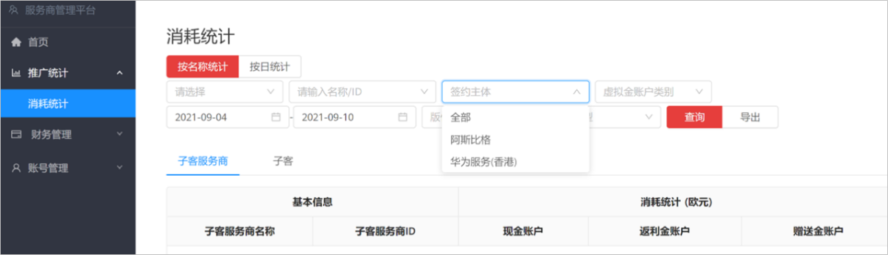
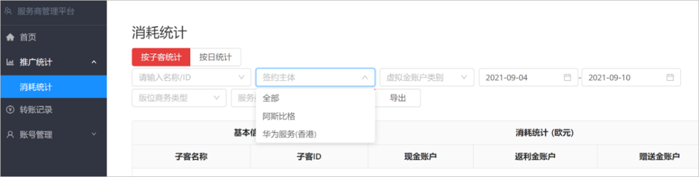

# 数据查看

支持服务商和子客服务商查看自己账户下关联账户的消耗：

- <strong>服务商消耗统计</strong>：点击“<strong>推广统计</strong>” &gt; “<strong>消耗统计</strong>”，支持按名称统计、按日统计条件下对消耗主体类型、签约主体、账户名称/ID、虚拟金账户类别、版位商务类型、服务类型进行筛选，查询到对应主体覆盖区域下的<strong>子客服务商</strong>和<strong>子客</strong>的消耗统计数据；签约主体（阿斯比格、华为服务（香港））是根据<strong>子客</strong>的投放地区来区分的。

  
- <strong>子客服务商消耗统计</strong>：点击“<strong>推广统计</strong>” &gt; “<strong>消耗统计</strong>”，支持按子客统计、按日统计条件下对签约主体、账户名称/ID、虚拟金账户类别、版位商务类型、服务类型进行筛选，可以查询到对应账户下<strong>子客</strong>的消耗统计数据；签约主体（阿斯比格、华为服务（香港））是根据<strong>子客</strong>的投放地区来区分的。

  
