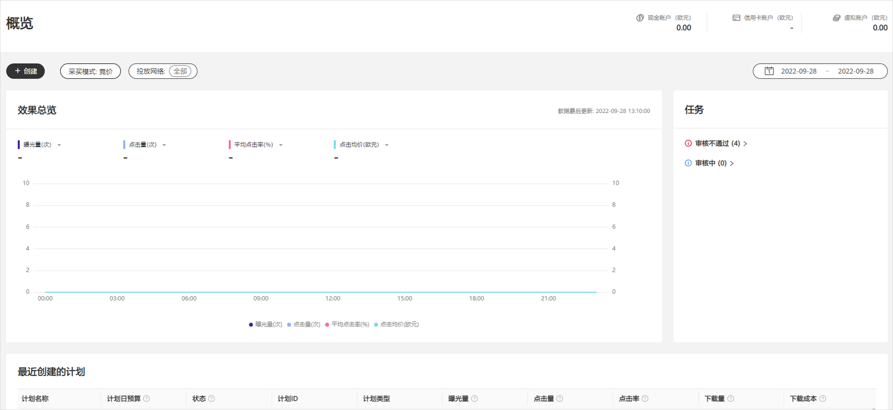
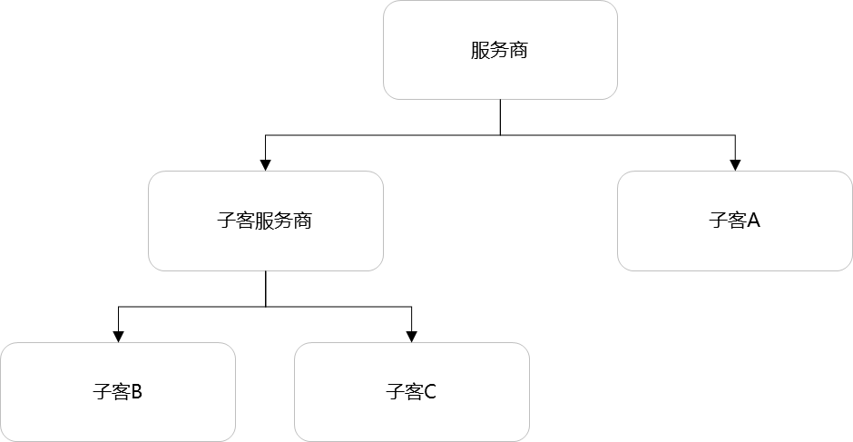
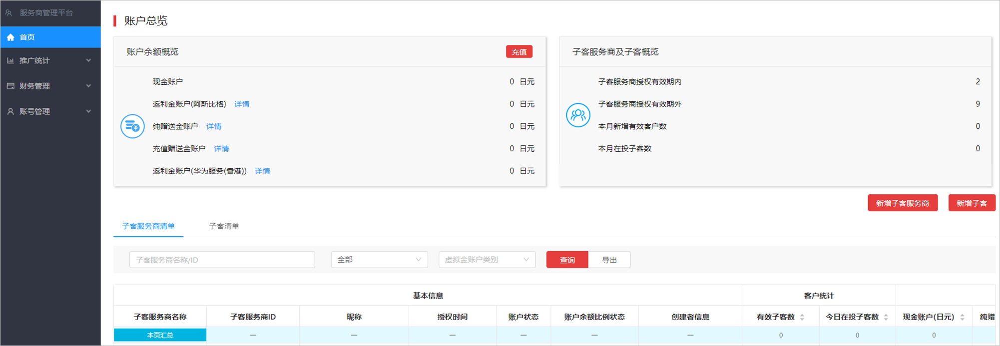
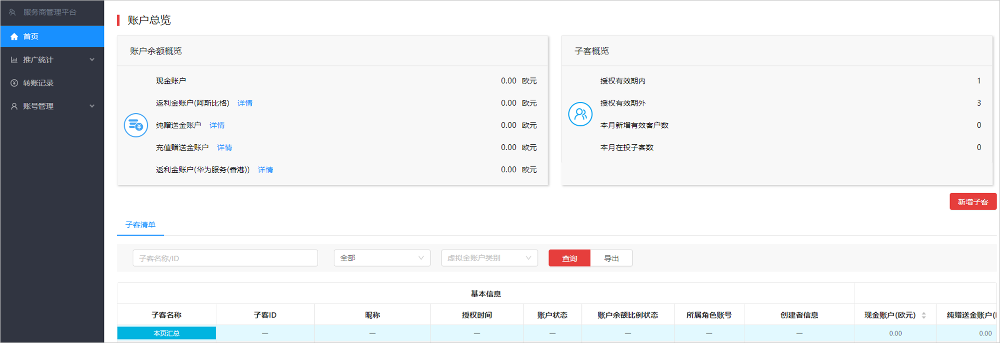
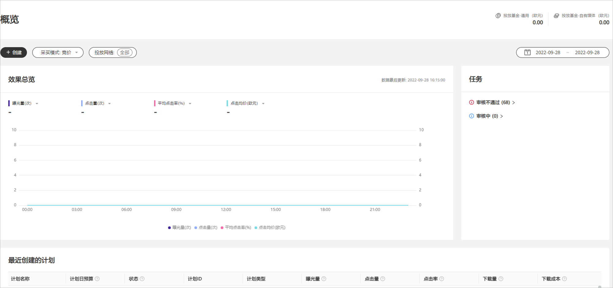

# 概述

投放端账户分直客账户和服务商账户两种类型：

- <strong>直客：</strong>如果您只推广自己企业的产品和服务，请选择直客类型，支持投放广告、充值账户，直客账户属于单独的账户，与其他账户类型无关联。直客账户如图所示：

  
- <strong>服务商：</strong>如果您是广告代理商，代理其他企业投放广告，请注册成服务商账户。服务商是鲸鸿动能广告为服务商提供的用于管理子客服务商及子客的系统。
  - 服务商账户分为三个层级：<strong>服务商、子客服务商、子客</strong>，如下图：

    

    - 每个服务商可以新增多个子客服务商或者子客，子客服务商可以新增多个子客。
    - 服务商和子客服务商账户只用于管理，不能创建投放任务，只有子客账户可以创建投放任务。
    - 只有服务商账户可以进行充值，子客服务商、子客均不可进行充值，子客服务商、子客需要由他的上一级进行转账。
    - 每一个鲸鸿动能广告账户需使用不同的华为帐号注册。
  - 服务商账户如图所示：

    
  - 子客服务商账户如图所示：

    
  - 子客账户如图所示：

    

注册不同类型账户时，您所需要准备的材料及注意事项如下：

- 相关文件必须以图片形式上传，且图片大小必须小于5M。
- 华为帐号的注册国家/地区必须与企业的营业执照注册地保持一致，否则会导致鲸鸿动能广告账户注册失败。

  |  |  |  |  |  |  |  |  |  |
  | --- | --- | --- | --- | --- | --- | --- | --- | --- |
  | 华为帐号注册国家/地区 | 中国大陆区域 | | | | | | | |
  | 实名认证方式 | [企业资料人工审核认证](/docs/monetize/promotion/bpos-start-guest-register-0000001328677526#企业资料人工审核认证) | | | | [对公银行打款认证](/docs/monetize/promotion/bpos-start-guest-register-0000001328677526#对公银行打款认证) | | | |
  | 角色 | 直客 | 服务商 | 子客服务商 | 子客 | 直客 | 服务商 | 子客服务商 | 子客 |
  | 营业执照 | √ | √ | √ | √ | √ | √ | √ | √ |
  | 法定代表人身份证 | √ | √ | √ | √ | - | - | - | - |
  | 税务资质（若无税号则无需提供税务资质文件） | √ | √ | √ | √ | √ | √ | √ | √ |
  | 授权文件 | - | - | √ | √ | - | - | √ | √ |

  |  |  |  |  |  |
  | --- | --- | --- | --- | --- |
  | 华为帐号注册国家/地区 | 非中国大陆区域 | | | |
  | 角色 | 直客 | 服务商 | 子客服务商 | 子客 |
  | 营业执照/邓白氏号码 | - | √ | √ | √ |
  | 税务资质（若无税号则无需提供税务资质文件） | √ | √ | - | - |
  | 授权文件 | - | - | √ | √ |

- 营业执照：企业营业执照是企业从事生产经营活动的证件。企业必须依法取得营业执照后方可进行生产经营活动。营业执照由企业登记主管机关核发。若您没有三证合一的营业执照，需要提供税务登记证和组织机构代码。
- 法定代表人身份证：法定代表人指依法律或公司章程规定代表法人行使职权的负责人。您需要向鲸鸿动能广告提供该法定代表人的身份证正反面照片。
- 邓白氏号码：邓氏编码(D-U-N-S Number)是一种实时动态的企业身份标志。邓白氏编码源自于一个独一无二的9位数字全球编码系统DUNS,相当于企业的身份识别码 (就像是个人的身份证),被广泛应用于企业识别、商业信息的组织及整理。
- 税务资质：税务资质是企业拥有的税务方面的权利或名誉，通过拥有某种资质可以享受某些税务方面的权利。
  - 华为帐号注册国家/地区为中国大陆区域：

    如果您是增值税一般纳税人，请补充一般纳税人证、税务登记证、开户许可证。如果您不是增值税一般纳税人，请补充税务登记证、开户许可证。
  - 华为帐号注册国家/地区为非中国大陆区域：
    - 如果您的企业是增值税一般纳税人，请选择是，此时需要补充纳税人识别号，部分国家/地区需要上传税务资质，具体的税务登记证请与您的财务确认。
    - 如果您的企业不是增值税一般纳税人，请选择否，此时不需要提交税号和税务资质。
- 授权文件：授权文件指的是授权上一级可以操作下一级账户的授权证明文件。

## 不同账户类型注册说明

- 每一个鲸鸿动能广告账户需使用不同的华为帐号注册。
- 如果您之前使用<strong>邓白氏码</strong>（邓白氏码只能使用一次）实名认证过直客账户，当前您想要用<strong>同一个公司</strong>继续注册服务商时，您需要使用<strong>营业执照</strong>注册，不能使用邓白氏码进行注册。
- 如果您的服务商账户已使用邓白氏码（邓白氏码只能使用一次）注册，同时您想要使用<strong>同一个公司</strong>注册<strong>子客服务商、子客</strong>，您需要使用<strong>营业执照</strong>注册子客服务商与子客。
- 子客服务商下的子客账户不支持转移。您需要使用新的HUAWEI ID通过营业执照在其他子客服务商下重新注册（因为邓白氏码只能使用一次），注意广告后台的投放历史数据仍然在原账户中。
