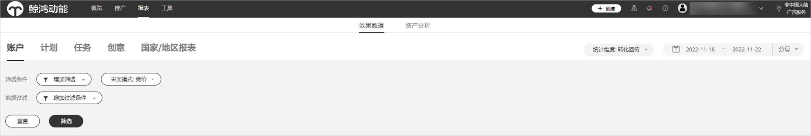
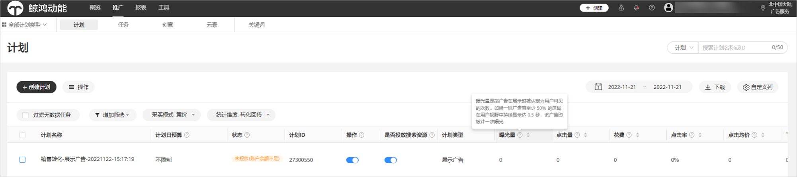
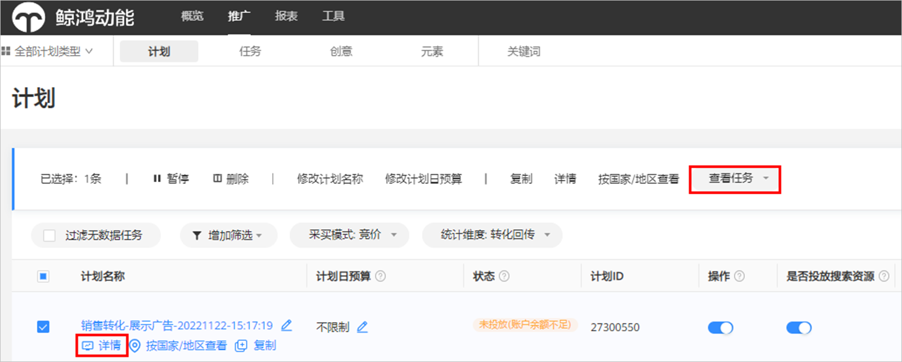
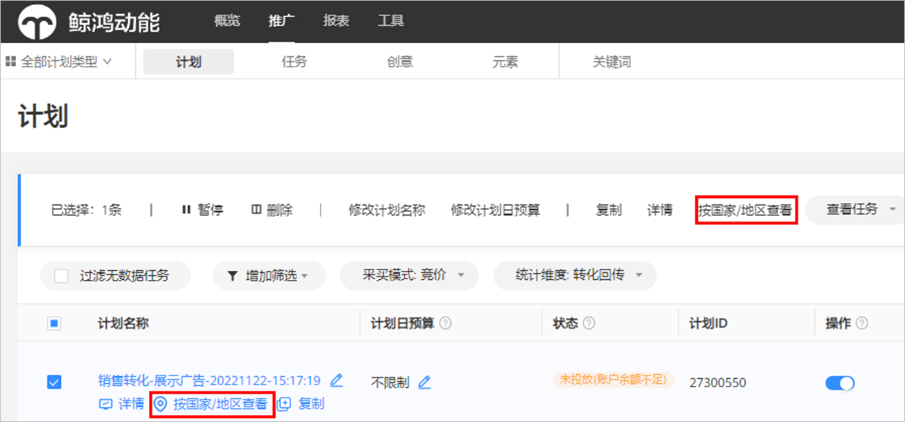
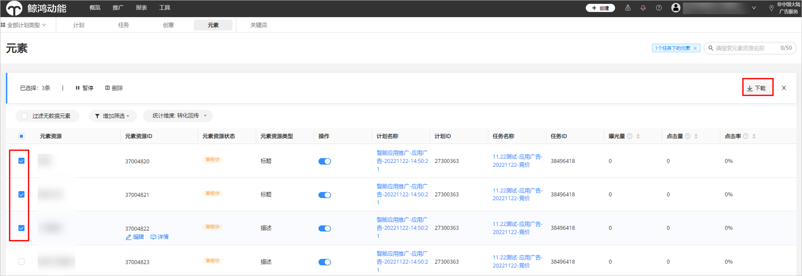
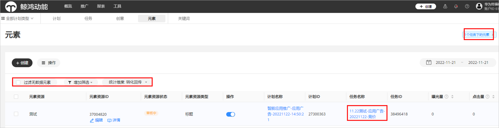
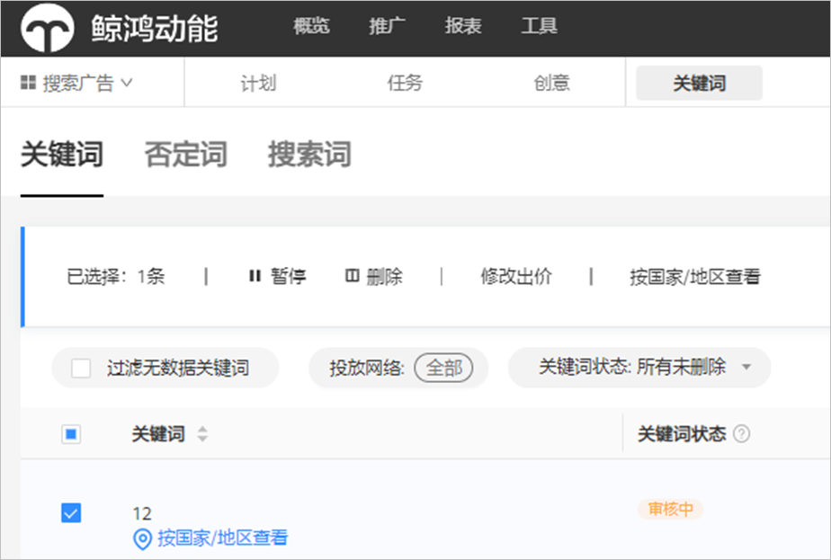
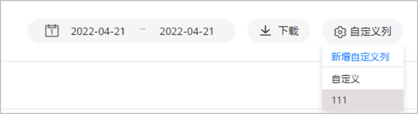

# 数据查看

## 在报表中查看数据

通过报表筛选、数据过滤功能，快速查找到您要的效果数据。

- 效果数据：

  

  - 筛选条件：

    筛选条件支持多选，您可以在账户、计划、任务、创意、国家/地区报表中，按照投放网络、计划类型进行筛选，完成后点击“筛选”，即可展现您想要的数据。
  - 数据过滤：您可以在账户、计划、任务、创意、国家/地区报表中，按照曝光量、下载量等进行筛选，完成后点击“筛选”，即可展现您想要的数据。
  - 统计维度：您可以通过统计维度对投放数据进行筛选，快速找到您最关注的广告数据。
    - 广告请求 ： 所有指标都按照该次广告请求发生的时间统计
    - 转化回传 ：转化跟踪的指标（激活、表单提交）按照实际回传转化的时间进行统计，非转化跟踪指标（曝光、点击、下载）仍按照请求发生的时间统计。

    示例：

    |  |  |  |  |  |  |
    | --- | --- | --- | --- | --- | --- |
    | <strong>时间</strong> | 12月1日23：55 | 12月1日23：59 | 12月2日00：01 | 12月2日00：10 | 12月3日 |
    | <strong>用户行为</strong> | 用户在华为视频请求广告 | 用户产生了曝光 | 用户产生了点击 | 用户下载完成 | 用户完成了激活 |
    | <strong>广告请求口径</strong> | / | 所有数据记录在12/1 | | | |
    | <strong>转化回传口径</strong> | / | 曝光：12月1日 | 点击：12月1日 | 下载：12月1日 | 激活：12月3日 |

- 时间维度：支持按照小时/日/月/整体进行统计数据。

## 在推广中查看数据

您可以通过计划/任务/创意/元素/关键词查看详细数据。如果您对某个数据指标存在疑问，可以点击指标名后的“”按钮，会给出此指标的口径解释。

### 查看计划/任务/创意数据

选择某个计划/任务/创意之后，点击“详情”查看对应数据。

您也可以在每个计划上查看对应的任务、创意的数据，同时您在任务层级上也可以查看该任务的创意数据。

### 查看国家/地区数据

若您需要分析广告在不同国家/地区的投放情况，您可以选择您想要查看的推广计划/任务/关键词，点击“按国家/地区查看”，弹出对应推广计划/任务分地区的广告数据。

### 查看元素数据

- <strong>路径一：</strong>点击“<strong>推广</strong>” &gt; <strong>“元素</strong>”，通过“元素资源类型”进行筛选，筛选完成之后勾选元素资源，点击“<strong>下载</strong>”，下载元素数据；如果您的应用广告任务引用了相同的元素，那么列表中的各个元素会将账户内多个相同元素跨任务合并统计数据。

  
- <strong>路径二：</strong>点击“<strong>推广</strong>” &gt; <strong>“任务</strong>”，选中某一个智能应用任务，点击任务名称，进入元素页面，您可以通过“筛选”、“统计维度”进行筛选，筛选完成之后勾选元素资源，点击“<strong>下载</strong>”，下载您想要元素数据。

  

  点击查看详情，您可以看到元素的预览，该处预览仅为示例，并不代表所有广告样式；元素列表“操作日志”，支持元素级操作查询。界面如下：

  

### 查看关键词数据

对搜索广告，您可以在搜索关键词广告页面查看投放效果。

关键词数据：您可以查看不同关键词带来的曝光、点击、花费以及下载，对下载量高、高点击率的关键词，您可以使用“关键词推荐”功能增加更多相似关键词，提高您的广告效果。

## 查看自定义指标数据

广告投放后，您可以根据需要从“自定义列”中选择报表中需要查看的数据，包括“属性指标”，“展示指标”，“转化及生命周期”等，勾选后即可出现在报表中。

- 属性指标：包含计划类型、营销目标、投放网络等。
- 展示指标：包含广告曝光量、点击量、花费等。
- 转化及生命周期：大部分指标依赖转化跟踪数据回传。
- 保存为常用自定义列：您可以将您常用的指标保存，并设置名称（限制20个字符），下一次使用时可以直接进行选择。

  

## 查看转化回传数据

完成应用跟踪或线索跟踪后，回传的转化数据可以在鲸鸿动能广告广告平台查看，进入“推广”或“报表”菜单下的相关页面，选择“自定义列”，选择您跟踪的[转化指标](https://developer.huawei.com/consumer/cn/doc/promotion/bpos-functions-tripartite-attribution-data-0000001379958197#ZH-CN_TOPIC_0000001379958197__p4119mcpsimp)进行查看。

如果您在广告平台没有看到相应的转化数据，您需要检查应用跟踪或者线索跟踪回传配置是否正确。
