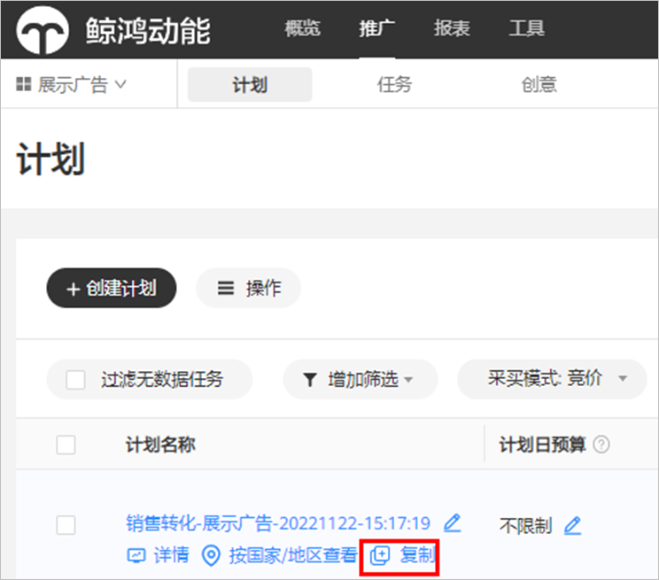
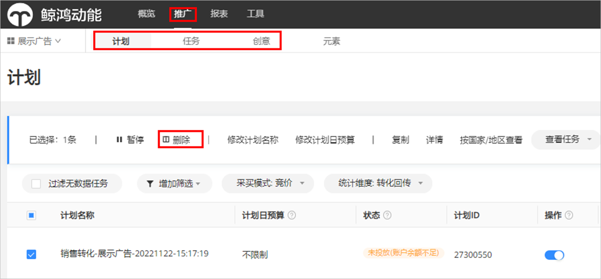
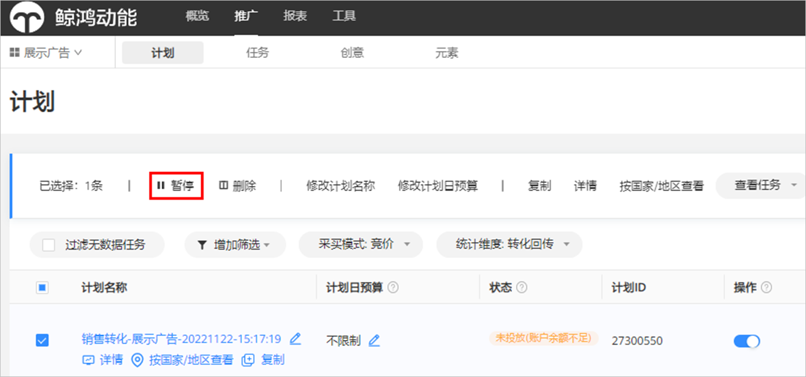
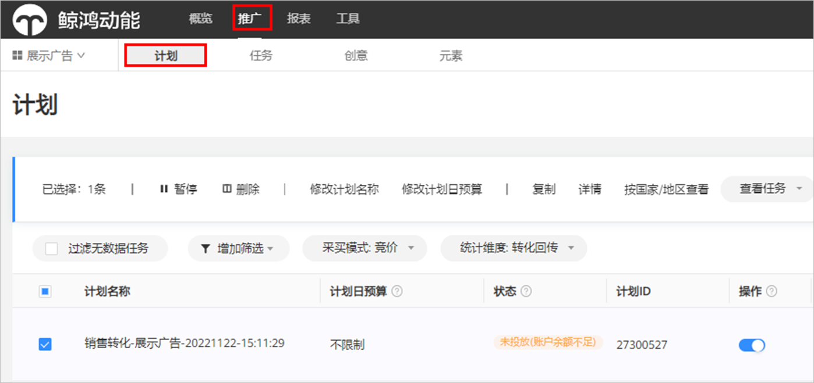
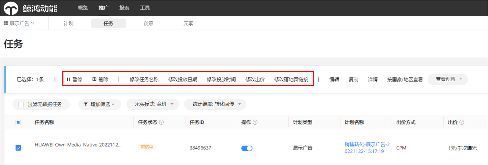
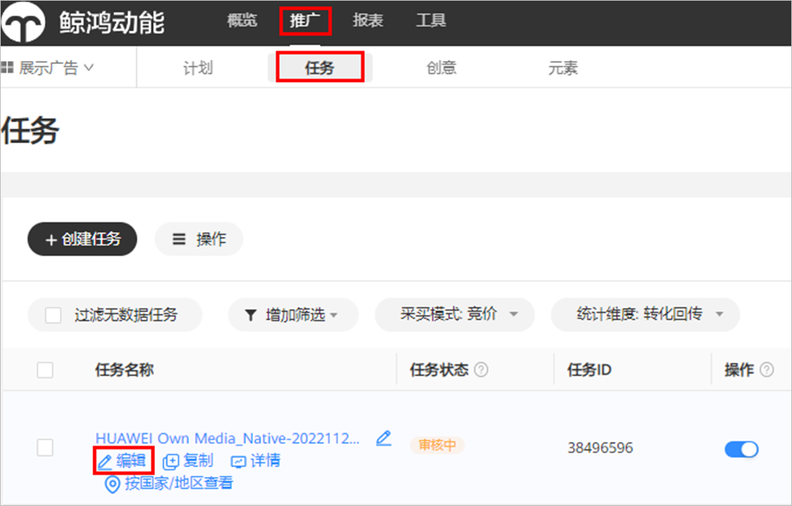

# 投放管理

## 复制

您可以复制所有的资源类型下的广告计划。每次仅支持复制一条，不能批量复制计划。

点击“<strong>推广</strong>”，选择您想要复制的计划，复制成功后，则生成一条与原计划结构、设置一模一样的广告计划，包含：任务、创意、定向、投放时间及日期、计划日限额、出价策略、版位、推广产品、创意文案及图片、监测链接、商品组等。

成功复制后的计划默认开启，仍需重新审核，审核通过后即可投放。如果您不希望立马投放，您可以在复制计划时勾选“复制后暂停新的副本广告计划”。

## 筛选

点击“<strong>推广</strong>”，选择“<strong>计划或者任务或者创意</strong>”，通过筛选目标对广告进行筛选。

## 删除

点击<strong>“推广”，</strong>选择<strong>“计划</strong>或者<strong>任务</strong>或者<strong>创意”，</strong>勾选需要删除的“<strong>计划</strong>或者<strong>任务</strong>或者<strong>创意</strong>”，点击“<strong>删除”</strong>；跳出确认删除弹框后，点击“<strong>OK”</strong>完成操作。

 

- 未开始投放的任务可立即删除；

- 投放结束且90天及以上无广告效果数据变化的任务可删除；

- 不限制日期任务90天以上无广告效果数据的任务，需要先设置结束时间，结束后第二天才可删除。

## 暂停

点击<strong>“推广”，</strong>选择<strong>“计划</strong>或者<strong>任务</strong>或者<strong>创意”，</strong>勾选需要暂停的“<strong>计划</strong>或者<strong>任务</strong>或者<strong>创意</strong>”，点击“<strong>暂停”</strong>或者“<strong>”</strong>完成操作。

## 修改

- 修改计划名称、计划日预算。

  点击<strong>“推广“，</strong>选择<strong>”计划”，</strong> 勾选需要修改的计划，进行对应操作。

  修改计划日预算支持当日生效和次日生效，每条计划日预算每天最多可修改10次。

  
- 修改广告任务名称、日期、时间、出价、修改落地页链接。

  点击<strong>“推广“，</strong>选择<strong>”任务”，</strong> 勾选需要修改的任务，进行对应操作，修改后直接生效。

  
- 修改广告定向

  点击<strong>“推广”</strong>，选择<strong>“任务”，</strong> 勾选需要修改的任务，或者鼠标移至任务，点击“<strong>编辑</strong>”即可修改。

  
