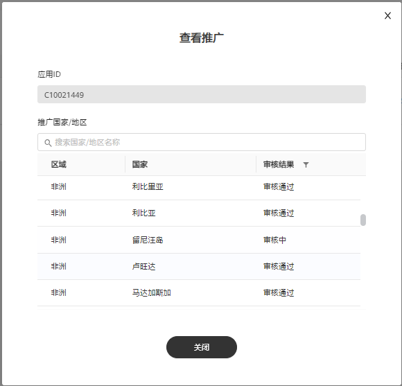

# 应用市场应用推广评测

## 概述

为保证华为终端用户的使用体验，您的行业需要符合准入规则，确保内容合法合规。只有通过审核的应用才能进行广告投放。

## 应用市场应用推广评测流程

在投放应用市场广告之前，您需要根据应用上架的应用市场在应用管理中添加应用，审核通过后方可启动投放。

<strong>审核流程：</strong>

## 应用市场-应用管理操作步骤

 

AG投放应用管理中最多添加100个来自华为应用市场的应用。

1. 添加应用并申请推广国家/地区。

   点击”工具”&gt;“应用管理“&gt;"AG投放应用管理"，点击“添加App”：

   

   - <strong>应用ID</strong>：输入应用ID，应用ID可在华为应用市场应用详情页网页链接尾部获取，例如：``https://appgallery.huawei.com/#/app/<strong>Cxxxxxxxxx</strong>``，请前往[华为应用市场](https://appgallery.huawei.com/#/Featured)查看。
   - <strong>推广国家</strong>/<strong>地区</strong>：您只能在应用已发布的地域/国家进行推广。您可以在搜索框中搜索您想要推广的国家，为避免重复评测给您带来的推广延迟，建议您选择半年内要推广的国家/地区。例如，您应用仅在英国和俄罗斯上架，则您只能在英国和俄罗斯申请推广。

     若您的应用曾经在鲸鸿动能广告、应用市场应用推广平台进行过推广，系统会默认显示您推广过的<strong>国家</strong>/<strong>地区</strong>，若您此次想要推广的区域包含在界面上显示的“<strong>推广国家</strong>/<strong>地区</strong>”内，请点击确认即可进行推广，无需进行第二步审核。

     若您想要推广的区域未包含在界面上显示的“<strong>推广国家</strong>/<strong>地区</strong>”内，推广国家添加完成后，请点击“确认“，此时应用将会提交审核。

2. 提交应用审核。

   您提交的应用将在3个工作日内完成审核，审核结果将发送至您的联系人邮箱，请注意查收。

   

3. 投放应用市场广告。
