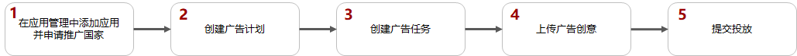
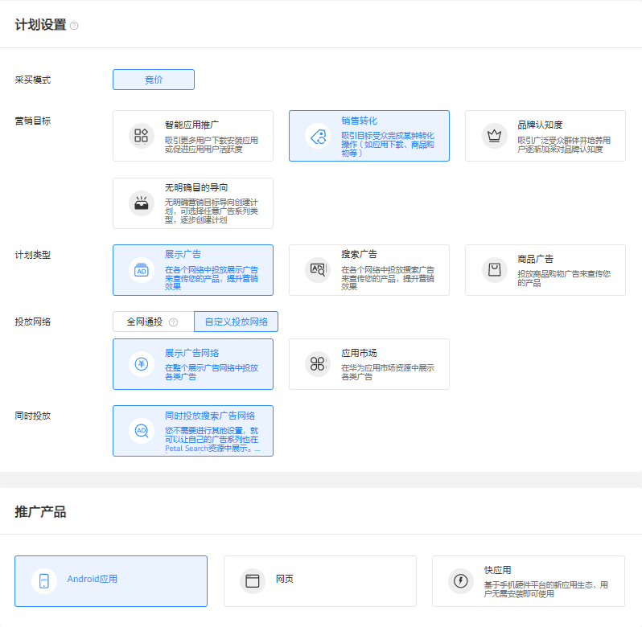
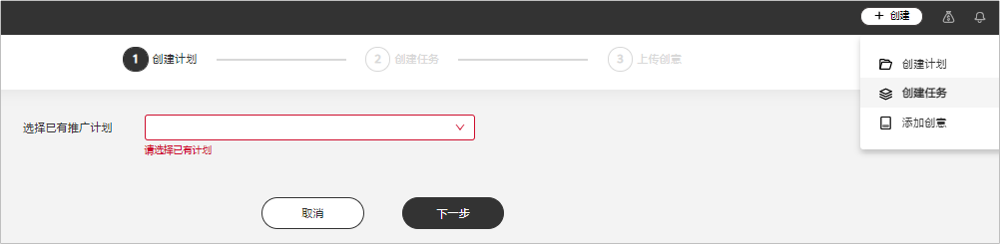

# 投放推荐任务

## 概述

应用市场展示广告是在华为应用市场的展示位上将您的应用展示推荐给用户，提升用户的下载。

## 操作流程

## 操作步骤

1. 在[应用管理](https://developer.huawei.com/consumer/cn/doc/distribution/promotion/appmanagement-0000001182393586)中添加应用并申请推广国家。
2. 创建广告计划。

   点击，选择“创建计划”。

   

   - <strong>营销目标：</strong>选择“销售转化”或者“无明确目的导向”。
   - <strong>计划类型：</strong>选择“展示广告”。
   - <strong>投放网络：</strong>选择“应用市场”<strong>。</strong>
   - <strong>推广产品：</strong>选择“Android应用”<strong>。</strong>
   - <strong>计划日预算：</strong>如果您希望控制计划下所有任务的每日最高消耗金额，可以为计划指定日预算金额。超过限额时系统将自动暂停此计划的投放并在次日恢复限额和投放。日预算支持修改，修改后您可以选择立即生效或者次日生效，每天最多修改10次。
   - <strong>推广计划名称：</strong>设置一个清晰易懂的计划名称，方便您在广告账户中轻松找到这个计划，例如：推广产品 + 营销目标 + 投放网络 + 目标人群。

3. 创建广告任务（简称“基础任务”）。
   - <strong>推广应用ID：</strong>从下拉列表中选择要推广的应用。列表中仅展示已经成功添加到“应用管理”并通过推广审核的应用。如果需要推广的应用不在下拉列表中，您需要先添加应用，详情请参考应用市场应用推广评测-[应用管理](https://developer.huawei.com/consumer/cn/doc/distribution/promotion/appmanagement-0000001182393586)。
   - <strong>定向：</strong>设置您希望推广的国家/地区，只支持从此应用已经[广告审核](https://developer.huawei.com/consumer/cn/doc/promotion/bpos-delivery-task-promotion-evaluation-0000001379837553)的国家中进行选择，同一任务中可以选择多个国家/地区进行投放。如果您想使用更多的定向功能，请参考[应用市场应用推广任务支持基础定向功能](https://developer.huawei.com/consumer/cn/doc/promotion/bpos-functions-base-target-0000001328677542)。
   - <strong>版位：</strong>推荐您同时在所有版位进行推广，提升应用转化率。由于每个任务只能选择一个版位，需要您为应用市场的每个版位创建任务。
   - <strong>投放日期：</strong>不限制日期：如果您希望广告一直投放，您可以设置一个起始日期，起始日期默认是您创建广告的当天，您也可以指定未来的某一个日期进行投放。选择日期范围：如果您希望广告在某一段日期内投放，您可以为广告设置指定的日期。
   - <strong>出价：</strong>只支持按照CPD模式进行竞价，在用户下载应用后按照您的出价进行计费。
   - <strong>任务名称</strong>：设置一个清晰易懂的任务名称，方便您在广告账户中轻松找到这个任务，例如：任务类型+推广产品+推广国家+版位+出价方式。
4. 添加广告创意。

   在应用市场广告下，系统默认使用您在应用市场上传的应用图标，您无需上传其他图片且不支持修改。

   

   <strong>监测地址（选填）</strong>：如果您使用三方监测进行转化跟踪，请先完成三方归因操作指南[概述](https://developer.huawei.com/consumer/cn/doc/promotion/bpos-functions-tripartite-attribution-overview-0000001328677546)对应操作，完成后在您创建任务的时候，系统将会自动关联监测地址（关联出来的链接建议不要修改，避免影响跟踪数据）。如果您修改了关联分析工具中的监测链接，系统将会自动同步到任务，任务中无需修改。

5. 提交投放。

   点击“提交”，应用市场广告不需要审核，提交后直接进入投放状态。

## 应用市场展示广告支持更多定向功能

如果您想使用更多的定向功能，例如：语言、性别、年龄等，您需要在已有的计划下增加新的任务（简称“普通任务”），在新增的任务中选择定向。

 

- 如果您需要使用此功能，需要申请[特性通行名单](https://developer.huawei.com/consumer/cn/doc/distribution/promotion/addtongxing-0000001128278195)。

1. 在已有计划下创建普通任务。

   点击，选择“创建任务”。选择后，计划设置默认与所选计划一致，不可修改。

   

2. 设置任务信息。
   - <strong>推广产品详情：</strong>默认与基础任务选择的应用一致，不可修改。
   - <strong>定向</strong>：

     

     <strong>不限：</strong>对所有的定向，默认选择不限，此时您的广告将会投放给所有用户。您可以根据以下定向来设置您广告的投放人群：

     - <strong>地域：</strong>默认与基础任务地域一致，不可修改。
     - <strong>语言</strong>：通过语言定向，您可以选择希望覆盖使用哪种语言的用户，您的广告将会展示给手机上设置这些语言的用户。如果您未选择语言，您的广告创意语言应该与投放地域主流语言一致。
     - <strong>性别</strong>：指定只投放给某个性别的用户。
     - <strong>年龄</strong>：您可以覆盖那些可能在年龄段上符合您的特定要求的潜在客户。
     - <strong>APP行为：</strong>根据用户对某类APP的使用行为进行定向，支持三个定向条件：
       - 一个月内活跃：当前设备上安装有此类应用，且在过去一个月内至少使用过一次。
       - 已安装：当前设备上安装有此类应用。
       - 未安装：当前设备上未安装此类应用。
     - <strong>联网方式：</strong>您可以根据用户设备的联网方式进行定向，可以投放给wifi、2G、3G、4G、5G的用户。
     - <strong>自定义人群</strong>：您可以指定投放给某个人群，也可以指定不向某个人群投放。

       如果您选择了其他定向条件，此时“自定义人群”与其它定向条件同时生效（取并集）。

       如果您没有选择其他定向条件（默认为“不限”），此时您只投放给自定义人群包的人群。

       - <strong>类别</strong>：指的是人群包的类别，分为公共人群包、专属人群包、私有人群包。
       - <strong>区域</strong>：指当前人群包所在的区域，分为中国、俄罗斯、欧盟(GDPR)、亚非拉、全球等，每个区域只保存本区域内用户数据，投放时只能选择投放目标区域内的人群包。
       - <strong>覆盖量</strong>：指的是人群包中包含的人群总数。人群包定向和其它定向条件会同时生效，如果人群包包含的用户太少会导致任务覆盖较少。
   - <strong>版位：</strong>默认与基础任务版位一致，不可修改。
   - <strong>投放时间：</strong>默认与基础任务投放时间一致，不可修改。
   - <strong>出价：</strong>只支持按照CPD进行竞价，在用户下载应用后按照您的出价进行计费。
   - <strong>任务名称</strong>：设置一个清晰易懂的任务名称，方便您在广告账户中轻松找到这个任务，例如：任务类型+推广产品+推广国家+版位+出价方式。
3. 添加广告创意。

   默认与基础任务创意一致，不可修改。

4. 提交投放。

   点击“提交”，应用市场广告不需要审核，提交后直接进入投放状态。

## 管理基础任务/普通任务

- 暂停/删除：
  - 基础任务不支持暂停/删除，您需要通过暂停/删除应用广告推广计划，此时基础任务才会停止投放。
  - 普通任务支持暂停，您可以选择您想要暂停的普通任务，点击操作的“”。
  - 普通任务支持删除，您可以勾选您想要删除的普通任务，点击“删除”。
- 修改：

  基础任务/普通任务支持修改定向、投放时间、出价。
