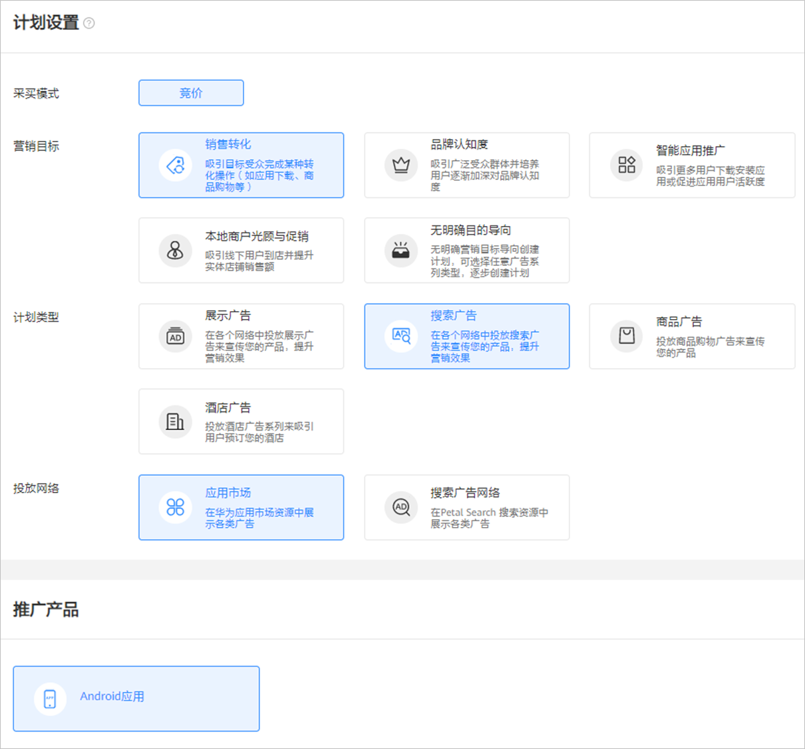
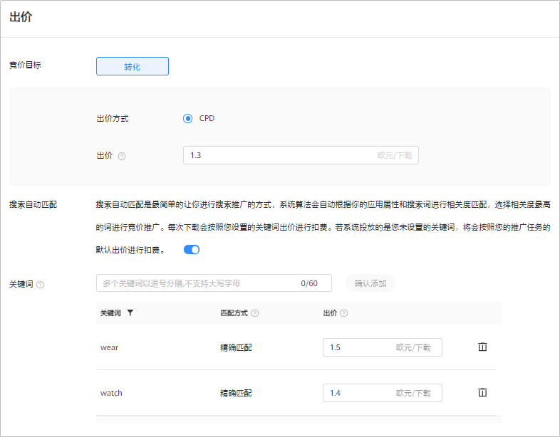
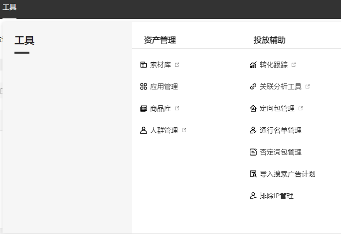
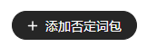

# 投放搜索任务

## 概述

应用市场搜索广告是指在应用市场搜索直达及搜索结果等资源上，将您的应用展示推荐给用户，提升用户的下载。

## 操作流程

## 操作步骤

1. 在[应用管理](https://developer.huawei.com/consumer/cn/doc/distribution/promotion/appmanagement-0000001182393586)中添加应用并申请推广国家。
2. 创建广告计划。

   点击，选择“创建计划”。

   

   - <strong>营销目标：</strong>选择“销售转化”或者“无明确目的导向”。
   - <strong>计划类型：</strong>选择“搜索广告”。
   - <strong>投放网络：</strong>选择“应用市场”<strong>。</strong>
   - <strong>推广产品：</strong>选择“Android应用”<strong>。</strong>
   - <strong>计划日预算：</strong>如果您希望控制计划下所有任务的每日最高消耗金额，可以为计划指定日预算金额。超过限额时系统将自动暂停此计划的投放并在次日恢复限额和投放。日预算支持修改，修改后您可以选择立即生效或者次日生效，每天最多修改10次。
   - <strong>推广计划名称：</strong>设置一个清晰易懂的计划名称，方便您在广告账户中轻松找到这个计划，例如：推广产品 + 营销目标 + 投放网络 + 目标人群。

3. 创建广告任务。
   - <strong>推广应用ID：</strong>从下拉列表中选择要推广的应用。列表中仅展示已经成功添加到“应用管理”并通过推广审核的应用。如果需要推广的应用不在下拉列表中，您需要先添加应用，详情请参考[应用管理](https://developer.huawei.com/consumer/cn/doc/distribution/promotion/appmanagement-0000001182393586)。
   - <strong>定向：</strong>设置您希望推广的国家/地区，只支持从此应用已经[广告审核](https://developer.huawei.com/consumer/cn/doc/promotion/bpos-delivery-task-promotion-evaluation-0000001379837553)的国家中进行选择，同一任务中可以选择多个国家/地区进行投放，详情参考[应用市场应用推广任务支持基础定向功能](https://developer.huawei.com/consumer/cn/doc/promotion/bpos-functions-base-target-0000001328677542)。
   - <strong>版位：</strong>选择App search。
   - <strong>投放日期：</strong>不限制日期：如果您希望广告一直投放，您可以设置一个起始日期，起始日期默认是您创建广告的当天，您也可以指定未来的某一个日期进行投放。选择日期范围：如果您希望广告在某一段日期内投放，您可以为广告设置指定的日期。
   - <strong>投放时间：</strong>全天：如果您希望广告全天投放，选择后，广告将会24小时进行投放。特定时间段：如果您希望广告在一天的某个时间段开始投放，此时您需要在页面上选择相应时间点。多个时间段：如果您希望广告每天的投放时间都不同，以一周为维度，您可以在周一设置一段时间，周二设置一段时间，设置完成后，这一周将会以此时间段投放广告。

   

   

- <strong>出价：</strong>只支持按照CPD模式进行竞价，在用户下载应用后按照您的出价进行计费。
- <strong>搜索自动匹配：</strong>搜索自动匹配是最简单的让你进行搜索推广的方式，系统算法会自动根据你的应用属性和搜索词进行相关度匹配，选择相关度最高的词进行竞价推广。每次下载会按照您设置的关键词出价进行扣费。若系统投放的是您未设置的关键词，将会按照您的推广任务的默认出价进行扣费。
- <strong>关键词：</strong>您可以设置希望在用户搜索哪些关键词时对您的应用进行推广。
  - 关键词支持的匹配方式：仅支持“精确匹配”，当用户搜索词与您设置的关键词完全一致时，您的广告才有展现机会。精确匹配可以匹配关键词的单复数，进行时、过去式等变体，并且顺序必须保持一致。

    例如：关键词coffee cups，用户搜索coffee cups或者coffee cup（单数）都可以匹配。但如果用户搜索的是blue coffee cups（添加了额外的单词）或者coffee mugs（相似单词），这时您的广告就不会出现。
  - 关键词出价：每个关键词可以单独出价，设置关键词是快速将您的产品推送给目标用户的有效手段。关键词出价的优先级高于任务的默认出价，例如：上图中设置了wear出价是1.5，而任务的默认出价是1.3，这时用户在搜索wear时，系统将用1.5出价进行竞价。若该关键词没有单独设置出价，则使用默认出价进行竞价。

    通过设置关键词出价，您可以更精确的控制对不同用户的出价，以便在一些高潜用户的竞价上通过高出价提高转化率。 例如：HUAWEI Watch 3 pro的用户是潜在的高价值用户，您可以对Watch 3 pro给出更高出价，以便提高在搜索watch 3 pro时的转化率。
  - 关键词可以分批次增加，最多添加200个，添加的时候，您可以用逗号分隔多个关键词。
- <strong>否定关键词</strong>：设置否定关键词后，在用户搜索的内容匹配上您设置的任意否定关键词时，您的广告都不会被展示。以便帮您屏蔽一些不希望展示的场景。若您想更便捷的管理您的关键词，您可以添加一个否定关键词包，然后运用到你想要使用的计划或者任务中，具体您可以参考[否定关键词管理列表](https://developer.huawei.com/consumer/cn/doc/distribution/promotion/negative-keyword-lists-0000001174605089)。

  <strong>工具—&gt;投放辅助—&gt;否定词包管理</strong>

  

  

  - <strong>任务名称</strong>：设置一个清晰易懂的任务名称，方便您在广告账户中轻松找到这个任务，例如：任务类型+推广产品+推广国家+版位+出价方式。

4. 添加广告创意。

   在应用市场广告下，系统默认使用您在应用市场上传的应用图标，您无需上传其他图片且不支持修改。

   

   <strong>监测地址（选填）</strong>：如果您使用三方监测进行转化跟踪，请先完成[概述](https://developer.huawei.com/consumer/cn/doc/promotion/bpos-functions-tripartite-attribution-overview-0000001328677546)的对应操作，完成后在您创建任务的时候，系统将会自动关联监测地址（关联出来的链接建议不要修改，避免影响跟踪数据）。如果您修改了关联分析工具中的监测链接，系统将会自动同步到任务，任务中无需修改。

5. 提交投放。

   点击“提交”，应用市场广告不需要审核，提交后直接进入投放状态。
