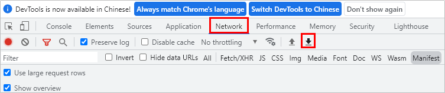
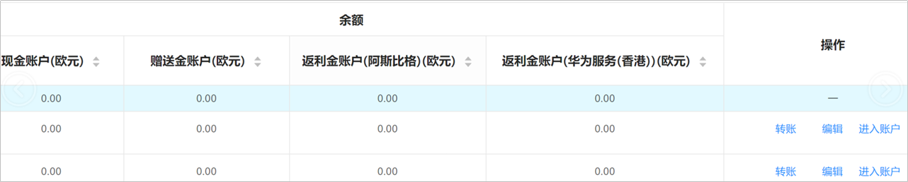

# FAQ

## 新手入门

1. <strong>应用市场非中国大陆区域计费类型有哪些？</strong>

   竞价CPD、合约CPD、合约CPT
2. <strong>应用市场非中国大陆区域有哪些资源可以购买？</strong>

   推荐资源：Recommended apps、Standard

   搜索资源：搜索直达、搜索结果

   品效资源：开屏、首页焦点图、Banner
3. <strong>个人是否可以注册鲸鸿动能广告账户？</strong>

   目前鲸鸿动能广告暂不支持个人注册鲸鸿动能广告账户。若您需要推广您的产品服务，可考虑通过华为[认证服务商](/docs/monetize/promotion/partnerinformation-0000001058393913)推广投放。
4. <strong>注册的时候选择直客还是服务商？如何成为子客？</strong>

   如果您希望成为服务商，代理您的客户投放广告，请选择[服务商账户注册](/docs/monetize/promotion/bpos-start-service-provider-register-0000001328677530)；

   如果您是广告主只需要推广自己的产品，可以选择：A：[直客账户注册](/docs/monetize/promotion/bpos-start-guest-register-0000001328677526)，使用直客账户进行广告投放；B：选择一个[认证服务商](/docs/monetize/promotion/partnerinformation-0000001058393913)，由服务商注册子客账户代为投放。

   若想成为服务商的子客，则需要参考[新增子客账户](/docs/monetize/promotion/bpos-start-service-provider-increase-sub-0000001379677853)。
5. <strong>企业注册地非中国大陆地区，想投放至中国大陆地区怎么办？</strong>

   投放中国大陆地区需联系中国大陆地区的服务商，可以通过[在线提单](/docs/monetize/promotion/bpos-contact-0000001379837569#ZH-CN_TOPIC_0000001379837569__p5642mcpsimp)发送合作信息。
6. <strong>想注册直客的，但是注册成了服务商怎么办？</strong>
   - 重新注册一个华为账号，重新注册为直客；
   - 若您的华为账号不存在其他关键业务，可删除华为账号重新注册为直客，此种情况下会删除此华为账号关联的所有信息；
   - 若存在其他情况，请通过[在线提单](/docs/monetize/promotion/bpos-contact-0000001379837569#ZH-CN_TOPIC_0000001379837569__p5642mcpsimp)解决。
7. <strong>华为账户注册国家/地区是否需要与企业注册地一致？</strong>

   需要保持一致。
8. <strong>账户注册时账户币种该如何选择？</strong>

   账户币种将用来作为您账户的充值币种及出价计费币种，如果您充值币种和此币种不一致，可能会产生换汇费用。账户币种一经选择后无法更换，请根据具体情况选择合适币种。
9. <strong>页面提示需要签署协议，但找不到签署的入口</strong>。

   请使用主账户登录并签署协议。
10. <strong>如何注销广告账户？</strong>

    目前不支持只注销鲸鸿动能广告账户，如果您需要注销只能选择同时注销注册此鲸鸿动能广告账户的华为账号。请注意此操作会同步删除您华为账号下关联的所有其他信息，如华为开发者联盟华为账号、应用市场华为账号、云空间存储的信息等等，请谨慎操作。

    操作方式：使用您需要注销的华为账号登录鲸鸿动能广告，点击<strong>工具</strong> &gt; <strong>华为账号中心</strong>&gt; <strong>账号安全</strong>&gt;<strong>安全中心</strong>&gt;<strong>销户</strong>，按照页面提示操作即可完成注销。
11. <strong>广告平台无法登录、登录报错等</strong>

    您的问题可能是因为浏览器的广告屏蔽功能屏蔽了鲸鸿动能广告的页面，请使用谷歌/火狐浏览器并确认所有广告屏蔽插件已经关闭并尝试使用网页无痕模式登录。 若仍登录异常，请及时通过[在线提单](/docs/monetize/promotion/bpos-contact-0000001379837569#ZH-CN_TOPIC_0000001379837569__p5642mcpsimp)处理，并附上账户信息及报错截图和网页日志，日志获取方式：

    1. F12调出开发者工具；
    2. 找到网络（network）；
    3. 重复报错之前的操作复现报错页面；
    4. 点击网络（network）右下方的下载按钮，下载并保存日志。

       
12. <strong>广告账户登录密码忘记，无法登录</strong>。

    可以在登录页面选择“忘记密码”，利用注册的邮箱/手机号进行密码重置，详情请查看[账号常见问题](https://developer.huawei.com/consumer/cn/doc/start/account-management-0000001052865467)。
13. <strong>用户华为账号变更（原手机号/邮箱无法接收验证码）</strong>

    更改账号流程如下：登录“[华为开发者联盟官网](https://developer.huawei.com/consumer/cn/)” &gt; 鼠标放在账号图标上 &gt; 选择下拉框中的“账号设置”进入“账号中心” &gt; 点击手机号或邮箱后的“更改”。安全手机号/邮箱同样可以在账号中心修改，详情请查看[账号常见问题](https://developer.huawei.com/consumer/cn/doc/start/account-management-0000001052865467)。
14. <strong>广告账户登录时提示登录频繁。</strong>

    由于过多验证码获取，受到系统限制，请通过[在线提单](/docs/monetize/promotion/bpos-contact-0000001379837569#ZH-CN_TOPIC_0000001379837569__p5642mcpsimp)提供报错信息给鲸鸿动能广告获取帮助。
15. <strong>注册时收不到验证码</strong>。

    请检查是否被屏蔽，可以到屏蔽短信或邮箱垃圾箱中查询；若仍然无法获取，请通过[在线提单](/docs/monetize/promotion/bpos-contact-0000001379837569#ZH-CN_TOPIC_0000001379837569__p5642mcpsimp)处理。
16. <strong>充值时银行转账主体是否需要和账户注册的主体保持一致？</strong>

    您的银行转账主体需和鲸鸿动能广告的账户主体保持一致。若不一致，将导致充值失败。请在转账前仔细确认主体信息。
17. <strong>我的实际充值币种和账户的默认币种不一致怎么办？</strong>

    若您的实际充值币种和账户币种不一致，我们会根据到款时的汇率转换成账户币种为您充值，因汇率带来的损益需由您承担，因此请尽量使用账户的默认币种充值。
18. <strong>广告费充值金额有要求吗？</strong>

    您好，对于充值金额不做限制，但出于对广告效果的保证，建议您预留较为充足的广告预算。
19. <strong>广告费充值后，发票怎么获取？</strong>

    按照您鲸鸿动能广告账户的注册地不同，我们将按照充值金额或月消耗金额开具发票，具体请参考[直客获取发票](/docs/monetize/promotion/invoice-0000001051704326)。
20. <strong>如何申请开具形式发票？</strong>

    如果您尚未充值，需要在充值前申请开具发票支持充值转账，您可以申请形式发票，形式发票不可替代正式发票。
21. <strong>银行账户转账充值，完成银行转账后充值金额迟迟未充值到广告账户，如何解决？</strong>

    当完成银行转账后，还需要在鲸鸿动能广告提交充值申请。在充值界面右上角点击&gt;“<strong>充值</strong>”提交充值申请；填写到账金额及充值备注,上传付款凭证；确认充值信息并提交，等待鲸鸿动能广告审核。

    一般情况下，银行转账1-3个工作日到账，到账后鲸鸿动能广告会在3个工作日内完成充值审批，提交充值申请后关注申请状态。
22. <strong>充值订单审核被拒绝，提示审核不通过</strong>

    请按照审核拒绝理由修改充值订单并提交审核；若有其他充值问题请通过[在线提单](/docs/monetize/promotion/bpos-contact-0000001379837569#ZH-CN_TOPIC_0000001379837569__p5642mcpsimp)处理，并附上广告账户信息、充值主体名称和带有付款主体的付款凭证。

## 投放与任务管理

1. <strong>服务商、子客服务商为什么不可以创建任务？</strong>

   服务商、子客服务商只有账户管理的权限，广告投放需要通过注册子客账户，子客可直接创建任务进行广告投放。
2. <strong>同一个企业可以同时注册服务商、子客服务商、子客吗？</strong>

   可以。但是需要注意，同一个邓白氏码不能用作多个账户的企业验证信息。如果在注册服务商账户的时候使用邓白氏码作为企业验证信息，在注册子客服务商和子客账户时需要使用营业执照作为企业验证信息。
3. <strong>服务商和子客服务商使用同一个企业注册，授权书主体可以一致么</strong>？

   授权模板中，partA为子客服务商，partB为服务商，当服务商和子客服务商为同一个企业时，授权书partA和partB可以一致。
4. <strong>服务商账户失效，该如何处理？</strong>

   如果服务商账户过期，请联系您的商务经理协助处理。若依旧无法解决，请通过[在线提单](/docs/monetize/promotion/bpos-contact-0000001379837569#ZH-CN_TOPIC_0000001379837569__p5642mcpsimp)处理。
5. <strong>服务商页面中部分子客服务商账户显示失效</strong>，<strong>该如何处理？</strong>

   登录服务商账户，从服务商账户的子客服务商列表里面选择对应的子客服务商账户，点击“编辑”，进行信息补充或者重新设置授权期限后再提交。如果对应子客服务商账户的操作栏没有“编辑”，那么您需要登录子客服务商账户去完成注册。

   
6. <strong>子客服务商页面中部分子客账户显示失效，该如何处理？</strong>

   登录子客服务商账户，从子客服务商账户的子客列表里面选择对应的子客账户，点击“编辑”，进行资质信息补充修改或者重新设置授权期限后再提交。如果对应子客账户的操作栏没有“编辑”，那么您需要登录子客账户去完成注册。

   
7. <strong>子客服务商/子客收到链接之后点击链接时报错显示“邀请链接无效”，该如何处理？</strong>

   选择页面右上方下拉菜单的“<strong>退出</strong>”，退出当前的华为账号，建议使用谷歌/火狐浏览器重新打开邀请链接。

   
8. <strong>子客账户支持转移吗？</strong>

   子客服务商下的子客账户不支持转移。您需要使用未使用过的华为账号通过营业执照在其他子客服务商下重新注册（因为邓白氏号码只能使用一次），其中鲸鸿动能广告平台的投放历史数据仍然在原账户中。
9. <strong>子客服务商/子客授权过期后，是否支持更换上一级服务商？</strong>

   不支持。

## 归因

1. <strong>支持哪些平台的归因？</strong>

   华为：华为分析

   三方：Appsflyer、Adjust、Kochava、Sizmek
2. <strong>归因模式有几种？</strong>

   三方监测进行转化效果分析，最常用的是设备ID归因。

   1. install referrer 归因（调用AG接口读取referrer）。
   2. 设备id 归因（OAID）。
3. <strong>鲸鸿动能广告有效点击、总点击和三方平台的点击数，分别是什么含义？</strong>
   1. <strong>总点击量：</strong> 广告媒体上报的，鲸鸿动能广告收到的所有点击数。
   2. <strong>有效点击量：</strong>总点击数经过反作弊规则过滤后，得到的点击数为有效点击（有效且计费的点击数量）。鲸鸿动能广告报表默认显示有效点击。
   3. <strong>第三方监测平台点击量：</strong>第三方监测平台收到的点击数，与鲸鸿动能广告的总点击数基本一致。
4. <strong>三方监测平台的Install代表的是什么含义？</strong>
   1. 三方监测平台的install字段代表的是激活，指的是用户在点击广告之后，下载并安装应用，首次打开应用的次数。
5. <strong>如何查看三方监测的数据？</strong>
   1. 您可以登陆到第三方监测平台，看到三方监测相关数据。
   2. 部分三方监测平台，您可以将华为运营人员的账号加入项目成员中，加入后华为运营人员也可以查看广告的相关数据。
6. <strong>为什么不能监测到广告数据？</strong>

   如果您正在新建计划任务，请按照操作步骤操作。

   如果您已经创建任务并且任务在投放中，您需要编辑任务，进入到创意，重新点击“提交”，此时监测链接生效。
7. <strong>如何检查我的监测地址是生效状态？</strong>

   点击“推广”&gt;"创意"&gt;“详情”，查看监测地址是否添加链接。若您的这个位置中未显示链接，请参考[问题6](#ZH-CN_TOPIC_0000001328517634__li3345mcpsimp)进行修改。

   
8. <strong>三方监测的数据与鲸鸿动能广告的数据不一致以哪个为准？</strong>
   1. 曝光、点击数据不一致：如果差额在10%以内，则以鲸鸿动能广告数据为准。如果偏差超过10%，则以经过排查后的鲸鸿动能广告数据为准。
   2. 后项转化数据不一致：以三方监测数据为准，例如：激活等。

      三方监测的转化数据回传鲸鸿动能广告后，不会直接展示在鲸鸿动能广告的报表，而是经过鉴权、去重等层层过滤后，再呈现报表。所以鲸鸿动能广告侧数据会比三方监测略少，相差应在5%左右。
9. <strong>为什么鲸鸿动能广告报表数据与第三方监测平台的数据会存在数差异？</strong>

   <strong>原因：</strong>

   1. 曝光/点击数据：是由媒体SDK同时上报给鲸鸿动能广告和第三方监测平台的。由于网络丢包和平台之间反作弊规则的不同，可能导致两边存在数据差异，曝光/点击数据允许5%以内的差异。
   2. 转化数据：鲸鸿动能广告对于三方监测回传的数据，会再做一套严格的过滤流程，包含去重/反作弊/再归因等等，过滤后才上报表，导致鲸鸿动能广告的报表数据常常小于三方监测平台。

   <strong>措施：</strong>

   1. 若您在第三方监测平台看到的曝光/点击数与鲸鸿动能广告报表数据，差异超过10%，请联系您的华为运营或者[在线提单](/docs/monetize/promotion/bpos-contact-0000001379837569#ZH-CN_TOPIC_0000001379837569__p5642mcpsimp)，提供如下信息，以便我们进行排查：

   |  |  |  |  |  |  |
   | --- | --- | --- | --- | --- | --- |
   | 您的广告账户ID | 任务ID | 投放时间 | 第三方监测平台曝光量 | 第三方监测平台点击量 | 数据截图 |

10. <strong>鲸鸿动能广告报表的下载量和第三方监测平台的安装量，为什么数据差异较大？</strong>

    <strong>原因：</strong>

    1. <strong>统计口径不一致</strong>

       鲸鸿动能广告下载量：仅仅指用户完成下载应用动作的数量，不包含安装和应用打开。

       第三方监测平台安装量：用户完成下载/安装以及首次打开应用，整个过程的数量。此时第三方监测平台的安装量与鲸鸿动能广告平台的激活量概念一致。
    2. <strong>用户流失/误下载</strong>

       从点击广告到下载、安装、首次打开应用，整个过程中，存在用户流失/用户误下载/不打开应用等情况。下载量和安装量指标，数据差异在50%左右。

    <strong>措施：</strong>遇到转化数据差异问题，请先确保转化指标数据定义一致，再做比较。
11. <strong>三方监测后台安装量很少 ，甚至没有转化数据 ，为什么？</strong>

    <strong>原因：</strong>

    1. 您在集成三方监测平台SDK时有遗漏，没有根据文档完整地集成，导致应用未采集到OAID，而OAID被用于归因，若应用未采集OAID，导致大部分鲸鸿动能广告的转化会被归到自然量或者其他渠道。
    2. 您集成三方监测平台SDK的版本过低。

    <strong>措施：</strong>

    1. SDK版本需符合要求，支持鲸鸿动能广告转化追踪的三方监测平台SDK版本要求请参考[概述](/docs/monetize/promotion/bpos-functions-tripartite-attribution-overview-0000001328677546)。
    2. 您的应用在集成SDK时，请严格按照以下开发文档的要求集成SDK，确保应用可采集到OAID：

       AppsFlyer：SDK集成

       Adjust：SDK集成

       Kochava：SDK集成
12. <strong>鲸鸿动能广告报表激活量等转化数据 ，为什么很少，甚至为0 ？</strong>

    <strong>原因：</strong>

    1. 三方监测平台中的点击监测地址配置错误。
    2. 未在“关联分析工具”里创建关联。
    3. 未在“转化跟踪”里创建转化，只创建了广告任务。
    4. 未把鲸鸿动能广告秘钥填入三方监测平台，填入时有空格。
    5. 转化指标的测试状态为“未激活”。

    <strong>措施：</strong>

    1. 请参考[问题11](#ZH-CN_TOPIC_0000001328517634__d0e28710)，先确保三方监测后台有转化数据。
    2. 对以上原因进行完整排查，若排查没有问题，请联系您的华为运营或者[在线提单](/docs/monetize/promotion/bpos-contact-0000001379837569#ZH-CN_TOPIC_0000001379837569__p5642mcpsimp)，提供以下信息，以便我们进行排查：

    |  |  |  |  |  |  |
    | --- | --- | --- | --- | --- | --- |
    | 您的广告账户ID | 投放地区 | 投放时间 | 秘钥 | 监测地址 | 三方监测平台数据截图 |

13. <strong>鲸鸿动能广告报表为什么没有付费金额？</strong>

    <strong>原因：</strong>

    1. 您的应用没有采集付费事件，或者没有在三方监测平台配置付费事件，没有配置付费金额回传。
    2. 若您是使用DTM工具回传，您没有在“自定义参数” 配置附加参数“revenue”和“currency”。
    3. 当三方监测平台有付费金额，鲸鸿动能广告报表没有，表示您可能没有将数据回传给鲸鸿动能广告。

    <strong>措施：</strong>

    1. 您的应用需要采集付费事件，或者在三方监测平台配置付费事件，并配置付费金额回传。
    2. 若您是使用DTM工具回传，请确保在“自定义参数” 配置模块，配置了附加参数“revenue”和“currency”，这样金额才会随转化事件发生上报。
    3. 当三方监测平台有付费金额，鲸鸿动能广告报表没有，请确保您已经将数据回传给鲸鸿动能广告。
14. <strong>为什么下载到激活/安装的比例太低？</strong>

    <strong>原因：</strong>

    1. 与投放的版位/投放策略/流量质量有关，请做相关检查。
    2. 静默安装可能引导了很多非主观的用户下载。

    <strong>措施：</strong>

    如果下载到激活/安装比例低于20%，请联系您的华为运营或者[在线提单](/docs/monetize/promotion/bpos-contact-0000001379837569#ZH-CN_TOPIC_0000001379837569__p5642mcpsimp)，提供以下内容，以便我们进行排查：

    |  |  |  |  |  |  |
    | --- | --- | --- | --- | --- | --- |
    | 您的广告账户ID | 投放地区 | 投放时间 | 计划ID | 监测地址 | 三方监测平台数据截图 |

15. <strong>鲸鸿动能广告 可以监控的转化指标有哪些？</strong>

    鲸鸿动能广告平台可直接监测曝光量、点击量。而广告后向转化的指标数据(激活量、付费量等等)，需要接入其他监测平台，并且您需要回传数据才可追踪。
16. <strong>鲸鸿动能广告 中国大陆区域和非中国大陆区域支持的第三方监测是否不同？</strong>

    不同，我们国内外对接的厂家不一样，对宏的要求也是不一样的。

## 人群定向

1. <strong>如何创建人群定向任务？</strong>

   在已有计划下创建定向任务：进入鲸鸿动能广告投放端 – 选择创建任务 – 设置任务信息– 添加广告创意 – 提交投放。详细指导请参考[（创建应用市场展示广告- 应用市场广告支持更多定向功能）](/docs/monetize/promotion/bpos-functions-base-target-0000001328677542)

   注意：推广应用、地域、版位、投放时间默认与主任务设置一致，不可修改
2. <strong>使用人群定向，子任务的价格要怎么设置？</strong>

   建议定向任务的价格要高于通投任务（主任务），针对人群定向，是选取您需要的更精确的人群，针对您更想要的人群，建议您出更高的价格去获取这类客户的曝光和下载。
3. <strong>搜索场景是否支持定向呢？</strong>

   搜索场景目前仅支持地区定向。

4. <strong>定向包中的每一个用户都能收到我投放的广告吗？</strong>

   不一定，定向包起的是一个过滤作用，限定您投放的人群范围，您依然需要对这部分人群参与竞价，竞价成功后您的应用才会被展示。一般而言，实际投放的人数会小于您所选定向的人数，实际曝光依赖进入应用市场的实际用户。为保证广告顺利投放，一般我们建议人群包规模不宜过小。
5. <strong>使用人群包广告效果一定会更好吗？</strong>

   不一定，广告效果影响因素很多，只能说您所选择的人群包与实际潜在用户人群匹配度越高，广告效果好的概率就越高
6. <strong>人群包投放效果与预期不符如何处理？</strong>

   可联系运营人员或BD并提出投放效果与预期存在差异的依据，由华为运营定位后会与您一起对人群包进行优化。
7. <strong>主任务可以直接进行人群定向吗？</strong>

   不可以，主任务是确定投放地区、投放应用、资源位、预算等的通投任务，定向需要基于这个通投任务，去增加精准人群的高价投放。支持广告主针对自己的高精准客户的投放中有更高的竞争力，同时又不丢失非高精准人群的补量
