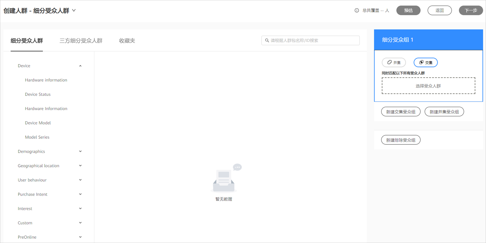
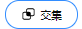
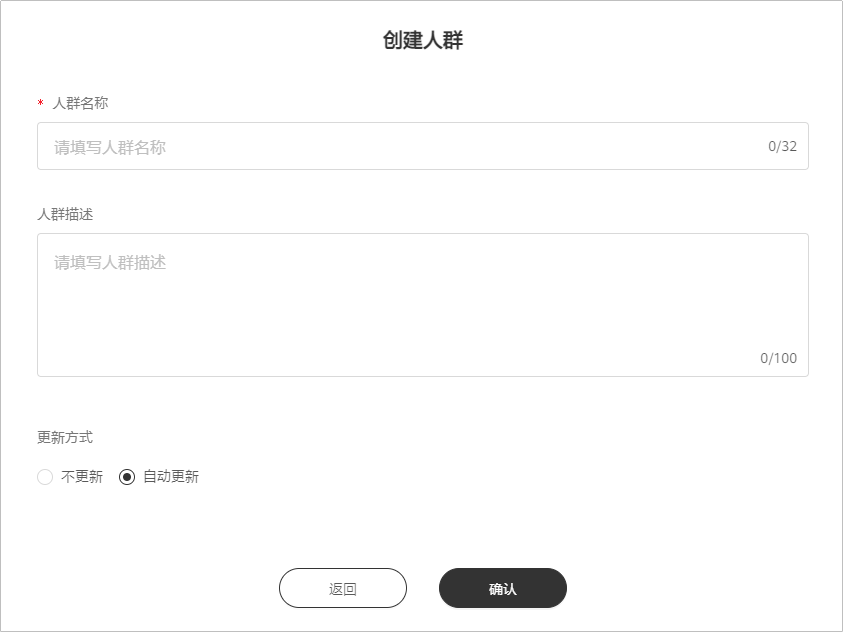

# 受众人群定向

## 概述

您可以使用以下方式创建受众人群定向：

- 细分受众人群：根据鲸鸿动能广告提供的细分受众人群，您可以依据某个受众群体在线使用的应用或他们感兴趣的产品和服务来定位到这个受众群体。

## 细分受众人群

细分受众人群包含用户的人口统计信息、兴趣、位置和他们使用设备的方式等。

1. 点击“工具”&gt;“人群管理”&gt;"创建人群"&gt;"细分受众人群"，进行参数设置，完成后点击下一步。

   

   - 细分受众人群：鲸鸿动能广告 预先定义的细分受众，您可以按照需要选择您想投放的人群。此处“细分受众人群”将会持续更新。
   - 三方细分受众人群：鲸鸿动能广告提供已合作的三方细分受众人群，您可以在这里选择不同的细分受众人群用于投放。
   - 收藏夹：您收藏的细分受众人群、三方细分受众人群中的标签将会出现在“标签收藏夹”，便于使用。
   - 细分受众组：
     - 交集：如果您选择了多个细分受众人群，系统将同时匹配您选择的所有细分受众人群中重合的数据。
     - 并集：如果您选择了多个细分受众人群，系统将会任意匹配其中一个细分受众人群。
   - 预估：当前您选择的细分受众人群在鲸鸿动能广告中的预估人数。

2. 输入人群名称、人群描述，选择更新方式，完成后点击确认。

   

   更新方式：

   - 不更新：当您创建的受众人群计算完成后，受众人群数据不会更新。
   - 自动更新：当您创建的受众人群计算完成后，受众人群的数据随着细分受众人群的数据自动更新。

   提交后系统将进行计算，计算完成后人群会显示为“就绪”状态，此时此受众人群可用于投放定向，同时您可以查看受众人群中的用户数。
