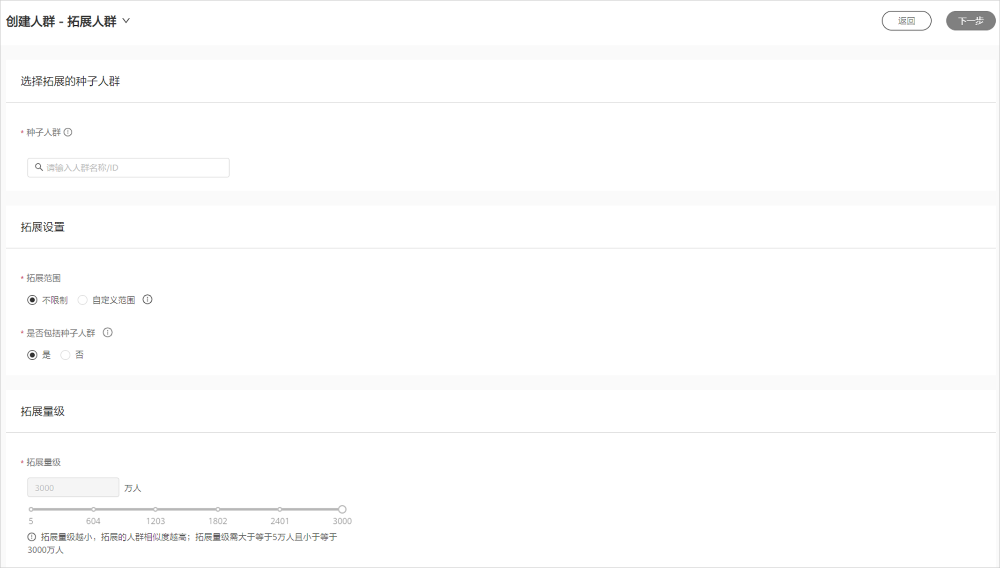
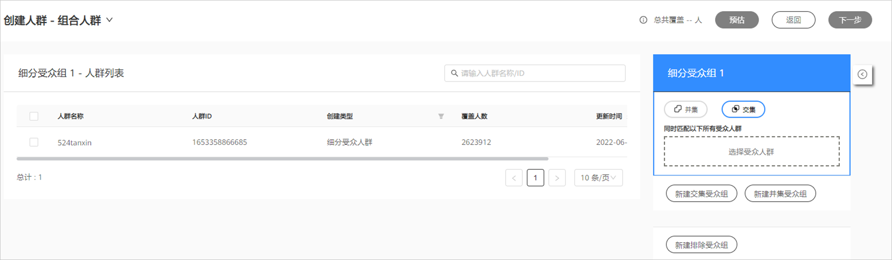

# 计算受众人群

## 概述

计算受众人群分为拓展人群和组合人群。您可使用鲸鸿动能广告提供的拓展人群或组合人群能力，来对已创建的人群进行拓展或交并差组合。

## 拓展人群

将您已创建的受众人群作为种子人群，系统根据种子人群的特征智能拓展出更多用户特征相似的人群。

1. 点击“工具”&gt;“人群管理”&gt;"创建人群"&gt;"拓展人群"，进行参数设置，完成后点击下一步。

   

   - 种子人群<strong>：</strong>将您近期创建的受众人群作为种子人群，且种子人群的覆盖人数不得低于5000。
   - 拓展设置<strong>：</strong>
     - 拓展范围：
       - 不限制：系统根据您种子人群的特性进行自动拓展。
       - 自定义范围：您可以选择已创建的受众人群，作为本次定向的拓展范围。
     - 是否包括种子人群：您可以选择是否将种子人群从拓展出的人群排除，排除种子人群后，种子人群所包含的个体不会出现在新创建的拓展人群中。
   - 拓展量级：您可以手动输入拓展量级，拓展量级越小，拓展的人群相似度越高，拓展量级需大于等于5万人且小于等于3000万人。您刚开始投放广告任务时，建议您拓展人群的拓展量级50w-200w，投放一段时间后，您可以观察数据效果，再逐步扩量。

2. 输入人群名称、人群描述，完成后点击确认。

   提交后系统将进行计算，计算完成后人群会显示为“就绪”状态，此时此受众人群可用于投放定向，同时您可以查看受众人群中的用户数。

## 组合人群创建步骤

选择多个已创建的受众人群，自由进行交并差组合。

1. 点击“工具”&gt;“人群管理”&gt;"创建人群"&gt;"组合人群"，进行参数设置，完成后点击下一步。

   

   - 细分受众组：从所有已创建的受众人群中，选择多个受众人群进行组合。
     - 交集：如果您选择了多个受众人群，系统将同时匹配所有受众人群中重合的数据。
     - 并集：如果您选择了多个受众人群，系统将会任意匹配其中一个受众人群。
   - 预估：当前您选择的细分受众人群在鲸鸿动能广告中的预估人数。

2. 输入人群名称、人群描述，完成后点击确认。

   提交后系统将进行计算，计算完成后人群会显示为“就绪”状态，此时此受众人群可用于投放定向，同时您可以查看受众人群中的用户数。
