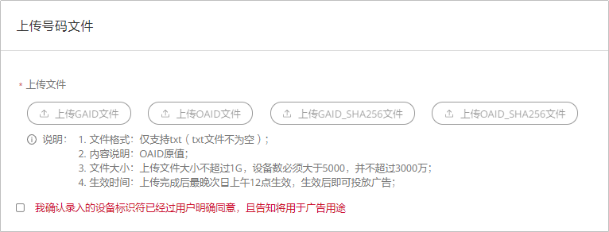
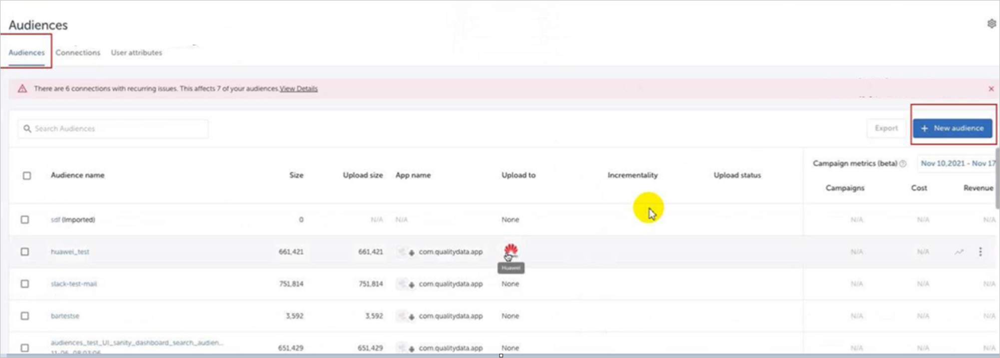
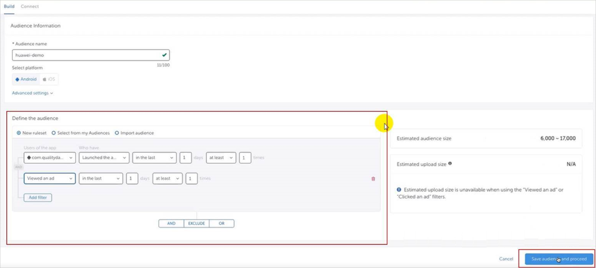
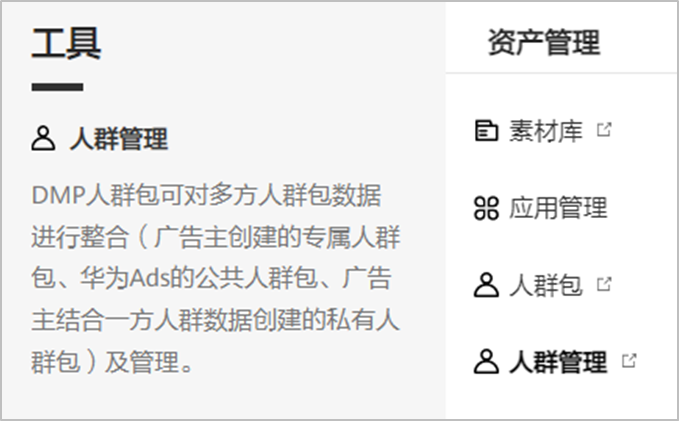
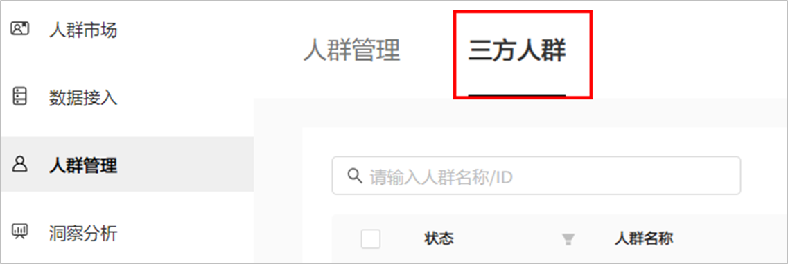

# 一方数据人群

## 概述

使用您的一方数据可以重新吸引之前在用户设备上与您的品牌或服务进行过互动的用户，您的广告将会展示给这些用户。一方数据人群仅对您自己的广告账户可见。一方数据人群包含：

- 号码文件人群：如果您有自己的用户列表，例如OAID，您可以将用户列表上传到鲸鸿动能广告平台创建专属人群包。
- 应用内行为数据：根据您转化跟踪回传给鲸鸿动能广告的用户行为来进行人群定向。例如激活、付费等。
- 广告行为人群：将您的广告曾经互动过的用户创建为一个受众人群，例如您的广告曾经曝光给某些用户。 您可以将这些用户创建为一个受众人群用于重定向营销、相似人群拓展等。
- 您的三方数据人群：您在三方或者您自己的数据平台创建受众人群，并同步至鲸鸿动能广告，您在进行广告投放时，可以选择这些三方数据人群作为指定投放人群或者排除人群。当前三方平台仅支持AppsFlyer、HUAWEI Analytics。

## 号码文件人群

您可以使用自己采集的客户列表创建受众人群进行再营销，您可以将您采集的用户OAID上传到鲸鸿动能广告平台，用于创建广告时指定投放人群。

1. 点击“工具”&gt;“人群管理”&gt;"创建人群"&gt;"号码文件人群"，勾选同意，上传文件，完成后点击下一步。

   

   上传文件：您可以上传OAID或SHA256加密后的OAID。

   - 文件内容：每一行为一个独立的OAID或SHA256加密后的OAID，且文件中的ID类型保持统一。
   - 文件格式：仅支持txt，且txt文件不得为空。
   - 文件大小：1G以内。OAID设备数应大于5000，不超过3000万行。
   - 生效时间：上传完成后最晚次日上午12点生效，生效后即可投放广告。

2. 输入受众人群名称、受众人群描述，完成后点击确认。

   提交后系统将进行计算，计算完成后受众人群会显示为“就绪”状态，此时受众人群可用于投放定向，同时您可以查看受众人群中的用户数。

## 应用内行为数据

您可以将您收集的应用内行为数据通过转化跟踪回传给鲸鸿动能广告, 例如用户在您的应用内激活、付费等行为数据。您可以使用这些行为数据创建受众人群，用于广告任务中，精准触达受众人群。

1. 点击“工具”&gt;“人群管理”&gt;"创建人群"&gt;"一方数据"，进行参数设置，完成后点击下一步。

   

   - 数据来源：选择您的应用，如果没有您想要选择的应用，您可以点击“新增数据源”进行增加。
   - 用户行为组：
     - 交集：如果您增加了多个行为，系统将同时匹配所有行为中重合的数据。
     - 并集：如果您增加了多个行为，系统将会任意匹配其中一个行为。
     - 用户行为：目前支持16种用户行为，如果您想了解每个行为的含义，您可以参考[自定义列指标](https://developer.huawei.com/consumer/cn/doc/distribution/promotion/tracking-shu-0000001139892541#ZH-CN_TOPIC_0000001139892541__table10838115914391)。
   - 设置时间范围：
     - 按起止日期：支持选择过去3个月的时间范围。
     - 按过去一段时间：您可以自己设置过去的时间范围，最多输入90天。

2. 输入人群名称、人群描述，完成后点击确认。

   提交后系统将进行计算，计算完成后人群会显示为“就绪”状态，此时此受众人群可用于投放定向，同时您可以查看受众人群中的用户数。

## 您的三方数据人群

您在三方或者您自己的数据平台创建受众人群，并同步至鲸鸿动能广告，您在进行广告投放时，可以选择这些三方数据人群作为指定投放人群或者排除人群。当前三方平台仅支持AppsFlyer、HUAWEI Analytics。以AppsFlyer为例：

1. 在AppsFlyer平台创建受众人群并同步至鲸鸿动能广告。
   1. 登录AppsFlyer平台，点击"Integration"&gt;"Audiences"，选择"Connections"，点击“New connection”，补充相关信息并保存。

      

      - Partner name：选择“Huawei”
      - Connection name：填写名称。
      - Log in with HUAWEI：点击“Log in with HUAWEI”，登录您的广告账户。
      - Set user identifiers：设置[用户标识符](https://developer.huawei.com/consumer/cn/doc/distribution/promotion/glossary-0000001064019898)，通过用户标识符将人群同步给鲸鸿动能广告，只有符合您的用户标识符的数据才会成功同步。您需要选择OAID。
   2. 点击“Audiences”，点击“New Audience”，新建受众人群。

      
   3. 补充定向信息件并保存。

      

      - Audience name：设置人群名称。
      - Select platform：可以选择Android，选择后，您的人群将会投放给Android用户。
      - Define the audience：添加定向筛选条件。
   4. 保存后，将会跳转至“Manage audience connections”，选择您创建的华为连接源并保存。

      
   5. 在“Audiences”页面中找到刚刚创建的受众人群，点击“Upload now”，将同步人群至鲸鸿动能广告。

      
2. 在鲸鸿动能广告平台查看受众人群并投放。

   点击“工具”&gt;"人群管理"，点击“三方受众人群”，查看三方DMP同步过来的人群并用于广告投放。

   

   
