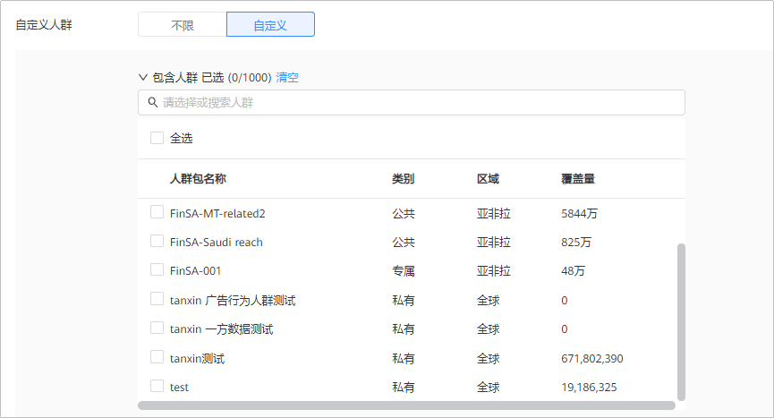

# 概述

 

若[基础人群定向](/docs/monetize/promotion/bpos-functions-base-target-0000001328677542)无法满足您的定向需求，您可以申请[特性通行名单](https://developer.huawei.com/consumer/cn/doc/distribution/promotion/addtongxing-0000001128278195)，使用人群管理，可支持拓展人群、交并差等更多定制人群功能。

仅支持直客与子客使用人群管理功能。

通过受众人群管理功能，您可以创建受众人群和对受众人群进行管理，您可以使用受众人群作为广告投放的定向人群或排除人群。受众人群可以通过以下方式创建或计算：

- 一方数据人群：您可以使用自己的数据创建一方数据受众人群。通过一方数据人群，您可以将广告系列定位到最具价值的用户，从而更高效地从您的广告中获利。
- 受众人群定向：您可以使用以下两种方式创建受众人群：
  - 细分受众人群：根据鲸鸿动能广告提供的细分受众人群，您可以依据某个受众群体在线使用的应用或他们感兴趣的产品和服务来定位到这个受众群体。
- 计算人群：您可使用鲸鸿动能广告提供的拓展人群或组合人群能力，来对已创建的人群进行拓展或交并差组合。
- 推荐人群：鲸鸿动能广告会给您推荐有价值的人群，它们可能是某个主题相关人群集群，或者是单个的高质量人群；您可以选择是否将推荐的人群加入您的人群列表中。

## 受众人群的状态

- 就绪：表示您的受众人群此时可以用于广告投放。
- 准备中：表示您的受众人群正在运算中，请耐心等待，如果您的受众人群超过24小时未能计算完成，请提供账户ID、人群ID，[在线提单](/docs/monetize/promotion/bpos-contact-0000001379837569#ZH-CN_TOPIC_0000001379837569__p5642mcpsimp)联系我们。
- 错误：表示您的受众人群运算错误，请提供账户ID、人群ID，[在线提单](/docs/monetize/promotion/bpos-contact-0000001379837569#ZH-CN_TOPIC_0000001379837569__p5642mcpsimp)联系我们。

## 受众人群计算时间

受众人群计算时间受您受众人群的数据的影响，如果您的受众人群超过24小时未能计算完成，请提供账户ID、人群ID，[在线提单](/docs/monetize/promotion/bpos-contact-0000001379837569#ZH-CN_TOPIC_0000001379837569__p5642mcpsimp)联系我们。

## 如何使用受众人群

- 您在创建广告任务时，可以在“自定义人群”中选择您创建的多个受众人群进行包含或者排除定向。如果您选择了多个受众人群，多个受众人群是并集关系。

  
- 系统在进行投放时“自定义人群”与其它定向条件同时生效（取交集），如果选择的“自定义人群”与其它定向条件交集较小会导致广告触达人数较少。

   

  当您在应用市场对您的应用进行推广时，如果您选择了其他定向条件，此时“自定义人群”与其它定向条件同时生效（取并集）；如果您没有选择其他定向条件（默认为“不限”），此时您只投放给自定义受众人群的人群。

  

## 受众人群管理

受众人群创建完成后，您可以对您创建的受众人群进行查看、删除操作。

- 查看：您可以查看人群详情。您也可以在查看界面中复制、删除人群（状态为“就绪”时才能删除）。
- 删除：当受众人群计算完成后，状态为“就绪”时，您可以删除自己创建的受众人群。
