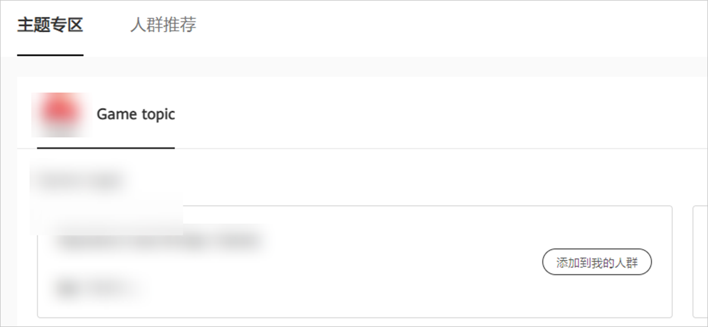
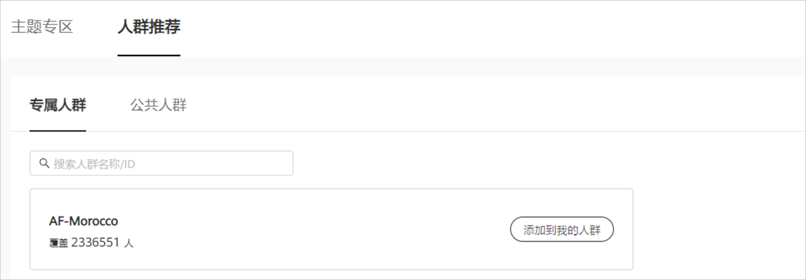

# 推荐受众人群

## 概述

鲸鸿动能广告会给您推荐有价值的受众人群，它们可能是某个主题相关的受众人群集群，或者是单个高质量受众人群，您可以选择是否将推荐的受众人群加入您的受众人群列表中。推荐受众人群包含：主题推荐、人群推荐。

## 主题推荐

鲸鸿动能广告会给您推荐某个主题相关的受众人群集群，您可以自主选择将这些受众人群添加到您的列表中。

1. 点击“工具”&gt;“人群市场”&gt;“主题专区”，挑选您感兴趣的受众人群，点击“添加到我的人群”可将该受众人群添加到您的人群列表中。

   

## 人群推荐

鲸鸿动能广告会给您推荐公共的受众人群资源和与您广告相匹配的专属人群资源，您可以自主选择将这些受众人群添加到您的受众人群列表中。

1. 点击“工具”&gt;“人群市场”&gt;“人群推荐”&gt;“查看全部人群”，您可以将“您的专属细分人群”和“华为推荐细分人群”添加到你的人群列表中。

   

   - 专属人群：展示的受众人群只有您的广告账户可见。
   - 公共人群：展示的受众人群为公共资源，对所有鲸鸿动能广告账户可见。
